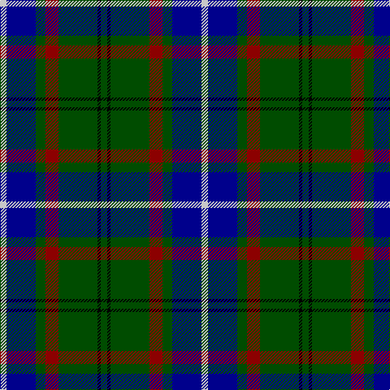

In pattern [GKGRGBW](/stripes/gkgrgbw/).

This was sourced from register-of-tartans.  It is a [7 stripe tartan](/stripes/stripes7/).

Original link https://www.tartanregister.gov.uk/tartanDetails.aspx?ref=2080

## Attestations

This cloth appears in 2 source records; the oldest owns this page.

- 01/01/1995 — Lee (Personal) (register-of-tartans, [record](https://www.tartanregister.gov.uk/tartanDetails.aspx?ref=2080))
- 1995 — Lee (Name) (tartans-authority, [record](http://www.tartansauthority.com/tartan-ferret/display/5407/))

## Register references

External register numbers recorded for this tartan.

- Scottish Register of Tartans: [2080](https://www.tartanregister.gov.uk/tartanDetails.aspx?ref=2080)
- Scottish Tartans Authority (ITI): 5407

## Thread count
N/8 DB36 G12 DR16 G48 K4 G/8

## Palette
Each colour and its ΔE from the base-6 reference it is a variant of.

| Colour | Shade | Base | ΔE (OKLab) |
|---|---|---|---|
| DB | <code style="background-color:#00008C;">#00008C</code> `#00008C` | B <code style="background-color:#2A418A;">#2A418A</code> | 0.13 |
| DR | <code style="background-color:#8C0000;">#8C0000</code> `#8C0000` | R <code style="background-color:#CC0000;">#CC0000</code> | 0.14 |
| G | <code style="background-color:#004C00;">#004C00</code> `#004C00` | G <code style="background-color:#006100;">#006100</code> | 0.07 |
| K | <code style="background-color:#000000;">#000000</code> `#000000` | K <code style="background-color:#000000;">#000000</code> | 0.00 |
| N | <code style="background-color:#C8C8C8;">#C8C8C8</code> `#C8C8C8` | W <code style="background-color:#F7F7F7;">#F7F7F7</code> | 0.14 |

# Sample pattern

## Nearest tartans

The nearest existing variants by ΔTartan distance.

1. [Gillies](/setts/s8/db32k12db12g6r6g18k2ly3~x2/) — ΔT 0.88
1. [Croy, Jake (Personal)](/setts/s8/n10k7lt2lb2k27b7lt2b7~x2/) — ΔT 0.90
1. [City of Guelph](/setts/s8/g28k4g5dr4g5k19db19y2~x2/) — ΔT 0.93
1. [Lossiemouth/Hersbruck](/setts/s6/g26db3g12k10dp15w2~x2/) — ΔT 0.96
1. [Pride of Yorkland (Fashion)](/setts/s6/g35k3db26k4db4w3~x2/) — ΔT 1.01
1. [Carmichael](/setts/s6/k5g32db32r3db3ly3~x2/) — ΔT 1.01
1. [Maitland Chief](/setts/s9/g5db24g7k10g24ly2db2ly2r2~x2/) — ΔT 1.02
1. [Wishart Htg (Clan)](/setts/s7/k7db4dg31db3ly2db27lb4~x2/) — ΔT 1.07
1. [MacIntyre, Inglis](/setts/s6/w4g28db18r4db18ly3~x2/) — ΔT 1.07
1. [Vance (Family Association)](/setts/s6/r4db24w2g13db2k3~x4/) — ΔT 1.07

## Neighbour map

Every grey dot is one of 14299 variants placed by the first two principal components of the ΔTartan feature space (44% of its variance). Red is this tartan; blue dots are its nearest — click one to open its page.

<svg viewBox="0 0 640 380" role="img" style="max-width:100%;height:auto;border:1px solid #e0e0e0;border-radius:4px;display:block" xmlns="http://www.w3.org/2000/svg"><image href="/nn/cloud.v1.png" width="640" height="380"/><a href="/setts/s8/db32k12db12g6r6g18k2ly3~x2/"><circle cx="222.0" cy="167.9" r="4" fill="#3465a4"><title>Gillies</title></circle></a><a href="/setts/s8/n10k7lt2lb2k27b7lt2b7~x2/"><circle cx="267.0" cy="169.1" r="4" fill="#3465a4"><title>Croy, Jake (Personal)</title></circle></a><a href="/setts/s8/g28k4g5dr4g5k19db19y2~x2/"><circle cx="209.4" cy="179.4" r="4" fill="#3465a4"><title>City of Guelph</title></circle></a><a href="/setts/s6/g26db3g12k10dp15w2~x2/"><circle cx="275.6" cy="207.4" r="4" fill="#3465a4"><title>Lossiemouth/Hersbruck</title></circle></a><a href="/setts/s6/g35k3db26k4db4w3~x2/"><circle cx="252.7" cy="188.1" r="4" fill="#3465a4"><title>Pride of Yorkland (Fashion)</title></circle></a><a href="/setts/s6/k5g32db32r3db3ly3~x2/"><circle cx="250.9" cy="188.4" r="4" fill="#3465a4"><title>Carmichael</title></circle></a><a href="/setts/s9/g5db24g7k10g24ly2db2ly2r2~x2/"><circle cx="241.8" cy="173.1" r="4" fill="#3465a4"><title>Maitland Chief</title></circle></a><a href="/setts/s7/k7db4dg31db3ly2db27lb4~x2/"><circle cx="246.9" cy="169.1" r="4" fill="#3465a4"><title>Wishart Htg (Clan)</title></circle></a><a href="/setts/s6/w4g28db18r4db18ly3~x2/"><circle cx="224.0" cy="206.3" r="4" fill="#3465a4"><title>MacIntyre, Inglis</title></circle></a><a href="/setts/s6/r4db24w2g13db2k3~x4/"><circle cx="277.3" cy="178.6" r="4" fill="#3465a4"><title>Vance (Family Association)</title></circle></a><circle cx="248.5" cy="194.8" r="5" fill="#c00000"/></svg>

ID: /setts/s7/dg2k1dg12r4dg3db9lb2~x4/
