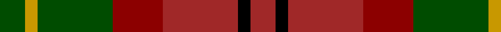

In pattern [GYGRRKR](/stripes/gygrrkr/).

This was sourced from register-of-tartans.  It is a [7 stripe tartan](/stripes/stripes7/).

Original link https://www.tartanregister.gov.uk/tartanDetails.aspx?ref=4361

## Register references

External register numbers recorded for this tartan.

- Scottish Register of Tartans: [4361](https://www.tartanregister.gov.uk/tartanDetails.aspx?ref=4361)
- Scottish Tartans Authority (ITI): 5049

## Thread count
G/8 DY4 G24 DR16 DRa24 K4 DRa/8

## Palette
Each colour and its ΔE from the base-6 reference it is a variant of.

| Colour | Shade | Base | ΔE (OKLab) |
|---|---|---|---|
| DR | <code style="background-color:#8C0000;">#8C0000</code> `#8C0000` | R <code style="background-color:#CC0000;">#CC0000</code> | 0.14 |
| DRa | <code style="background-color:#A02828;">#A02828</code> `#A02828` | R <code style="background-color:#CC0000;">#CC0000</code> | 0.09 |
| DY | <code style="background-color:#C89800;">#C89800</code> `#C89800` | Y <code style="background-color:#F2BF00;">#F2BF00</code> | 0.12 |
| G | <code style="background-color:#004C00;">#004C00</code> `#004C00` | G <code style="background-color:#006100;">#006100</code> | 0.07 |
| K | <code style="background-color:#000000;">#000000</code> `#000000` | K <code style="background-color:#000000;">#000000</code> | 0.00 |

# Sample pattern

## Nearest tartans

The nearest existing variants by ΔTartan distance.

1. [Roscommon, County](/setts/s10/r5ly3r19do6ly5do6dg12db5dg12db3~x2/) — ΔT 1.27
1. [Monaghan, County (District)](/setts/s9/lo3do2o14lo8do14dg16o13do2lo3~x2/) — ΔT 1.28
1. [Monaghan Irish County Tartan Tartan Number: 2267. Earliest known date: 1996 One of a series of Irish District tartans designed by Polly Wittering of the House of Edgar, with colours reminiscent of the Country with soft warm colours dominating. See products available Copyright © Blair Urquhart, Comrie, 2015](/setts/s9/lo3dy2o14dg17dy14lo8o14dy2lo3~x2/) — ΔT 1.31
1. [Murdoch (Dalgliesh)](/setts/s10/k5do1g3do1g3do1k5r1r5r1~x4/) — ΔT 1.35
1. [Indiana "Cardinal" (District)](/setts/s8/db8lo1g12r10y2r6y2r4~x4/) — ΔT 1.37
1. [Tinkler (Corporate)](/setts/s9/g2lo9do6r3do2r3do2r10w2~x4/) — ΔT 1.38
1. [Unidentified #66](/setts/s6/ly1dy10k8r8dy1ly1~x4/) — ΔT 1.40
1. [Maple Leaf](/setts/s12/dg19r3dg3r15lo13r15dg3r3dg19ly6lo6dy6~x2/) — ΔT 1.40
1. [Caledonian Brewery (Corporate)](/setts/s7/lb4dg13g6r16lb2r2g2~x2/) — ΔT 1.43
1. [Glenmorangie #2](/setts/s11/dy6m2dy2m4dy13dy12o13m4o2m2o6~x2/) — ΔT 1.47

## Neighbour map

Every grey dot is one of 14299 variants placed by the first two principal components of the ΔTartan feature space (44% of its variance). Red is this tartan; blue dots are its nearest — click one to open its page.

<svg viewBox="0 0 640 380" role="img" style="max-width:100%;height:auto;border:1px solid #e0e0e0;border-radius:4px;display:block" xmlns="http://www.w3.org/2000/svg"><image href="/nn/cloud.v1.png" width="640" height="380"/><a href="/setts/s10/r5ly3r19do6ly5do6dg12db5dg12db3~x2/"><circle cx="116.9" cy="208.2" r="4" fill="#3465a4"><title>Roscommon, County</title></circle></a><a href="/setts/s9/lo3do2o14lo8do14dg16o13do2lo3~x2/"><circle cx="201.9" cy="231.3" r="4" fill="#3465a4"><title>Monaghan, County (District)</title></circle></a><a href="/setts/s9/lo3dy2o14dg17dy14lo8o14dy2lo3~x2/"><circle cx="187.0" cy="221.3" r="4" fill="#3465a4"><title>Monaghan Irish County Tartan Tartan Number: 2267. Earliest known date: 1996 One of a series of Irish District tartans designed by Polly Wittering of the House of Edgar, with colours reminiscent of the Country with soft warm colours dominating. See products available Copyright © Blair Urquhart, Comrie, 2015</title></circle></a><a href="/setts/s10/k5do1g3do1g3do1k5r1r5r1~x4/"><circle cx="147.9" cy="224.4" r="4" fill="#3465a4"><title>Murdoch (Dalgliesh)</title></circle></a><a href="/setts/s8/db8lo1g12r10y2r6y2r4~x4/"><circle cx="236.8" cy="205.4" r="4" fill="#3465a4"><title>Indiana &quot;Cardinal&quot; (District)</title></circle></a><a href="/setts/s9/g2lo9do6r3do2r3do2r10w2~x4/"><circle cx="159.6" cy="205.4" r="4" fill="#3465a4"><title>Tinkler (Corporate)</title></circle></a><a href="/setts/s6/ly1dy10k8r8dy1ly1~x4/"><circle cx="219.6" cy="214.4" r="4" fill="#3465a4"><title>Unidentified #66</title></circle></a><a href="/setts/s12/dg19r3dg3r15lo13r15dg3r3dg19ly6lo6dy6~x2/"><circle cx="161.9" cy="200.9" r="4" fill="#3465a4"><title>Maple Leaf</title></circle></a><a href="/setts/s7/lb4dg13g6r16lb2r2g2~x2/"><circle cx="185.4" cy="197.1" r="4" fill="#3465a4"><title>Caledonian Brewery (Corporate)</title></circle></a><a href="/setts/s11/dy6m2dy2m4dy13dy12o13m4o2m2o6~x2/"><circle cx="181.9" cy="225.1" r="4" fill="#3465a4"><title>Glenmorangie #2</title></circle></a><circle cx="180.4" cy="235.2" r="5" fill="#c00000"/></svg>

ID: /setts/s7/dg2ly1dg6r4r6k1r2~x4/
