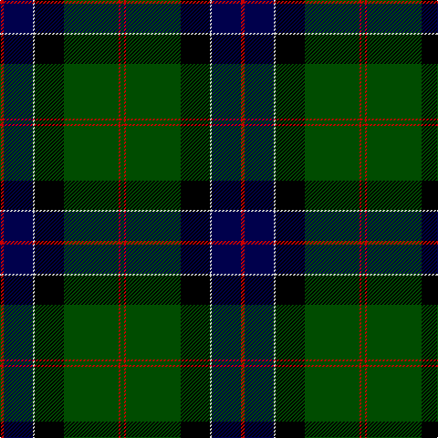

**Bands:** [RBWKGRG](/stripes/rbwkgrg/) · **Stripes:** [R DB LB K DG R DG](/stripes/stripes7/) R DB LB K DG R DG

This was sourced from weddslist.  It is a [7 band tartan](/bands/bands7/).

Original link http://www.weddslist.com/cgi-bin/tartans/pg.pl?source=rb

## Register references

External register numbers recorded for this tartan.

- Scottish Register of Tartans: [1166](https://www.tartanregister.gov.uk/tartanDetails.aspx?ref=1166)
- Scottish Register of Tartans: [1758](https://www.tartanregister.gov.uk/tartanDetails.aspx?ref=1758)
- Scottish Register of Tartans: [2307](https://www.tartanregister.gov.uk/tartanDetails.aspx?ref=2307)
- Scottish Register of Tartans: [2540](https://www.tartanregister.gov.uk/tartanDetails.aspx?ref=2540)
- Scottish Register of Tartans: [2666](https://www.tartanregister.gov.uk/tartanDetails.aspx?ref=2666)
- Scottish Register of Tartans: [2862](https://www.tartanregister.gov.uk/tartanDetails.aspx?ref=2862)
- Scottish Register of Tartans: [3808](https://www.tartanregister.gov.uk/tartanDetails.aspx?ref=3808)
- Scottish Register of Tartans: [982](https://www.tartanregister.gov.uk/tartanDetails.aspx?ref=982)
- Scottish Tartans Authority (ITI): 218
- Scottish Tartans World Register: 1010
- Scottish Tartans World Register: 1042
- Scottish Tartans World Register: 127
- Scottish Tartans World Register: 1585
- Scottish Tartans World Register: 218
- Scottish Tartans World Register: 2218
- Scottish Tartans World Register: 737
- Scottish Tartans World Register: 897

## Thread count
R/4 DB32 N2 K32 G60 R2 G/4

## Palette
Each colour and its ΔE from the base-6 reference it is a variant of.

| Colour | Shade | Base | ΔE (OKLab) |
|---|---|---|---|
| DB | <code style="background-color:#00004C;">#00004C</code> `#00004C` | B <code style="background-color:#2A418A;">#2A418A</code> | 0.21 |
| G | <code style="background-color:#004C00;">#004C00</code> `#004C00` | G <code style="background-color:#006100;">#006100</code> | 0.07 |
| K | <code style="background-color:#000000;">#000000</code> `#000000` | K <code style="background-color:#000000;">#000000</code> | 0.00 |
| N | <code style="background-color:#D0D0D0;">#D0D0D0</code> `#D0D0D0` | W <code style="background-color:#F7F7F7;">#F7F7F7</code> | 0.12 |
| R | <code style="background-color:#C80000;">#C80000</code> `#C80000` | R <code style="background-color:#CC0000;">#CC0000</code> | 0.01 |

# Sample pattern

## Nearest tartans

The nearest existing variants by ΔTartan distance.

1. [Sinclair Hunting](/setts/s7/dg2r1dg30k16lr1db16r2~x2/) — ΔT 0.46
1. [MacDonnald of ye Ylis](/setts/s9/lr4dg30k1dg1k1dg3k12db10r3~x2/) — ΔT 0.83
1. [MacDonnald of ye Ylis](/setts/s9/lr4dg30k1dg1k1dg3k12db10r3/) — ΔT 0.83
1. [Colquhoun VS](/setts/s7/db4k2db16lb1k8dg24r4/) — ΔT 0.94
1. [Ogilvy VS](/setts/s8/db28ly1db2k16dg24k1dg2r3~x2/) — ΔT 0.98
1. [Fergusson](/setts/s7/db24k8dg8r2dg8k1lb2/) — ΔT 1.02
1. [Colqhoun VS](/setts/s7/db4k2db16lr1k8dg24r4~x2/) — ΔT 1.05
1. [MacDonnald of ye Ylis](/setts/s9/lb4dg30k1dg1k1dg3k12db10r3/) — ΔT 1.05
1. [Ogilvy Hunting](/setts/s9/db24ly2k8dg16k1dg3k1dg3r4~x2/) — ΔT 1.09
1. [MacLaren](/setts/s7/db24k8dg8r2dg8k1ly2~x2/) — ΔT 1.12

## Neighbour map

Every grey dot is one of 14299 variants placed by the first two principal components of the ΔTartan feature space (44% of its variance). Red is this tartan; blue dots are its nearest — click one to open its page.

<svg viewBox="0 0 640 380" role="img" style="max-width:100%;height:auto;border:1px solid #e0e0e0;border-radius:4px;display:block" xmlns="http://www.w3.org/2000/svg"><image href="/nn/cloud.v1.png" width="640" height="380"/><a href="/setts/s7/dg2r1dg30k16lr1db16r2~x2/"><circle cx="292.9" cy="154.6" r="4" fill="#3465a4"><title>Sinclair Hunting</title></circle></a><a href="/setts/s9/lr4dg30k1dg1k1dg3k12db10r3~x2/"><circle cx="304.7" cy="125.6" r="4" fill="#3465a4"><title>MacDonnald of ye Ylis</title></circle></a><a href="/setts/s9/lr4dg30k1dg1k1dg3k12db10r3/"><circle cx="304.7" cy="125.6" r="4" fill="#3465a4"><title>MacDonnald of ye Ylis</title></circle></a><a href="/setts/s7/db4k2db16lb1k8dg24r4/"><circle cx="232.7" cy="163.1" r="4" fill="#3465a4"><title>Colquhoun VS</title></circle></a><a href="/setts/s8/db28ly1db2k16dg24k1dg2r3~x2/"><circle cx="250.2" cy="147.2" r="4" fill="#3465a4"><title>Ogilvy VS</title></circle></a><a href="/setts/s7/db24k8dg8r2dg8k1lb2/"><circle cx="254.2" cy="162.3" r="4" fill="#3465a4"><title>Fergusson</title></circle></a><a href="/setts/s7/db4k2db16lr1k8dg24r4~x2/"><circle cx="248.6" cy="171.1" r="4" fill="#3465a4"><title>Colqhoun VS</title></circle></a><a href="/setts/s9/lb4dg30k1dg1k1dg3k12db10r3/"><circle cx="290.4" cy="118.7" r="4" fill="#3465a4"><title>MacDonnald of ye Ylis</title></circle></a><a href="/setts/s9/db24ly2k8dg16k1dg3k1dg3r4~x2/"><circle cx="225.8" cy="139.3" r="4" fill="#3465a4"><title>Ogilvy Hunting</title></circle></a><a href="/setts/s7/db24k8dg8r2dg8k1ly2~x2/"><circle cx="267.5" cy="169.2" r="4" fill="#3465a4"><title>MacLaren</title></circle></a><circle cx="280.5" cy="148.8" r="5" fill="#c00000"/></svg>

ID: /setts/s7/dg2r1dg30k16lb1db16r2~x2/
