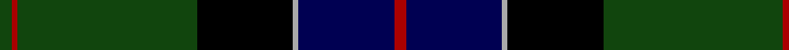
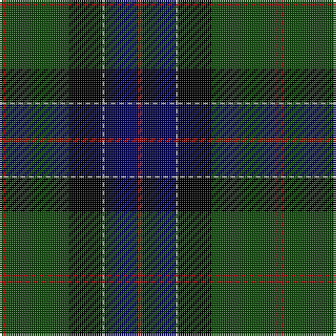

**Bands:** [GRGKYBR](/stripes/grgkybr/) · **Stripes:** [DG R DG K LR DB R](/stripes/stripes7/) DG R DG K LR DB R

This was sourced from weddslist.  It is a [7 band tartan](/bands/bands7/).

Original link http://www.weddslist.com/cgi-bin/tartans/pg.pl?source=x

## Register references

External register numbers recorded for this tartan.

- Scottish Register of Tartans: [2540](https://www.tartanregister.gov.uk/tartanDetails.aspx?ref=2540)
- Scottish Register of Tartans: [2625](https://www.tartanregister.gov.uk/tartanDetails.aspx?ref=2625)
- Scottish Register of Tartans: [3555](https://www.tartanregister.gov.uk/tartanDetails.aspx?ref=3555)
- Scottish Tartans Authority (ITI): 1429
- Scottish Tartans Authority (ITI): 218
- Scottish Tartans World Register: 1429
- Scottish Tartans World Register: 218
- Scottish Tartans World Register: 864

## Variants

Other setts woven to the same stripe pattern.

- [Sinclair Hunting](/setts/s7/dg2r1dg30k16lr1db16r2~x2/)

## Thread count
DG/2 DR1 DG30 K16 N1 DB16 DR/2

## Palette
Each colour and its ΔE from the base-6 reference it is a variant of.

| Colour | Shade | Base | ΔE (OKLab) |
|---|---|---|---|
| DB | <code style="background-color:#000052;">#000052</code> `#000052` | B <code style="background-color:#2A418A;">#2A418A</code> | 0.20 |
| DG | <code style="background-color:#11450D;">#11450D</code> `#11450D` | G <code style="background-color:#006100;">#006100</code> | 0.09 |
| DR | <code style="background-color:#AA0000;">#AA0000</code> `#AA0000` | R <code style="background-color:#CC0000;">#CC0000</code> | 0.07 |
| K | <code style="background-color:#000000;">#000000</code> `#000000` | K <code style="background-color:#000000;">#000000</code> | 0.00 |
| N | <code style="background-color:#AAAAAA;">#AAAAAA</code> `#AAAAAA` | Y <code style="background-color:#F2BF00;">#F2BF00</code> | 0.19 |

# Sample pattern

## Nearest tartans

The nearest existing variants by ΔTartan distance.

1. [Sinclair Hunting](/setts/s7/dg2r1dg30k16lr1db16r2~x2/) — ΔT 0.00
1. [Sinclair Hunting](/setts/s7/dg2r1dg30k16lb1db16r2/) — ΔT 0.46
1. [Colqhoun VS](/setts/s7/db4k2db16lr1k8dg24r4~x2/) — ΔT 0.84
1. [Colqhoun VS](/setts/s7/db4k2db16lr1k8dg24r4/) — ΔT 0.84
1. [Ogilvy VS](/setts/s8/db28ly1db2k16dg24k1dg2r3~x2/) — ΔT 0.87
1. [MacLaren](/setts/s7/db24k8dg8r2dg8k1ly2~x2/) — ΔT 0.89
1. [Colquhoun VS](/setts/s7/db4k2db16lb1k8dg24r4/) — ΔT 0.97
1. [Fergusson](/setts/s7/db24k8dg8r2dg8k1lb2/) — ΔT 0.98
1. [Fergusson](/setts/s7/db24k8dg8r2dg8k1lr2~x2/) — ΔT 0.99
1. [Fergusson](/setts/s7/db24k8dg8r2dg8k1lr2/) — ΔT 0.99

## Neighbour map

Every grey dot is one of 14313 variants placed by the first two principal components of the ΔTartan feature space (44% of its variance). Red is this tartan; blue dots are its nearest — click one to open its page.

<svg viewBox="0 0 640 380" role="img" style="max-width:100%;height:auto;border:1px solid #e0e0e0;border-radius:4px;display:block" xmlns="http://www.w3.org/2000/svg"><image href="/nn/cloud.v1.png" width="640" height="380"/><a href="/setts/s7/dg2r1dg30k16lr1db16r2~x2/"><circle cx="292.7" cy="154.6" r="4" fill="#3465a4"><title>Sinclair Hunting</title></circle></a><a href="/setts/s7/dg2r1dg30k16lb1db16r2/"><circle cx="280.3" cy="148.8" r="4" fill="#3465a4"><title>Sinclair Hunting</title></circle></a><a href="/setts/s7/db4k2db16lr1k8dg24r4~x2/"><circle cx="248.5" cy="171.1" r="4" fill="#3465a4"><title>Colqhoun VS</title></circle></a><a href="/setts/s7/db4k2db16lr1k8dg24r4/"><circle cx="248.5" cy="171.1" r="4" fill="#3465a4"><title>Colqhoun VS</title></circle></a><a href="/setts/s8/db28ly1db2k16dg24k1dg2r3~x2/"><circle cx="250.0" cy="147.2" r="4" fill="#3465a4"><title>Ogilvy VS</title></circle></a><a href="/setts/s7/db24k8dg8r2dg8k1ly2~x2/"><circle cx="267.3" cy="169.2" r="4" fill="#3465a4"><title>MacLaren</title></circle></a><a href="/setts/s7/db4k2db16lb1k8dg24r4/"><circle cx="232.5" cy="163.0" r="4" fill="#3465a4"><title>Colquhoun VS</title></circle></a><a href="/setts/s7/db24k8dg8r2dg8k1lb2/"><circle cx="254.0" cy="162.3" r="4" fill="#3465a4"><title>Fergusson</title></circle></a><a href="/setts/s7/db24k8dg8r2dg8k1lr2~x2/"><circle cx="267.9" cy="169.3" r="4" fill="#3465a4"><title>Fergusson</title></circle></a><a href="/setts/s7/db24k8dg8r2dg8k1lr2/"><circle cx="267.9" cy="169.3" r="4" fill="#3465a4"><title>Fergusson</title></circle></a><circle cx="292.7" cy="154.6" r="5" fill="#c00000"/></svg>

ID: /setts/s7/dg2r1dg30k16lr1db16r2/
