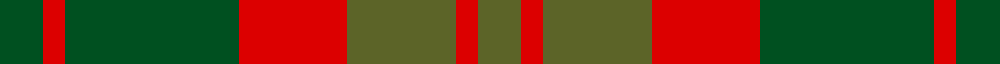
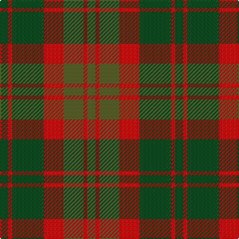

In pattern [GRGRGRG](/stripes/grgrgrg/).

This was sourced from register-of-tartans.  It is a [7 stripe tartan](/stripes/stripes7/).

Original link https://www.tartanregister.gov.uk/tartanDetails.aspx?ref=1377

## Attestations

This cloth appears in 2 source records; the oldest owns this page.

- 01/01/1993 — Glen Esk (1993) (register-of-tartans, [record](https://www.tartanregister.gov.uk/tartanDetails.aspx?ref=1377))
- 1993 — Glen Esk (Fashion) (tartans-authority, [record](http://www.tartansauthority.com/tartan-ferret/display/5007/))

## Register references

External register numbers recorded for this tartan.

- Scottish Register of Tartans: [1377](https://www.tartanregister.gov.uk/tartanDetails.aspx?ref=1377)
- Scottish Tartans Authority (ITI): 5007

## Thread count
G/8 R4 G32 R20 Ga20 R4 Ga/8

## Palette
Each colour and the base-6 reference it is a variant of.

| Colour | Shade | Base |
|---|---|---|
| G | <code style="background-color:#005020;">#005020</code> `oklch(37.7% 0.105 149.6)` <small>#005020</small> | G <code style="background-color:#006100;">#006100</code> |
| Ga | <code style="background-color:#5C6428;">#5C6428</code> `oklch(48.3% 0.084 116.0)` <small>#5C6428</small> | G <code style="background-color:#006100;">#006100</code> |
| R | <code style="background-color:#DC0000;">#DC0000</code> `oklch(56.2% 0.230 29.2)` <small>#DC0000</small> | R <code style="background-color:#CC0000;">#CC0000</code> |

# Sample pattern

## Nearest tartans

The nearest existing variants by ΔTartan distance.

1. [Dewar](/setts/s10/dy1r7dy4g7dy1g1~x4/) — ΔT 1.01
1. [Chindecella Gorse (Kemete Heil)](/setts/s8/o9do4o4do4o24dy19do19dy4~x2/) — ΔT 1.12
1. [Harmony 8](/setts/s5/dr2y10o15dr10y2~x4/) — ΔT 1.12
1. [Scott Htg (Clan)](/setts/s8/r3dy16g10r3g3lb2g3r3~x2/) — ΔT 1.16
1. [MacNab, Variant](/setts/s6/r1r7r4g7r1g1~x4/) — ΔT 1.22
1. [Heil, Rudiger (Personal)](/setts/s8/lo6n2lo2n2lo18n13dt13n2~x2/) — ΔT 1.28
1. [Ballantrae (Dalgety)](/setts/s7/dy5r3dy31dg20dy3g22r5~x2/) — ΔT 1.36
1. [Harmony, 6](/setts/s5/dp2g10o15dp10g2~x4/) — ΔT 1.38
1. [Harmony 8](/setts/s5/dy2y10o15dy10y2~x4/) — ΔT 1.39
1. [Loch Rannoch Trade Tartan Tartan Number: 1735. Earliest known date: 1975 Nothing See products available Copyright © Blair Urquhart, Comrie, 2015](/setts/s8/do24g2do5lo14g2lo5dy17do2~x2/) — ΔT 1.39

## Neighbour map

Every grey dot is one of 14299 variants placed by the first two principal components of the ΔTartan feature space (44% of its variance). Red is this tartan; blue dots are its nearest — click one to open its page.

<svg viewBox="0 0 640 380" role="img" style="max-width:100%;height:auto;border:1px solid #e0e0e0;border-radius:4px;display:block" xmlns="http://www.w3.org/2000/svg"><image href="/nn/cloud.v1.png" width="640" height="380"/><a href="/setts/s10/dy1r7dy4g7dy1g1~x4/"><circle cx="252.8" cy="254.3" r="4" fill="#3465a4"><title>Dewar</title></circle></a><a href="/setts/s8/o9do4o4do4o24dy19do19dy4~x2/"><circle cx="281.3" cy="273.8" r="4" fill="#3465a4"><title>Chindecella Gorse (Kemete Heil)</title></circle></a><a href="/setts/s5/dr2y10o15dr10y2~x4/"><circle cx="257.0" cy="276.7" r="4" fill="#3465a4"><title>Harmony 8</title></circle></a><a href="/setts/s8/r3dy16g10r3g3lb2g3r3~x2/"><circle cx="247.9" cy="226.7" r="4" fill="#3465a4"><title>Scott Htg (Clan)</title></circle></a><a href="/setts/s6/r1r7r4g7r1g1~x4/"><circle cx="251.9" cy="248.2" r="4" fill="#3465a4"><title>MacNab, Variant</title></circle></a><a href="/setts/s8/lo6n2lo2n2lo18n13dt13n2~x2/"><circle cx="279.5" cy="227.5" r="4" fill="#3465a4"><title>Heil, Rudiger (Personal)</title></circle></a><a href="/setts/s7/dy5r3dy31dg20dy3g22r5~x2/"><circle cx="261.7" cy="225.8" r="4" fill="#3465a4"><title>Ballantrae (Dalgety)</title></circle></a><a href="/setts/s5/dp2g10o15dp10g2~x4/"><circle cx="253.8" cy="277.7" r="4" fill="#3465a4"><title>Harmony, 6</title></circle></a><a href="/setts/s5/dy2y10o15dy10y2~x4/"><circle cx="229.1" cy="262.0" r="4" fill="#3465a4"><title>Harmony 8</title></circle></a><a href="/setts/s8/do24g2do5lo14g2lo5dy17do2~x2/"><circle cx="277.6" cy="206.2" r="4" fill="#3465a4"><title>Loch Rannoch Trade Tartan Tartan Number: 1735. Earliest known date: 1975 Nothing See products available Copyright © Blair Urquhart, Comrie, 2015</title></circle></a><circle cx="271.1" cy="257.8" r="5" fill="#c00000"/></svg>

ID: /setts/s7/dg2r1dg8r5y5r1y2~x4/
