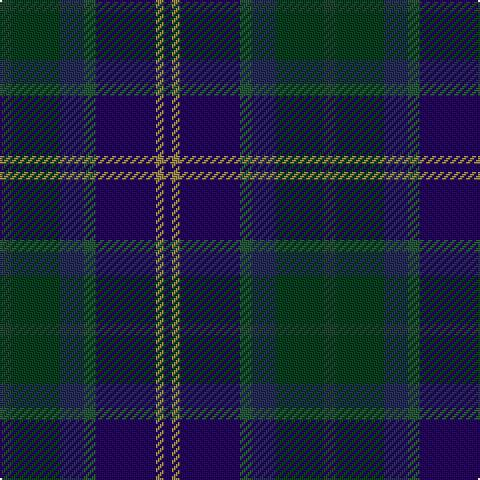

This page is one **sett** — a single exact thread-count. It belongs to the [tartan](/tartans/dg3dg12dt6dg3db15o2db2/)
(the same proportion at any scale), whose colour order is pattern [BRBGBGG](/stripes/brbgbgg/).

Sourced from register-of-tartans.  It is a [7 stripe tartan](/stripes/stripes7/).

Original link https://www.tartanregister.gov.uk/tartanDetails.aspx?ref=10068

## Register references

External register numbers recorded for this tartan.

- Scottish Register of Tartans: [10068](https://www.tartanregister.gov.uk/tartanDetails.aspx?ref=10068)

## Thread count
DN/6 DG24 DB12 N6 DBa30 LT4 DBa/4

## Palette

Palette: <strong>custom</strong>
<table><thead><tr><th>Colour</th><th>Threads</th><th>Shade</th><th>Base</th><th>OKLCh</th></tr></thead><tbody><tr><td>DN/</td><td style="text-align:right;font-variant-numeric:tabular-nums">6</td><td><code style="background-color:#233D30;">#233D30</code> <small style="color:#888">#233D30</small></td><td>G <code style="background-color:#006100;">#006100</code></td><td><small style="color:#888">oklch(33.4% 0.040 161.5)</small></td></tr><tr><td>DG</td><td style="text-align:right;font-variant-numeric:tabular-nums">24</td><td><code style="background-color:#0E3820;">#0E3820</code> <small style="color:#888">#0E3820</small></td><td>G <code style="background-color:#006100;">#006100</code></td><td><small style="color:#888">oklch(30.4% 0.063 154.6)</small></td></tr><tr><td>DB</td><td style="text-align:right;font-variant-numeric:tabular-nums">12</td><td><code style="background-color:#282D4B;">#282D4B</code> <small style="color:#888">#282D4B</small></td><td>B <code style="background-color:#2A418A;">#2A418A</code></td><td><small style="color:#888">oklch(30.8% 0.054 275.5)</small></td></tr><tr><td>N</td><td style="text-align:right;font-variant-numeric:tabular-nums">6</td><td><code style="background-color:#2D503C;">#2D503C</code> <small style="color:#888">#2D503C</small></td><td>G <code style="background-color:#006100;">#006100</code></td><td><small style="color:#888">oklch(39.8% 0.053 157.8)</small></td></tr><tr><td>DBa</td><td style="text-align:right;font-variant-numeric:tabular-nums">30</td><td><code style="background-color:#200A4A;">#200A4A</code> <small style="color:#888">#200A4A</small></td><td>B <code style="background-color:#2A418A;">#2A418A</code></td><td><small style="color:#888">oklch(23.0% 0.108 290.9)</small></td></tr><tr><td>LT</td><td style="text-align:right;font-variant-numeric:tabular-nums">4</td><td><code style="background-color:#8D815B;">#8D815B</code> <small style="color:#888">#8D815B</small></td><td>R <code style="background-color:#CC0000;">#CC0000</code></td><td><small style="color:#888">oklch(60.4% 0.056 92.6)</small></td></tr><tr><td>DBa/</td><td style="text-align:right;font-variant-numeric:tabular-nums">4</td><td><code style="background-color:#200A4A;">#200A4A</code> <small style="color:#888">#200A4A</small></td><td>B <code style="background-color:#2A418A;">#2A418A</code></td><td><small style="color:#888">oklch(23.0% 0.108 290.9)</small></td></tr></tbody></table>

# Sample pattern

## Nearest tartans

The nearest existing variants by ΔTartan distance, with this tartan at the top so the swatches line up against it.

ΔTartan

Tartan

Sett

—

<a href="/ttd/edit/#slug=dg3dg12dt6dg3db15o2db2~x2">Myres Castle</a> <a class="nn-out" href="/setts/s7/dg3dg12dt6dg3db15o2db2~x2/" title="open its dictionary page">↗</a>

1.25

<a href="/ttd/edit/#slug=db30dt4dy6n4dy6n6dy12n13dr4~x2">Sound of Mull</a> <a class="nn-out" href="/setts/s9/db30dt4dy6n4dy6n6dy12n13dr4~x2/" title="open its dictionary page">↗</a>

1.32

<a href="/ttd/edit/#slug=dg20r2y3dt12k20r2n3dt4n3~x2">Ithilien Heather (Personal)</a> <a class="nn-out" href="/setts/s9/dg20r2y3dt12k20r2n3dt4n3~x2/" title="open its dictionary page">↗</a>

1.43

<a href="/ttd/edit/#slug=dp2dg16dt16dt2dt2dt2dt2dt15db3lo2~x2">Brydon (Scottish Borders)</a> <a class="nn-out" href="/setts/s10/dp2dg16dt16dt2dt2dt2dt2dt15db3lo2~x2/" title="open its dictionary page">↗</a>

1.54

<a href="/ttd/edit/#slug=dt8db10dt22dg7g10dg22dp3~x2">Baron of Crawfordjohn (Personal)</a> <a class="nn-out" href="/setts/s7/dt8db10dt22dg7g10dg22dp3~x2/" title="open its dictionary page">↗</a>

1.60

<a href="/ttd/edit/#slug=b30o6dy16dp8dg10dp14dg24lo4dy10dp3dy28">Greyfriars</a> <a class="nn-out" href="/setts/s11/b30o6dy16dp8dg10dp14dg24lo4dy10dp3dy28/" title="open its dictionary page">↗</a>

1.61

<a href="/ttd/edit/#slug=dg18db2dg5r2dg5k21k20k5~x2">MacRae, Special Hunting</a> <a class="nn-out" href="/setts/s8/dg18db2dg5r2dg5k21k20k5~x2/" title="open its dictionary page">↗</a>

1.62

<a href="/ttd/edit/#slug=db5dg2db2dg2db2dt5dg2dt1t1dt1dg10r3~x4">Richard of Wales</a> <a class="nn-out" href="/setts/s12/db5dg2db2dg2db2dt5dg2dt1t1dt1dg10r3~x4/" title="open its dictionary page">↗</a>

1.66

<a href="/ttd/edit/#slug=dg2y8dt1y1dt1y1dt8dt9n1~x4">Cowal Highland Gathering</a> <a class="nn-out" href="/setts/s9/dg2y8dt1y1dt1y1dt8dt9n1~x4/" title="open its dictionary page">↗</a>

1.67

<a href="/ttd/edit/#slug=dt10y3dt10r3k21dg20k15r3~x2">Williamson/Smart</a> <a class="nn-out" href="/setts/s8/dt10y3dt10r3k21dg20k15r3~x2/" title="open its dictionary page">↗</a>

1.71

<a href="/ttd/edit/#slug=dg28k2db3k11db3k2db17db4lr2~x2">West of Wells (Personal)</a> <a class="nn-out" href="/setts/s9/dg28k2db3k11db3k2db17db4lr2~x2/" title="open its dictionary page">↗</a>

## Neighbour map

Every grey dot is one of 14299 variants placed by the first two principal components of the ΔTartan feature space (44% of its variance). Red is this tartan; blue dots are its nearest — click one to open its page.

<svg viewBox="0 0 640 380" role="img" style="max-width:100%;height:auto;border:1px solid #e0e0e0;border-radius:4px;display:block" xmlns="http://www.w3.org/2000/svg"><image href="/nn/cloud.v1.png" width="640" height="380"/><a href="/setts/s9/db30dt4dy6n4dy6n6dy12n13dr4~x2/"><circle cx="223.7" cy="228.6" r="4" fill="#3465a4"><title>Sound of Mull</title></circle></a><a href="/setts/s9/dg20r2y3dt12k20r2n3dt4n3~x2/"><circle cx="227.2" cy="223.7" r="4" fill="#3465a4"><title>Ithilien Heather (Personal)</title></circle></a><a href="/setts/s10/dp2dg16dt16dt2dt2dt2dt2dt15db3lo2~x2/"><circle cx="255.1" cy="234.8" r="4" fill="#3465a4"><title>Brydon (Scottish Borders)</title></circle></a><a href="/setts/s7/dt8db10dt22dg7g10dg22dp3~x2/"><circle cx="242.0" cy="294.3" r="4" fill="#3465a4"><title>Baron of Crawfordjohn (Personal)</title></circle></a><a href="/setts/s11/b30o6dy16dp8dg10dp14dg24lo4dy10dp3dy28/"><circle cx="212.9" cy="231.1" r="4" fill="#3465a4"><title>Greyfriars</title></circle></a><a href="/setts/s8/dg18db2dg5r2dg5k21k20k5~x2/"><circle cx="304.4" cy="273.5" r="4" fill="#3465a4"><title>MacRae, Special Hunting</title></circle></a><a href="/setts/s12/db5dg2db2dg2db2dt5dg2dt1t1dt1dg10r3~x4/"><circle cx="304.2" cy="240.0" r="4" fill="#3465a4"><title>Richard of Wales</title></circle></a><a href="/setts/s9/dg2y8dt1y1dt1y1dt8dt9n1~x4/"><circle cx="256.0" cy="239.2" r="4" fill="#3465a4"><title>Cowal Highland Gathering</title></circle></a><a href="/setts/s8/dt10y3dt10r3k21dg20k15r3~x2/"><circle cx="265.4" cy="277.9" r="4" fill="#3465a4"><title>Williamson/Smart</title></circle></a><a href="/setts/s9/dg28k2db3k11db3k2db17db4lr2~x2/"><circle cx="317.2" cy="222.1" r="4" fill="#3465a4"><title>West of Wells (Personal)</title></circle></a><circle cx="255.0" cy="258.6" r="5" fill="#c00000"/></svg>

ID: /setts/s7/dg3dg12dt6dg3db15o2db2~x2/
