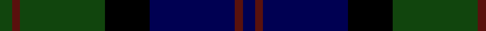
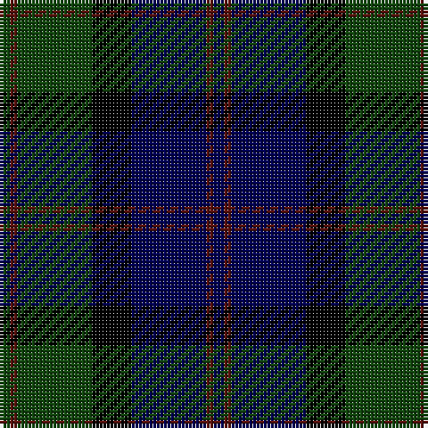

**Bands:** [GBGKBBB](/stripes/gbgkbbb/) · **Stripes:** [DG DR DG K DB DR DB](/stripes/stripes7/) DG DR DG K DB DR DB

This was sourced from weddslist.  It is a [7 band tartan](/bands/bands7/).

Original link http://www.weddslist.com/cgi-bin/tartans/pg.pl?source=x

## Register references

External register numbers recorded for this tartan.

- Scottish Register of Tartans: [1166](https://www.tartanregister.gov.uk/tartanDetails.aspx?ref=1166)
- Scottish Register of Tartans: [1758](https://www.tartanregister.gov.uk/tartanDetails.aspx?ref=1758)
- Scottish Register of Tartans: [2307](https://www.tartanregister.gov.uk/tartanDetails.aspx?ref=2307)
- Scottish Register of Tartans: [2540](https://www.tartanregister.gov.uk/tartanDetails.aspx?ref=2540)
- Scottish Register of Tartans: [2625](https://www.tartanregister.gov.uk/tartanDetails.aspx?ref=2625)
- Scottish Register of Tartans: [2862](https://www.tartanregister.gov.uk/tartanDetails.aspx?ref=2862)
- Scottish Register of Tartans: [982](https://www.tartanregister.gov.uk/tartanDetails.aspx?ref=982)
- Scottish Tartans Authority (ITI): 1429
- Scottish Tartans Authority (ITI): 218
- Scottish Tartans World Register: 1042
- Scottish Tartans World Register: 127
- Scottish Tartans World Register: 1429
- Scottish Tartans World Register: 218
- Scottish Tartans World Register: 2218
- Scottish Tartans World Register: 737
- Scottish Tartans World Register: 897

## Variants

Other setts woven to the same stripe pattern.

- [MacThomas](/setts/s7/dg3dr2dg21k11db21dr2db3~x2/)

## Thread count
DG/3 DR2 DG21 K11 DB21 DR2 DB/3

## Palette
Each colour and its ΔE from the base-6 reference it is a variant of.

| Colour | Shade | Base | ΔE (OKLab) |
|---|---|---|---|
| DB | <code style="background-color:#000052;">#000052</code> `#000052` | B <code style="background-color:#2A418A;">#2A418A</code> | 0.20 |
| DG | <code style="background-color:#11450D;">#11450D</code> `#11450D` | G <code style="background-color:#006100;">#006100</code> | 0.09 |
| DR | <code style="background-color:#59110D;">#59110D</code> `#59110D` | B <code style="background-color:#2A418A;">#2A418A</code> | 0.22 |
| K | <code style="background-color:#000000;">#000000</code> `#000000` | K <code style="background-color:#000000;">#000000</code> | 0.00 |

# Sample pattern

## Nearest tartans

The nearest existing variants by ΔTartan distance.

1. [MacThomas](/setts/s7/dg3dr2dg21k11db21dr2db3~x2/) — ΔT 0.00
1. [MacThomas LC](/setts/s7/dg5dp3dg32k16db32dp3db5/) — ΔT 0.72
1. [MacThomas LC](/setts/s7/dg5n3dg32k16db32dp3db5~x2/) — ΔT 0.88
1. [MacThomas LC](/setts/s7/dg5n3dg32k16db32dp3db5/) — ΔT 0.88
1. [Abercrombie D](/setts/s9/dg14lr1dg7k7db2k2db2k2db14~x2/) — ΔT 0.94
1. [Abercrombie D](/setts/s9/dg14lr1dg7k7db2k2db2k2db14/) — ΔT 0.94
1. [Reid and Taylor](/setts/s7/k2g10k9db9r1k1db2~x2/) — ΔT 0.95
1. [Gunn](/setts/s6/dg2db12dg1k12dg12r2~x2/) — ΔT 0.99
1. [Renfrew](/setts/s7/db6k2db18k18g18k3r2~x2/) — ΔT 0.99
1. [National Galleries of Scotland](/setts/s7/k7g22k22db6r2db15r2~x2/) — ΔT 1.00

## Neighbour map

Every grey dot is one of 14299 variants placed by the first two principal components of the ΔTartan feature space (44% of its variance). Red is this tartan; blue dots are its nearest — click one to open its page.

<svg viewBox="0 0 640 380" role="img" style="max-width:100%;height:auto;border:1px solid #e0e0e0;border-radius:4px;display:block" xmlns="http://www.w3.org/2000/svg"><image href="/nn/cloud.v1.png" width="640" height="380"/><a href="/setts/s7/dg3dr2dg21k11db21dr2db3~x2/"><circle cx="250.5" cy="232.0" r="4" fill="#3465a4"><title>MacThomas</title></circle></a><a href="/setts/s7/dg5dp3dg32k16db32dp3db5/"><circle cx="234.9" cy="223.5" r="4" fill="#3465a4"><title>MacThomas LC</title></circle></a><a href="/setts/s7/dg5n3dg32k16db32dp3db5~x2/"><circle cx="230.4" cy="213.6" r="4" fill="#3465a4"><title>MacThomas LC</title></circle></a><a href="/setts/s7/dg5n3dg32k16db32dp3db5/"><circle cx="230.4" cy="213.6" r="4" fill="#3465a4"><title>MacThomas LC</title></circle></a><a href="/setts/s9/dg14lr1dg7k7db2k2db2k2db14~x2/"><circle cx="252.8" cy="207.4" r="4" fill="#3465a4"><title>Abercrombie D</title></circle></a><a href="/setts/s9/dg14lr1dg7k7db2k2db2k2db14/"><circle cx="252.8" cy="207.4" r="4" fill="#3465a4"><title>Abercrombie D</title></circle></a><a href="/setts/s7/k2g10k9db9r1k1db2~x2/"><circle cx="221.3" cy="231.7" r="4" fill="#3465a4"><title>Reid and Taylor</title></circle></a><a href="/setts/s6/dg2db12dg1k12dg12r2~x2/"><circle cx="218.1" cy="235.5" r="4" fill="#3465a4"><title>Gunn</title></circle></a><a href="/setts/s7/db6k2db18k18g18k3r2~x2/"><circle cx="219.3" cy="238.9" r="4" fill="#3465a4"><title>Renfrew</title></circle></a><a href="/setts/s7/k7g22k22db6r2db15r2~x2/"><circle cx="218.5" cy="229.4" r="4" fill="#3465a4"><title>National Galleries of Scotland</title></circle></a><circle cx="250.5" cy="232.0" r="5" fill="#c00000"/></svg>

ID: /setts/s7/dg3dr2dg21k11db21dr2db3/
