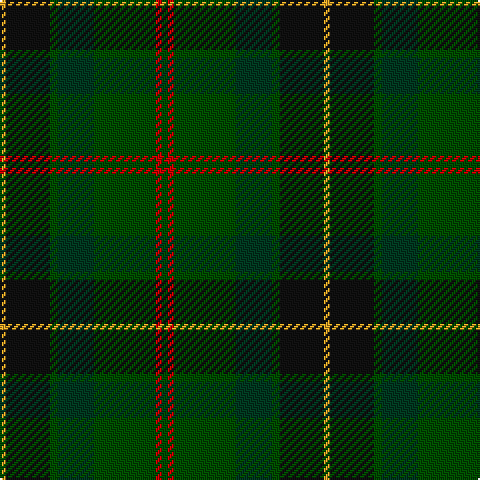

In pattern [GRGGGKY](/stripes/grgggky/).

This was sourced from register-of-tartans.  It is a [7 stripe tartan](/stripes/stripes7/).

Original link https://www.tartanregister.gov.uk/tartanDetails.aspx?ref=10888

## Also known as

This cloth is also recorded under:

- MacSween Hunting (Lochs, Isle of Lew

## Register references

External register numbers recorded for this tartan.

- Scottish Register of Tartans: [10888](https://www.tartanregister.gov.uk/tartanDetails.aspx?ref=10888)

## Thread count
Y/3 K22 G4 DG18 G31 R3 G/3

## Palette
Each colour and the base-6 reference it is a variant of.

| Colour | Shade | Base |
|---|---|---|
| DG | <code style="background-color:#003820;">#003820</code> `oklch(30.0% 0.070 158.3)` <small>#003820</small> | G <code style="background-color:#006100;">#006100</code> |
| G | <code style="background-color:#004C00;">#004C00</code> `oklch(36.1% 0.123 142.5)` <small>#004C00</small> | G <code style="background-color:#006100;">#006100</code> |
| K | <code style="background-color:#101010;">#101010</code> `oklch(17.3% 0.000 89.9)` <small>#101010</small> | K <code style="background-color:#000000;">#000000</code> |
| R | <code style="background-color:#C80000;">#C80000</code> `oklch(52.3% 0.215 29.2)` <small>#C80000</small> | R <code style="background-color:#CC0000;">#CC0000</code> |
| Y | <code style="background-color:#E0A126;">#E0A126</code> `oklch(75.1% 0.146 78.3)` <small>#E0A126</small> | Y <code style="background-color:#F2BF00;">#F2BF00</code> |

# Sample pattern

## Nearest tartans

The nearest existing variants by ΔTartan distance, with this tartan at the top so the swatches line up against it.

ΔTartan

Tartan

Sett

—

<a href="/ttd/edit/#slug=dg3r3dg31dg18dg4k22lo3">MacSween Hunting (Lochs, Isle of Lewis) (Personal)</a> <a class="nn-out" href="/setts/s7/dg3r3dg31dg18dg4k22lo3/" title="open its dictionary page">↗</a>

1.22

<a href="/ttd/edit/#slug=g31dg7lo3dg14g8db18dp5~x2">Reidy Wedding</a> <a class="nn-out" href="/setts/s7/g31dg7lo3dg14g8db18dp5~x2/" title="open its dictionary page">↗</a>

1.28

<a href="/ttd/edit/#slug=dt14k5dp5k5dt14dg32r4~x2">Bennachie (Whisky)</a> <a class="nn-out" href="/setts/s7/dt14k5dp5k5dt14dg32r4~x2/" title="open its dictionary page">↗</a>

1.28

<a href="/ttd/edit/#slug=g5k2g28k10dy26db4g4~x2">John Telfar Dunbar/Hunting Tartan Tartan Number: 776. Earliest known date: pre 2003 Check this entry... See products available Copyright © Blair Urquhart, Comrie, 2015</a> <a class="nn-out" href="/setts/s7/g5k2g28k10dy26db4g4~x2/" title="open its dictionary page">↗</a>

1.29

<a href="/ttd/edit/#slug=dg6ly3dg26k10n30lb3~x2">Montrose (1983)</a> <a class="nn-out" href="/setts/s6/dg6ly3dg26k10n30lb3~x2/" title="open its dictionary page">↗</a>

1.29

<a href="/ttd/edit/#slug=r4n38k4n6k41dg62y4">Bennett, John Paul (Personal)</a> <a class="nn-out" href="/setts/s7/r4n38k4n6k41dg62y4/" title="open its dictionary page">↗</a>

1.35

<a href="/ttd/edit/#slug=r2dy1dg9y1dy2y6g2y1~x4">Tomass</a> <a class="nn-out" href="/setts/s8/r2dy1dg9y1dy2y6g2y1~x4/" title="open its dictionary page">↗</a>

1.39

<a href="/ttd/edit/#slug=g15lo1do2db5k4dg5~x6">Dobson (Palm Bay) (Personal)</a> <a class="nn-out" href="/setts/s6/g15lo1do2db5k4dg5~x6/" title="open its dictionary page">↗</a>

1.41

<a href="/ttd/edit/#slug=o3dg13dt13lo2dg34w3~x2">Glencross (Tynron) (Personal)</a> <a class="nn-out" href="/setts/s6/o3dg13dt13lo2dg34w3~x2/" title="open its dictionary page">↗</a>

1.44

<a href="/ttd/edit/#slug=dg22r3dt10b2dt10r21dg22r3ly2dt2~x2">Glasgow Cathedral 2000</a> <a class="nn-out" href="/setts/s10/dg22r3dt10b2dt10r21dg22r3ly2dt2~x2/" title="open its dictionary page">↗</a>

1.46

<a href="/ttd/edit/#slug=g3r3g31dg18g4k22ly3">MacSween Hunting (Lochs, Isle of Lew</a> <a class="nn-out" href="/setts/s7/g3r3g31dg18g4k22ly3/" title="open its dictionary page">↗</a>

## Neighbour map

Every grey dot is one of 14299 variants placed by the first two principal components of the ΔTartan feature space (44% of its variance). Red is this tartan; blue dots are its nearest — click one to open its page.

<svg viewBox="0 0 640 380" role="img" style="max-width:100%;height:auto;border:1px solid #e0e0e0;border-radius:4px;display:block" xmlns="http://www.w3.org/2000/svg"><image href="/nn/cloud.v1.png" width="640" height="380"/><a href="/setts/s7/g31dg7lo3dg14g8db18dp5~x2/"><circle cx="245.7" cy="231.1" r="4" fill="#3465a4"><title>Reidy Wedding</title></circle></a><a href="/setts/s7/dt14k5dp5k5dt14dg32r4~x2/"><circle cx="252.6" cy="242.9" r="4" fill="#3465a4"><title>Bennachie (Whisky)</title></circle></a><a href="/setts/s7/g5k2g28k10dy26db4g4~x2/"><circle cx="333.4" cy="234.2" r="4" fill="#3465a4"><title>John Telfar Dunbar/Hunting Tartan Tartan Number: 776. Earliest known date: pre 2003 Check this entry... See products available Copyright © Blair Urquhart, Comrie, 2015</title></circle></a><a href="/setts/s6/dg6ly3dg26k10n30lb3~x2/"><circle cx="254.3" cy="228.2" r="4" fill="#3465a4"><title>Montrose (1983)</title></circle></a><a href="/setts/s7/r4n38k4n6k41dg62y4/"><circle cx="291.5" cy="211.6" r="4" fill="#3465a4"><title>Bennett, John Paul (Personal)</title></circle></a><a href="/setts/s8/r2dy1dg9y1dy2y6g2y1~x4/"><circle cx="234.2" cy="220.5" r="4" fill="#3465a4"><title>Tomass</title></circle></a><a href="/setts/s6/g15lo1do2db5k4dg5~x6/"><circle cx="266.3" cy="207.4" r="4" fill="#3465a4"><title>Dobson (Palm Bay) (Personal)</title></circle></a><a href="/setts/s6/o3dg13dt13lo2dg34w3~x2/"><circle cx="302.3" cy="193.3" r="4" fill="#3465a4"><title>Glencross (Tynron) (Personal)</title></circle></a><a href="/setts/s10/dg22r3dt10b2dt10r21dg22r3ly2dt2~x2/"><circle cx="271.8" cy="201.3" r="4" fill="#3465a4"><title>Glasgow Cathedral 2000</title></circle></a><a href="/setts/s7/g3r3g31dg18g4k22ly3/"><circle cx="240.1" cy="207.8" r="4" fill="#3465a4"><title>MacSween Hunting (Lochs, Isle of Lew</title></circle></a><circle cx="277.4" cy="229.4" r="5" fill="#c00000"/></svg>

ID: /setts/s7/dg3r3dg31dg18dg4k22lo3/
