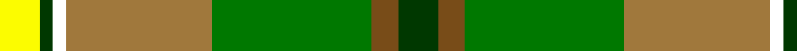
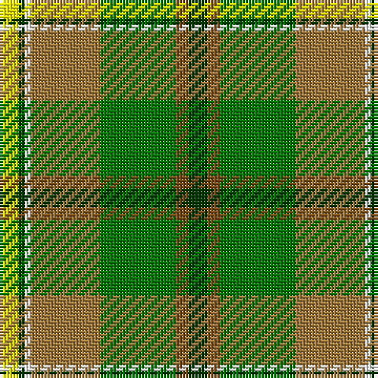

In pattern [GGGRWGY](/stripes/gggrwgy/).

This was sourced from register-of-tartans.  It is a [7 stripe tartan](/stripes/stripes7/).

Original link https://www.tartanregister.gov.uk/tartanDetails.aspx?ref=334

## Register references

External register numbers recorded for this tartan.

- Scottish Register of Tartans: [334](https://www.tartanregister.gov.uk/tartanDetails.aspx?ref=334)
- Scottish Tartans Authority (ITI): 908
- Scottish Tartans World Register: 908

## Thread count
Y/6 G2 W2 LT22 Ga24 T4 G/6

## Palette
Each colour and its ΔE from the base-6 reference it is a variant of.

| Colour | Shade | Base | ΔE (OKLab) |
|---|---|---|---|
| G | <code style="background-color:#003800;">#003800</code> `#003800` | G <code style="background-color:#006100;">#006100</code> | 0.14 |
| Ga | <code style="background-color:#007800;">#007800</code> `#007800` | G <code style="background-color:#006100;">#006100</code> | 0.07 |
| LT | <code style="background-color:#A0783C;">#A0783C</code> `#A0783C` | R <code style="background-color:#CC0000;">#CC0000</code> | 0.18 |
| T | <code style="background-color:#784C18;">#784C18</code> `#784C18` | G <code style="background-color:#006100;">#006100</code> | 0.15 |
| W | <code style="background-color:#FFFFFF;">#FFFFFF</code> `#FFFFFF` | W <code style="background-color:#F7F7F7;">#F7F7F7</code> | 0.02 |
| Y | <code style="background-color:#FCFC00;">#FCFC00</code> `#FCFC00` | Y <code style="background-color:#F2BF00;">#F2BF00</code> | 0.15 |

# Sample pattern

## Nearest tartans

The nearest existing variants by ΔTartan distance.

1. [Jolley (Personal)](/setts/s8/g4n2g24dy10ly12r1ly12g2~x2/) — ΔT 1.22
1. [McShane (Personal)](/setts/s8/g9lb2g9k2dy14ly4lb2r2~x4/) — ΔT 1.36
1. [Breacan](/setts/s12/o3w1o1w3g1w1g10g2g1g10ly2r2~x2/) — ΔT 1.37
1. [Dalwhinnie Trade Tartan Tartan Number: 1018. Earliest known date: 1982 Reconstructed and woven by Don Rankin from illustration. Sample in STS collection. See products available Copyright © Blair Urquhart, Comrie, 2015](/setts/s9/dg70ly6o28g56o5g11o5g11lo12/) — ΔT 1.41
1. [Royal Pharmaceutical, Society](/setts/s9/o3lb2g19lb6g2lb6o14m4w2~x2/) — ΔT 1.46
1. [Dalwhinnie](/setts/s9/dg70ly6y28g56y5g11y5g11lo12/) — ΔT 1.49
1. [Dalwhinnie](/setts/s9/dg70ly6lr28g56lr5g11lr5g11r12/) — ΔT 1.52
1. [Botherston (Name)](/setts/s8/r2lo24r2lo3r2g24k8ly2~x2/) — ΔT 1.54
1. [Kilkenny](/setts/s7/m5dg27o2g25ly7dg3m3~x2/) — ΔT 1.55
1. [Waterford](/setts/s6/g42ly2g16db7dr16r5~x2/) — ΔT 1.56

## Neighbour map

Every grey dot is one of 14299 variants placed by the first two principal components of the ΔTartan feature space (44% of its variance). Red is this tartan; blue dots are its nearest — click one to open its page.

<svg viewBox="0 0 640 380" role="img" style="max-width:100%;height:auto;border:1px solid #e0e0e0;border-radius:4px;display:block" xmlns="http://www.w3.org/2000/svg"><image href="/nn/cloud.v1.png" width="640" height="380"/><a href="/setts/s8/g4n2g24dy10ly12r1ly12g2~x2/"><circle cx="207.5" cy="138.5" r="4" fill="#3465a4"><title>Jolley (Personal)</title></circle></a><a href="/setts/s8/g9lb2g9k2dy14ly4lb2r2~x4/"><circle cx="156.5" cy="189.2" r="4" fill="#3465a4"><title>McShane (Personal)</title></circle></a><a href="/setts/s12/o3w1o1w3g1w1g10g2g1g10ly2r2~x2/"><circle cx="112.3" cy="127.0" r="4" fill="#3465a4"><title>Breacan</title></circle></a><a href="/setts/s9/dg70ly6o28g56o5g11o5g11lo12/"><circle cx="203.3" cy="161.5" r="4" fill="#3465a4"><title>Dalwhinnie Trade Tartan Tartan Number: 1018. Earliest known date: 1982 Reconstructed and woven by Don Rankin from illustration. Sample in STS collection. See products available Copyright © Blair Urquhart, Comrie, 2015</title></circle></a><a href="/setts/s9/o3lb2g19lb6g2lb6o14m4w2~x2/"><circle cx="155.0" cy="164.4" r="4" fill="#3465a4"><title>Royal Pharmaceutical, Society</title></circle></a><a href="/setts/s9/dg70ly6y28g56y5g11y5g11lo12/"><circle cx="206.6" cy="164.3" r="4" fill="#3465a4"><title>Dalwhinnie</title></circle></a><a href="/setts/s9/dg70ly6lr28g56lr5g11lr5g11r12/"><circle cx="222.1" cy="170.4" r="4" fill="#3465a4"><title>Dalwhinnie</title></circle></a><a href="/setts/s8/r2lo24r2lo3r2g24k8ly2~x2/"><circle cx="226.9" cy="162.0" r="4" fill="#3465a4"><title>Botherston (Name)</title></circle></a><a href="/setts/s7/m5dg27o2g25ly7dg3m3~x2/"><circle cx="202.7" cy="165.0" r="4" fill="#3465a4"><title>Kilkenny</title></circle></a><a href="/setts/s6/g42ly2g16db7dr16r5~x2/"><circle cx="240.5" cy="160.5" r="4" fill="#3465a4"><title>Waterford</title></circle></a><circle cx="158.8" cy="158.4" r="5" fill="#c00000"/></svg>

ID: /setts/s7/dg3y2g12o11w1dg1ly3~x2/
