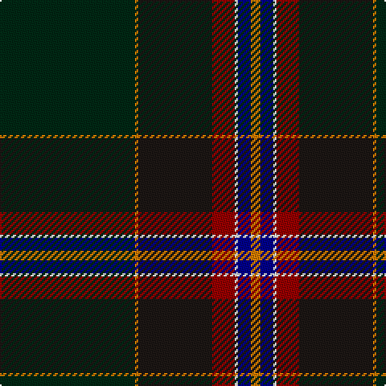

In pattern [GYKRWBY](/stripes/gykrwby/).

This was sourced from register-of-tartans.  It is a [7 stripe tartan](/stripes/stripes7/).

Original link https://www.tartanregister.gov.uk/tartanDetails.aspx?ref=11547

## Register references

External register numbers recorded for this tartan.

- Scottish Register of Tartans: [11547](https://www.tartanregister.gov.uk/tartanDetails.aspx?ref=11547)

## Thread count
DG/84 O2 K46 DR14 W2 DB8 O/6

## Palette
Each colour and its ΔE from the base-6 reference it is a variant of.

| Colour | Shade | Base | ΔE (OKLab) |
|---|---|---|---|
| DB | <code style="background-color:#00008C;">#00008C</code> `#00008C` | B <code style="background-color:#2A418A;">#2A418A</code> | 0.13 |
| DG | <code style="background-color:#002814;">#002814</code> `#002814` | G <code style="background-color:#006100;">#006100</code> | 0.20 |
| DR | <code style="background-color:#960000;">#960000</code> `#960000` | R <code style="background-color:#CC0000;">#CC0000</code> | 0.12 |
| K | <code style="background-color:#1C1714;">#1C1714</code> `#1C1714` | K <code style="background-color:#000000;">#000000</code> | 0.21 |
| O | <code style="background-color:#D87C00;">#D87C00</code> `#D87C00` | Y <code style="background-color:#F2BF00;">#F2BF00</code> | 0.17 |
| W | <code style="background-color:#F8F8F8;">#F8F8F8</code> `#F8F8F8` | W <code style="background-color:#F7F7F7;">#F7F7F7</code> | 0.00 |

# Sample pattern

## Nearest tartans

The nearest existing variants by ΔTartan distance.

1. [Downs](/setts/s8/db10ly2dg2w1dg18r1k45r2~x2/) — ΔT 0.75
1. [Downs (Name)](/setts/s8/b10lr2k2b1k18lr1k45lr2~x2/) — ΔT 1.09
1. [Pictou County](/setts/s8/dp23w1o3w1dp12lo9dg40dp3~x2/) — ΔT 1.33
1. [Muir-Hill (Personal)](/setts/s7/w2k2r1dt20k15dg30ly1~x2/) — ΔT 1.37
1. [Zorra Caledonian Society (Corporate](/setts/s10/dg3w2dg39k3t3k3dg3k20g10r2~x2/) — ΔT 1.59
1. [Unidentified, Toy Bear](/setts/s8/dg47ly2dg5ly2dg4k15db19r2~x2/) — ΔT 1.59
1. [Stansbury](/setts/s8/dg28r3k28db8t1dg8r2k3~x2/) — ΔT 1.60
1. [Rikaco Heirloom](/setts/s10/k3n3k1dg26k10y1k3dp5n4y2~x2/) — ΔT 1.61
1. [RCACA](/setts/s10/k4r1w1r2k48dr4w1db30ly2r2~x2/) — ΔT 1.63
1. [Police College Tulliallan](/setts/s7/db2k4k36g1k34db4w2~x2/) — ΔT 1.63

## Neighbour map

Every grey dot is one of 14299 variants placed by the first two principal components of the ΔTartan feature space (44% of its variance). Red is this tartan; blue dots are its nearest — click one to open its page.

<svg viewBox="0 0 640 380" role="img" style="max-width:100%;height:auto;border:1px solid #e0e0e0;border-radius:4px;display:block" xmlns="http://www.w3.org/2000/svg"><image href="/nn/cloud.v1.png" width="640" height="380"/><a href="/setts/s8/db10ly2dg2w1dg18r1k45r2~x2/"><circle cx="391.9" cy="119.5" r="4" fill="#3465a4"><title>Downs</title></circle></a><a href="/setts/s8/b10lr2k2b1k18lr1k45lr2~x2/"><circle cx="378.5" cy="114.2" r="4" fill="#3465a4"><title>Downs (Name)</title></circle></a><a href="/setts/s8/dp23w1o3w1dp12lo9dg40dp3~x2/"><circle cx="294.3" cy="124.3" r="4" fill="#3465a4"><title>Pictou County</title></circle></a><a href="/setts/s7/w2k2r1dt20k15dg30ly1~x2/"><circle cx="291.3" cy="161.0" r="4" fill="#3465a4"><title>Muir-Hill (Personal)</title></circle></a><a href="/setts/s10/dg3w2dg39k3t3k3dg3k20g10r2~x2/"><circle cx="317.2" cy="141.9" r="4" fill="#3465a4"><title>Zorra Caledonian Society (Corporate</title></circle></a><a href="/setts/s8/dg47ly2dg5ly2dg4k15db19r2~x2/"><circle cx="391.9" cy="172.1" r="4" fill="#3465a4"><title>Unidentified, Toy Bear</title></circle></a><a href="/setts/s8/dg28r3k28db8t1dg8r2k3~x2/"><circle cx="349.2" cy="184.1" r="4" fill="#3465a4"><title>Stansbury</title></circle></a><a href="/setts/s10/k3n3k1dg26k10y1k3dp5n4y2~x2/"><circle cx="286.8" cy="133.7" r="4" fill="#3465a4"><title>Rikaco Heirloom</title></circle></a><a href="/setts/s10/k4r1w1r2k48dr4w1db30ly2r2~x2/"><circle cx="389.0" cy="89.1" r="4" fill="#3465a4"><title>RCACA</title></circle></a><a href="/setts/s7/db2k4k36g1k34db4w2~x2/"><circle cx="322.0" cy="145.9" r="4" fill="#3465a4"><title>Police College Tulliallan</title></circle></a><circle cx="362.7" cy="135.5" r="5" fill="#c00000"/></svg>

ID: /setts/s7/dg42lo1k23r7w1db4lo3~x2/
