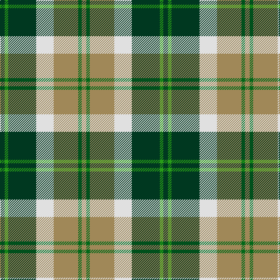

This page is one **sett** — a single exact thread-count. It belongs to the [tartan](/tartans/dg4g3dg24w15lo21gi3lo4/)
(the same proportion at any scale), whose colour order is pattern [GGGWYGY](/stripes/gggwygy/).

Sourced from register-of-tartans.  It is a [7 stripe tartan](/stripes/stripes7/).

Original link https://www.tartanregister.gov.uk/tartanDetails.aspx?ref=197

## Register references

External register numbers recorded for this tartan.

- Scottish Register of Tartans: [197](https://www.tartanregister.gov.uk/tartanDetails.aspx?ref=197)
- Scottish Tartans Authority (ITI): 761
- Scottish Tartans World Register: 761

## Thread count
DG/8 Ga6 DG48 LN30 LT42 G6 LT/8

## Palette

Palette: <strong>Tartan Register</strong>
<table><thead><tr><th>Colour</th><th>Threads</th><th>Shade</th><th>Base</th><th>OKLCh</th></tr></thead><tbody><tr><td>DG/</td><td style="text-align:right;font-variant-numeric:tabular-nums">8</td><td><code style="background-color:#003820;">#003820</code> <small style="color:#888">#003820</small></td><td>G <code style="background-color:#006100;">#006100</code></td><td><small style="color:#888">oklch(30.0% 0.070 158.3)</small></td></tr><tr><td>Ga</td><td style="text-align:right;font-variant-numeric:tabular-nums">6</td><td><code style="background-color:#289C18;">#289C18</code> <small style="color:#888">#289C18</small></td><td>G <code style="background-color:#006100;">#006100</code></td><td><small style="color:#888">oklch(60.6% 0.191 141.6)</small></td></tr><tr><td>DG</td><td style="text-align:right;font-variant-numeric:tabular-nums">48</td><td><code style="background-color:#003820;">#003820</code> <small style="color:#888">#003820</small></td><td>G <code style="background-color:#006100;">#006100</code></td><td><small style="color:#888">oklch(30.0% 0.070 158.3)</small></td></tr><tr><td>LN</td><td style="text-align:right;font-variant-numeric:tabular-nums">30</td><td><code style="background-color:#E0E0E0;">#E0E0E0</code> <small style="color:#888">#E0E0E0</small></td><td>W <code style="background-color:#F7F7F7;">#F7F7F7</code></td><td><small style="color:#888">oklch(90.7% 0.000 89.9)</small></td></tr><tr><td>LT</td><td style="text-align:right;font-variant-numeric:tabular-nums">42</td><td><code style="background-color:#A08858;">#A08858</code> <small style="color:#888">#A08858</small></td><td>Y <code style="background-color:#F2BF00;">#F2BF00</code></td><td><small style="color:#888">oklch(63.7% 0.071 84.0)</small></td></tr><tr><td>G</td><td style="text-align:right;font-variant-numeric:tabular-nums">6</td><td><code style="background-color:#006818;">#006818</code> <small style="color:#888">#006818</small></td><td>G <code style="background-color:#006100;">#006100</code></td><td><small style="color:#888">oklch(45.0% 0.142 145.0)</small></td></tr><tr><td>LT/</td><td style="text-align:right;font-variant-numeric:tabular-nums">8</td><td><code style="background-color:#A08858;">#A08858</code> <small style="color:#888">#A08858</small></td><td>Y <code style="background-color:#F2BF00;">#F2BF00</code></td><td><small style="color:#888">oklch(63.7% 0.071 84.0)</small></td></tr></tbody></table>

# Sample pattern

## Nearest tartans

The nearest existing variants by ΔTartan distance, with this tartan at the top so the swatches line up against it.

ΔTartan

Tartan

Sett

—

<a href="/ttd/edit/#slug=dg4g3dg24w15lo21gi3lo4~x2">Bannockbane Dark Green</a> <a class="nn-out" href="/setts/s7/dg4g3dg24w15lo21gi3lo4~x2/" title="open its dictionary page">↗</a>

0.51

<a href="/ttd/edit/#slug=dg8gi6dg48w31o42g6o8">Bannockbane, Green</a> <a class="nn-out" href="/setts/s7/dg8gi6dg48w31o42g6o8/" title="open its dictionary page">↗</a>

0.83

<a href="/ttd/edit/#slug=g7p3w1lg2g1lp2p1~x8">Lindley-Highfield of Ballumbie Castle</a> <a class="nn-out" href="/setts/s7/g7p3w1lg2g1lp2p1~x8/" title="open its dictionary page">↗</a>

0.88

<a href="/ttd/edit/#slug=g1w1g6db5w6r1g1lo1~x4">Vermont Dress</a> <a class="nn-out" href="/setts/s8/g1w1g6db5w6r1g1lo1~x4/" title="open its dictionary page">↗</a>

0.92

<a href="/ttd/edit/#slug=g10dp42r5gi42g42ly5g6">New Mexico (Fashion)</a> <a class="nn-out" href="/setts/s7/g10dp42r5gi42g42ly5g6/" title="open its dictionary page">↗</a>

0.96

<a href="/ttd/edit/#slug=dy17g5db2w12db2ly4g7~x4">Northern Ontario</a> <a class="nn-out" href="/setts/s7/dy17g5db2w12db2ly4g7~x4/" title="open its dictionary page">↗</a>

1.01

<a href="/ttd/edit/#slug=do21r2lg18r2lg18r2dg8w6do10~x2">Red Dirt Girl</a> <a class="nn-out" href="/setts/s9/do21r2lg18r2lg18r2dg8w6do10~x2/" title="open its dictionary page">↗</a>

1.02

<a href="/ttd/edit/#slug=g36lb4g8k29r24w7~x2">Entre Rios Province (Provisional</a> <a class="nn-out" href="/setts/s6/g36lb4g8k29r24w7~x2/" title="open its dictionary page">↗</a>

1.02

<a href="/ttd/edit/#slug=db8w33k15dg17t3dg17t3~x2">MacRobart Dress (Personal)</a> <a class="nn-out" href="/setts/s7/db8w33k15dg17t3dg17t3~x2/" title="open its dictionary page">↗</a>

1.06

<a href="/ttd/edit/#slug=db2y1o1dg6w3o3o1y1">Equorian Olympic</a> <a class="nn-out" href="/setts/s8/db2y1o1dg6w3o3o1y1/" title="open its dictionary page">↗</a>

1.06

<a href="/ttd/edit/#slug=ly5k5g17k6o24k6ly3~x2">Cape Breton District Tartan Tartan Number: 1883. Earliest known date: 1957 In 1907, Mrs Lillian Crewe Walsh of Glace Bay, Cape Breton, wrote a poem in praise of Cape Breton. This poem was given by Mrs Walsh to Mrs Grant in 1957 and the tartan designed to accord with the poem. Grey for our Cape Breton Steel, Green for our lofty See products available Copyright © Blair Urquhart, Comrie, 2015</a> <a class="nn-out" href="/setts/s7/ly5k5g17k6o24k6ly3~x2/" title="open its dictionary page">↗</a>

## Neighbour map

Every grey dot is one of 14359 variants placed by the first two principal components of the ΔTartan feature space (44% of its variance). Red is this tartan; blue dots are its nearest — click one to open its page.

<svg viewBox="0 0 640 380" role="img" style="max-width:100%;height:auto;border:1px solid #e0e0e0;border-radius:4px;display:block" xmlns="http://www.w3.org/2000/svg"><image href="/nn/cloud.v1.png" width="640" height="380"/><a href="/setts/s7/dg8gi6dg48w31o42g6o8/"><circle cx="142.4" cy="185.1" r="4" fill="#3465a4"><title>Bannockbane, Green</title></circle></a><a href="/setts/s7/g7p3w1lg2g1lp2p1~x8/"><circle cx="169.8" cy="188.1" r="4" fill="#3465a4"><title>Lindley-Highfield of Ballumbie Castle</title></circle></a><a href="/setts/s8/g1w1g6db5w6r1g1lo1~x4/"><circle cx="110.5" cy="181.1" r="4" fill="#3465a4"><title>Vermont Dress</title></circle></a><a href="/setts/s7/g10dp42r5gi42g42ly5g6/"><circle cx="171.4" cy="198.8" r="4" fill="#3465a4"><title>New Mexico (Fashion)</title></circle></a><a href="/setts/s7/dy17g5db2w12db2ly4g7~x4/"><circle cx="102.8" cy="176.7" r="4" fill="#3465a4"><title>Northern Ontario</title></circle></a><a href="/setts/s9/do21r2lg18r2lg18r2dg8w6do10~x2/"><circle cx="150.9" cy="164.0" r="4" fill="#3465a4"><title>Red Dirt Girl</title></circle></a><a href="/setts/s6/g36lb4g8k29r24w7~x2/"><circle cx="144.0" cy="194.7" r="4" fill="#3465a4"><title>Entre Rios Province (Provisional</title></circle></a><a href="/setts/s7/db8w33k15dg17t3dg17t3~x2/"><circle cx="114.3" cy="175.9" r="4" fill="#3465a4"><title>MacRobart Dress (Personal)</title></circle></a><a href="/setts/s8/db2y1o1dg6w3o3o1y1/"><circle cx="95.6" cy="195.8" r="4" fill="#3465a4"><title>Equorian Olympic</title></circle></a><a href="/setts/s7/ly5k5g17k6o24k6ly3~x2/"><circle cx="152.1" cy="208.9" r="4" fill="#3465a4"><title>Cape Breton District Tartan Tartan Number: 1883. Earliest known date: 1957 In 1907, Mrs Lillian Crewe Walsh of Glace Bay, Cape Breton, wrote a poem in praise of Cape Breton. This poem was given by Mrs Walsh to Mrs Grant in 1957 and the tartan designed to accord with the poem. Grey for our Cape Breton Steel, Green for our lofty See products available Copyright © Blair Urquhart, Comrie, 2015</title></circle></a><circle cx="144.3" cy="185.5" r="5" fill="#c00000"/></svg>

ID: /setts/s7/dg4g3dg24w15lo21gi3lo4~x2/
