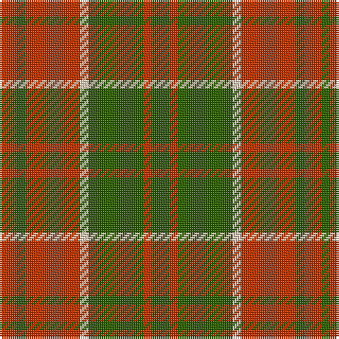

**Bands:** [RGRWGRG](/stripes/rgrwgrg/) · **Stripes:** [R DG R LB DG R DG](/stripes/stripes7/) R DG R LB DG R DG

This was sourced from register-of-tartans.  It is a [7 band tartan](/bands/bands7/).

Original link https://www.tartanregister.gov.uk/tartanDetails.aspx?ref=815

## Also known as

This cloth is also recorded under:

- Crossnor School

## Attestations

This cloth appears in 2 source records; the oldest owns this page.

- 01/01/2001 — Crossnor School (register-of-tartans, [record](https://www.tartanregister.gov.uk/tartanDetails.aspx?ref=815))
- 2001 — Crossnor (Corporate) (tartans-authority, [record](http://www.tartansauthority.com/tartan-ferret/display/6282/))

## Register references

External register numbers recorded for this tartan.

- Scottish Register of Tartans: [815](https://www.tartanregister.gov.uk/tartanDetails.aspx?ref=815)
- Scottish Tartans Authority (ITI): 6282

## Thread count
R/8 G4 R26 LR4 G26 R4 G/8

## Palette
Each colour and its ΔE from the base-6 reference it is a variant of.

| Colour | Shade | Base | ΔE (OKLab) |
|---|---|---|---|
| G | <code style="background-color:#285800;">#285800</code> `#285800` | G <code style="background-color:#006100;">#006100</code> | 0.03 |
| LR | <code style="background-color:#E8CCB8;">#E8CCB8</code> `#E8CCB8` | W <code style="background-color:#F7F7F7;">#F7F7F7</code> | 0.12 |
| R | <code style="background-color:#B03000;">#B03000</code> `#B03000` | R <code style="background-color:#CC0000;">#CC0000</code> | 0.06 |

# Sample pattern

## Nearest tartans

The nearest existing variants by ΔTartan distance.

1. [MacKinnon Hunting](/setts/s7/dg1r8dg8r1dg8r8lb1~x2/) — ΔT 1.16
1. [Unidentified #59](/setts/s7/r1dg4r1lr1r4dg1r1~x4/) — ΔT 1.21
1. [Miyuki #4](/setts/s8/r3lo8r3lo20dy20lo3dy8lo3~x2/) — ΔT 1.28
1. [MacDonald, Lord of The Isles (Artef)](/setts/s5/g16r5g2r18k2~x2/) — ΔT 1.33
1. [Burnett of Powis (Personal)](/setts/s8/r3y19ly3y19r3y3r21t3~x2/) — ΔT 1.36
1. [Burnett](/setts/s8/r4g14ly3g14r4g3r29y4~x2/) — ΔT 1.37
1. [Oakwood](/setts/s8/dg13ly2dg2ly2dg4r10g2r2~x4/) — ΔT 1.41
1. [Unidentified, NW Highlands](/setts/s6/r2g2r16g15r2g2~x2/) — ΔT 1.42
1. [Prince David #1 (Royal)](/setts/s7/dy3lo2dy18lo21lo2dy3lo2~x2/) — ΔT 1.44
1. [Glen Esk (1993)](/setts/s7/dg2r1dg8r5y5r1y2~x4/) — ΔT 1.45

## Neighbour map

Every grey dot is one of 14299 variants placed by the first two principal components of the ΔTartan feature space (44% of its variance). Red is this tartan; blue dots are its nearest — click one to open its page.

<svg viewBox="0 0 640 380" role="img" style="max-width:100%;height:auto;border:1px solid #e0e0e0;border-radius:4px;display:block" xmlns="http://www.w3.org/2000/svg"><image href="/nn/cloud.v1.png" width="640" height="380"/><a href="/setts/s7/dg1r8dg8r1dg8r8lb1~x2/"><circle cx="303.7" cy="240.3" r="4" fill="#3465a4"><title>MacKinnon Hunting</title></circle></a><a href="/setts/s7/r1dg4r1lr1r4dg1r1~x4/"><circle cx="316.3" cy="274.6" r="4" fill="#3465a4"><title>Unidentified #59</title></circle></a><a href="/setts/s8/r3lo8r3lo20dy20lo3dy8lo3~x2/"><circle cx="350.9" cy="255.8" r="4" fill="#3465a4"><title>Miyuki #4</title></circle></a><a href="/setts/s5/g16r5g2r18k2~x2/"><circle cx="352.4" cy="240.2" r="4" fill="#3465a4"><title>MacDonald, Lord of The Isles (Artef)</title></circle></a><a href="/setts/s8/r3y19ly3y19r3y3r21t3~x2/"><circle cx="352.2" cy="225.5" r="4" fill="#3465a4"><title>Burnett of Powis (Personal)</title></circle></a><a href="/setts/s8/r4g14ly3g14r4g3r29y4~x2/"><circle cx="308.6" cy="193.9" r="4" fill="#3465a4"><title>Burnett</title></circle></a><a href="/setts/s8/dg13ly2dg2ly2dg4r10g2r2~x4/"><circle cx="278.8" cy="216.9" r="4" fill="#3465a4"><title>Oakwood</title></circle></a><a href="/setts/s6/r2g2r16g15r2g2~x2/"><circle cx="380.4" cy="242.1" r="4" fill="#3465a4"><title>Unidentified, NW Highlands</title></circle></a><a href="/setts/s7/dy3lo2dy18lo21lo2dy3lo2~x2/"><circle cx="363.9" cy="212.4" r="4" fill="#3465a4"><title>Prince David #1 (Royal)</title></circle></a><a href="/setts/s7/dg2r1dg8r5y5r1y2~x4/"><circle cx="271.1" cy="257.8" r="4" fill="#3465a4"><title>Glen Esk (1993)</title></circle></a><circle cx="327.1" cy="250.2" r="5" fill="#c00000"/></svg>

ID: /setts/s7/dg4r2dg13lb2r13dg2r4~x2/
