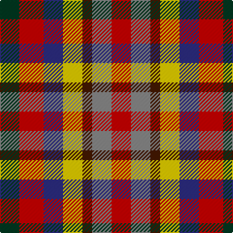

In pattern [GRBYBRR](/stripes/grbybrr/).

This was sourced from tartans-authority.  It is a [7 stripe tartan](/stripes/stripes7/).

Original link http://www.tartansauthority.com/tartan-ferret/display/11232/

## Thread count
DG/20 R25 DB20 Y20 DR10 N20 Ra/20

## Palette
Each colour and the base-6 reference it is a variant of.

| Colour | Shade | Base |
|---|---|---|
| DB | <code style="background-color:#2C2C80;">#2C2C80</code> `oklch(35.0% 0.138 276.6)` <small>#2C2C80</small> | B <code style="background-color:#2A418A;">#2A418A</code> |
| DG | <code style="background-color:#003820;">#003820</code> `oklch(30.0% 0.070 158.3)` <small>#003820</small> | G <code style="background-color:#006100;">#006100</code> |
| DR | <code style="background-color:#441800;">#441800</code> `oklch(27.3% 0.076 46.3)` <small>#441800</small> | B <code style="background-color:#2A418A;">#2A418A</code> |
| N | <code style="background-color:#888888;">#888888</code> `oklch(62.7% 0.000 89.9)` <small>#888888</small> | R <code style="background-color:#CC0000;">#CC0000</code> |
| R | <code style="background-color:#C80000;">#C80000</code> `oklch(52.3% 0.215 29.2)` <small>#C80000</small> | R <code style="background-color:#CC0000;">#CC0000</code> |
| Ra | <code style="background-color:#C80000;">#C80000</code> `oklch(52.3% 0.215 29.2)` <small>#C80000</small> | R <code style="background-color:#CC0000;">#CC0000</code> |
| Y | <code style="background-color:#FCCC00;">#FCCC00</code> `oklch(86.2% 0.176 91.5)` <small>#FCCC00</small> | Y <code style="background-color:#F2BF00;">#F2BF00</code> |

# Sample pattern

## Nearest tartans

The nearest existing variants by ΔTartan distance.

1. [Krifa-Jean (Personal)](/setts/s7/dg4r5ly4db4dy2k4r4~x10/) — ΔT 0.90
1. [Rainbow (Fashion)](/setts/s6/g2ly1lo1r1dp1db1~x36/) — ΔT 1.80
1. [Rainbow](/setts/s6/g2ly1lo1r1p1db1~x36/) — ΔT 1.84
1. [Becker (Name)](/setts/s6/lb3lb2db3r3k3ly1~x8/) — ΔT 2.00
1. [Lytley Formal (Personal)](/setts/s6/db1dt1r1dp2r1ly1~x10/) — ΔT 2.03
1. [Williams, Edmund (Personal)](/setts/s6/dp15dp15g15dg15k8w5~x2/) — ΔT 2.19
1. [Nicolson of Assynt & Coigach (Name)](/setts/s7/db8r11g5db3ly3w5k3~x2/) — ΔT 2.33
1. [Nicolson of Taransay Hunting (Personal)](/setts/s7/r11db3db8w3ly3g5k5~x4/) — ΔT 2.34
1. [Highland Princess, The](/setts/s5/b15g15o11r17m15~x2/) — ΔT 2.39
1. [Tipperary County Crest (Fashion)](/setts/s9/r10lr36k24r30lo8k16w18db16lo9/) — ΔT 2.46

## Neighbour map

Every grey dot is one of 14299 variants placed by the first two principal components of the ΔTartan feature space (44% of its variance). Red is this tartan; blue dots are its nearest — click one to open its page.

<svg viewBox="0 0 640 380" role="img" style="max-width:100%;height:auto;border:1px solid #e0e0e0;border-radius:4px;display:block" xmlns="http://www.w3.org/2000/svg"><image href="/nn/cloud.v1.png" width="640" height="380"/><a href="/setts/s7/dg4r5ly4db4dy2k4r4~x10/"><circle cx="14.0" cy="255.7" r="4" fill="#3465a4"><title>Krifa-Jean (Personal)</title></circle></a><a href="/setts/s6/g2ly1lo1r1dp1db1~x36/"><circle cx="14.0" cy="273.5" r="4" fill="#3465a4"><title>Rainbow (Fashion)</title></circle></a><a href="/setts/s6/g2ly1lo1r1p1db1~x36/"><circle cx="14.0" cy="271.3" r="4" fill="#3465a4"><title>Rainbow</title></circle></a><a href="/setts/s6/lb3lb2db3r3k3ly1~x8/"><circle cx="14.0" cy="254.5" r="4" fill="#3465a4"><title>Becker (Name)</title></circle></a><a href="/setts/s6/db1dt1r1dp2r1ly1~x10/"><circle cx="14.0" cy="276.6" r="4" fill="#3465a4"><title>Lytley Formal (Personal)</title></circle></a><a href="/setts/s6/dp15dp15g15dg15k8w5~x2/"><circle cx="14.0" cy="265.8" r="4" fill="#3465a4"><title>Williams, Edmund (Personal)</title></circle></a><a href="/setts/s7/db8r11g5db3ly3w5k3~x2/"><circle cx="14.0" cy="197.4" r="4" fill="#3465a4"><title>Nicolson of Assynt &amp; Coigach (Name)</title></circle></a><a href="/setts/s7/r11db3db8w3ly3g5k5~x4/"><circle cx="14.0" cy="201.5" r="4" fill="#3465a4"><title>Nicolson of Taransay Hunting (Personal)</title></circle></a><a href="/setts/s5/b15g15o11r17m15~x2/"><circle cx="14.0" cy="343.3" r="4" fill="#3465a4"><title>Highland Princess, The</title></circle></a><a href="/setts/s9/r10lr36k24r30lo8k16w18db16lo9/"><circle cx="14.0" cy="200.8" r="4" fill="#3465a4"><title>Tipperary County Crest (Fashion)</title></circle></a><circle cx="14.0" cy="260.2" r="5" fill="#c00000"/></svg>

ID: /setts/s7/dg4r5db4ly4do2o4r4~x5/
