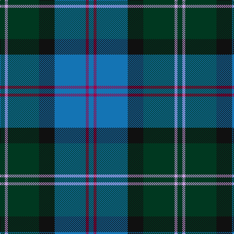

In pattern [BRBKGWG](/stripes/brbkgwg/).

This was sourced from tartans-authority.  It is a [7 stripe tartan](/stripes/stripes7/).

Original link http://www.tartansauthority.com/tartan-ferret/display/407/

## Thread count
DG/10 LP6 DG64 K32 B64 R6 B/10

## Palette
Each colour and the base-6 reference it is a variant of.

| Colour | Shade | Base |
|---|---|---|
| B | <code style="background-color:#1474B4;">#1474B4</code> `oklch(54.0% 0.129 245.1)` <small>#1474B4</small> | B <code style="background-color:#2A418A;">#2A418A</code> |
| DG | <code style="background-color:#003820;">#003820</code> `oklch(30.0% 0.070 158.3)` <small>#003820</small> | G <code style="background-color:#006100;">#006100</code> |
| K | <code style="background-color:#101010;">#101010</code> `oklch(17.3% 0.000 89.9)` <small>#101010</small> | K <code style="background-color:#000000;">#000000</code> |
| LP | <code style="background-color:#C49CD8;">#C49CD8</code> `oklch(75.0% 0.095 314.2)` <small>#C49CD8</small> | W <code style="background-color:#F7F7F7;">#F7F7F7</code> |
| R | <code style="background-color:#A00048;">#A00048</code> `oklch(45.4% 0.182 5.3)` <small>#A00048</small> | R <code style="background-color:#CC0000;">#CC0000</code> |

# Sample pattern

## Nearest tartans

The nearest existing variants by ΔTartan distance.

1. [MacThomas Clan Tartan Tartan Number: 407. Earliest known date: 1975 Designed by David Thomas - former director of the Strathmore Woollen Co. in Forfar who still (in 2011) weave this tartan. Adopted by Clan Society in 1975, and registered with Lord Lyon in 1979. See products available Copyright © Blair Urquhart, Comrie, 2015](/setts/s7/db3m2db22k11g24lp2g3~x2/) — ΔT 0.49
1. [Ednie (Personal)](/setts/s7/b11k4g4m1g4k1r1~x4/) — ΔT 0.68
1. [MacPhail Hunting](/setts/s6/r2db23k14dg16k2w2~x2/) — ΔT 0.75
1. [MacLeod Small Clan Tartan Tartan Number: 15833. Earliest known date: See products available Copyright © Blair Urquhart, Comrie, 2015](/setts/s7/r1k1g7k5db10k1ly1~x2/) — ΔT 0.77
1. [DeLoughery (Personal)](/setts/s6/db20k6lo4db3g20w2~x2/) — ΔT 0.78
1. [Leslie, Hebridean](/setts/s6/k6g15w2db22r2k4~x2/) — ΔT 0.80
1. [Grampian](/setts/s8/g26r2g3db15db26r2db3db4~x2/) — ΔT 0.84
1. [MacLaren](/setts/s7/db12k4g4r1g4k1lo1~x4/) — ΔT 0.85
1. [MacThomas](/setts/s7/g5m3g32k16b32m3b5~x2/) — ΔT 0.86
1. [Dickson (Kirkcudbrightshire) (Name)](/setts/s7/n6db8n8g12dt29w3dt4~x2/) — ΔT 0.90

## Neighbour map

Every grey dot is one of 14299 variants placed by the first two principal components of the ΔTartan feature space (44% of its variance). Red is this tartan; blue dots are its nearest — click one to open its page.

<svg viewBox="0 0 640 380" role="img" style="max-width:100%;height:auto;border:1px solid #e0e0e0;border-radius:4px;display:block" xmlns="http://www.w3.org/2000/svg"><image href="/nn/cloud.v1.png" width="640" height="380"/><a href="/setts/s7/db3m2db22k11g24lp2g3~x2/"><circle cx="233.8" cy="194.8" r="4" fill="#3465a4"><title>MacThomas Clan Tartan Tartan Number: 407. Earliest known date: 1975 Designed by David Thomas - former director of the Strathmore Woollen Co. in Forfar who still (in 2011) weave this tartan. Adopted by Clan Society in 1975, and registered with Lord Lyon in 1979. See products available Copyright © Blair Urquhart, Comrie, 2015</title></circle></a><a href="/setts/s7/b11k4g4m1g4k1r1~x4/"><circle cx="213.1" cy="194.5" r="4" fill="#3465a4"><title>Ednie (Personal)</title></circle></a><a href="/setts/s6/r2db23k14dg16k2w2~x2/"><circle cx="214.9" cy="209.8" r="4" fill="#3465a4"><title>MacPhail Hunting</title></circle></a><a href="/setts/s7/r1k1g7k5db10k1ly1~x2/"><circle cx="196.3" cy="194.4" r="4" fill="#3465a4"><title>MacLeod Small Clan Tartan Tartan Number: 15833. Earliest known date: See products available Copyright © Blair Urquhart, Comrie, 2015</title></circle></a><a href="/setts/s6/db20k6lo4db3g20w2~x2/"><circle cx="206.8" cy="203.1" r="4" fill="#3465a4"><title>DeLoughery (Personal)</title></circle></a><a href="/setts/s6/k6g15w2db22r2k4~x2/"><circle cx="214.6" cy="197.6" r="4" fill="#3465a4"><title>Leslie, Hebridean</title></circle></a><a href="/setts/s8/g26r2g3db15db26r2db3db4~x2/"><circle cx="195.0" cy="174.7" r="4" fill="#3465a4"><title>Grampian</title></circle></a><a href="/setts/s7/db12k4g4r1g4k1lo1~x4/"><circle cx="236.8" cy="186.9" r="4" fill="#3465a4"><title>MacLaren</title></circle></a><a href="/setts/s7/g5m3g32k16b32m3b5~x2/"><circle cx="212.2" cy="198.7" r="4" fill="#3465a4"><title>MacThomas</title></circle></a><a href="/setts/s7/n6db8n8g12dt29w3dt4~x2/"><circle cx="212.8" cy="202.7" r="4" fill="#3465a4"><title>Dickson (Kirkcudbrightshire) (Name)</title></circle></a><circle cx="213.8" cy="200.8" r="5" fill="#c00000"/></svg>

ID: /setts/s7/dg5lp3dg32k16b32m3b5~x2/
