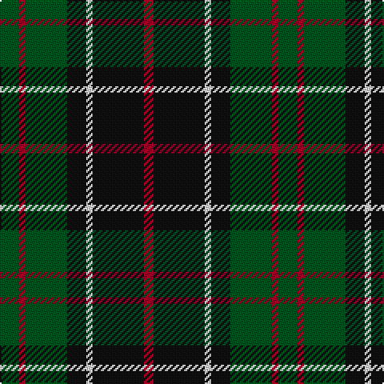

In pattern [GRGKWKR](/stripes/grgkwkr/).

This was sourced from register-of-tartans.  It is a [7 stripe tartan](/stripes/stripes7/).

Original link https://www.tartanregister.gov.uk/tartanDetails.aspx?ref=3796

## Also known as

This cloth is also recorded under:

- Sinclair, hunting

## Register references

External register numbers recorded for this tartan.

- Scottish Register of Tartans: [3796](https://www.tartanregister.gov.uk/tartanDetails.aspx?ref=3796)
- Scottish Tartans World Register: 965

## Thread count
G/12 DR4 G26 K12 LN4 K32 DR/6

## Palette
Each colour and its ΔE from the base-6 reference it is a variant of.

| Colour | Shade | Base | ΔE (OKLab) |
|---|---|---|---|
| DR | <code style="background-color:#960028;">#960028</code> `#960028` | R <code style="background-color:#CC0000;">#CC0000</code> | 0.12 |
| G | <code style="background-color:#005020;">#005020</code> `#005020` | G <code style="background-color:#006100;">#006100</code> | 0.07 |
| K | <code style="background-color:#101010;">#101010</code> `#101010` | K <code style="background-color:#000000;">#000000</code> | 0.17 |
| LN | <code style="background-color:#E0E0E0;">#E0E0E0</code> `#E0E0E0` | W <code style="background-color:#F7F7F7;">#F7F7F7</code> | 0.07 |

# Sample pattern

## Nearest tartans

The nearest existing variants by ΔTartan distance.

1. [Cameron Hunting](/setts/s7/r3dg10r3dg14db16dg3ly2~x2/) — ΔT 0.79
1. [Coburg](/setts/s6/g18t2g4k14dp12k3~x2/) — ΔT 0.83
1. [MacArthur of Milton Hunting Clan Tartan Tartan Number: 700. Earliest known date: 1823 This is the older of the two MacArthur setts, which links the clan with the Campbells. See products available Copyright © Blair Urquhart, Comrie, 2015](/setts/s6/g14db2g2k8dp9k2~x2/) — ΔT 0.94
1. [Wilson's No.167](/setts/s10/k20t2k6g16dp4k9~x2/) — ΔT 0.95
1. [Holman (Personal)](/setts/s6/r3k9g20k16g7b3~x2/) — ΔT 0.96
1. [Cameron Hunting](/setts/s7/r3dg10r3dg14db16dg3ly2/) — ΔT 1.01
1. [Fibonacci7](/setts/s7/db13dg8r5db3dg2r1ly1~x4/) — ΔT 1.04
1. [MacArthur of Milton (Clan)](/setts/s6/g7db1g1k4dp4k1~x4/) — ΔT 1.06
1. [AIton - 1979 (Clan)](/setts/s8/db6k1g3k1db3k1g10r3~x2/) — ΔT 1.11
1. [Graham W](/setts/s6/dg21lr2dg4k17n14k3~x2/) — ΔT 1.12

## Neighbour map

Every grey dot is one of 14299 variants placed by the first two principal components of the ΔTartan feature space (44% of its variance). Red is this tartan; blue dots are its nearest — click one to open its page.

<svg viewBox="0 0 640 380" role="img" style="max-width:100%;height:auto;border:1px solid #e0e0e0;border-radius:4px;display:block" xmlns="http://www.w3.org/2000/svg"><image href="/nn/cloud.v1.png" width="640" height="380"/><a href="/setts/s7/r3dg10r3dg14db16dg3ly2~x2/"><circle cx="285.4" cy="241.4" r="4" fill="#3465a4"><title>Cameron Hunting</title></circle></a><a href="/setts/s6/g18t2g4k14dp12k3~x2/"><circle cx="229.5" cy="248.4" r="4" fill="#3465a4"><title>Coburg</title></circle></a><a href="/setts/s6/g14db2g2k8dp9k2~x2/"><circle cx="221.3" cy="245.2" r="4" fill="#3465a4"><title>MacArthur of Milton Hunting Clan Tartan Tartan Number: 700. Earliest known date: 1823 This is the older of the two MacArthur setts, which links the clan with the Campbells. See products available Copyright © Blair Urquhart, Comrie, 2015</title></circle></a><a href="/setts/s10/k20t2k6g16dp4k9~x2/"><circle cx="267.9" cy="223.4" r="4" fill="#3465a4"><title>Wilson's No.167</title></circle></a><a href="/setts/s6/r3k9g20k16g7b3~x2/"><circle cx="252.3" cy="262.9" r="4" fill="#3465a4"><title>Holman (Personal)</title></circle></a><a href="/setts/s7/r3dg10r3dg14db16dg3ly2/"><circle cx="263.7" cy="229.7" r="4" fill="#3465a4"><title>Cameron Hunting</title></circle></a><a href="/setts/s7/db13dg8r5db3dg2r1ly1~x4/"><circle cx="283.8" cy="207.2" r="4" fill="#3465a4"><title>Fibonacci7</title></circle></a><a href="/setts/s6/g7db1g1k4dp4k1~x4/"><circle cx="233.3" cy="248.6" r="4" fill="#3465a4"><title>MacArthur of Milton (Clan)</title></circle></a><a href="/setts/s8/db6k1g3k1db3k1g10r3~x2/"><circle cx="256.1" cy="215.9" r="4" fill="#3465a4"><title>AIton - 1979 (Clan)</title></circle></a><a href="/setts/s6/dg21lr2dg4k17n14k3~x2/"><circle cx="212.0" cy="226.9" r="4" fill="#3465a4"><title>Graham W</title></circle></a><circle cx="254.0" cy="238.3" r="5" fill="#c00000"/></svg>

ID: /setts/s7/dg6r2dg13k6w2k16r3~x2/
