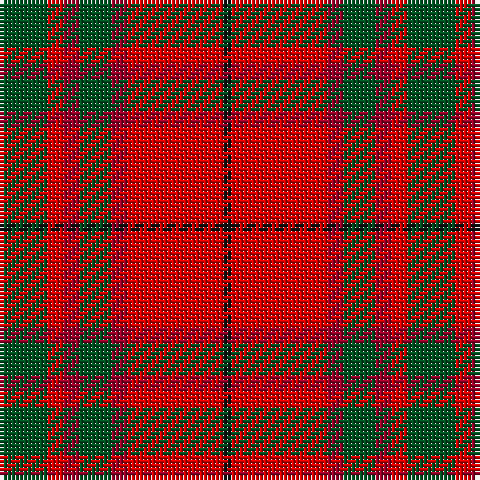

**Bands:** [GRRGRRK](/stripes/grrgrrk/) · **Stripes:** [DG R R DG R R K](/stripes/stripes7/) DG R R DG R R K

This was sourced from register-of-tartans.  It is a [7 band tartan](/bands/bands7/).

Original link https://www.tartanregister.gov.uk/tartanDetails.aspx?ref=2666

## Attestations

This cloth appears in 2 source records; the oldest owns this page.

- undated — MacNab #3 (register-of-tartans, [record](https://www.tartanregister.gov.uk/tartanDetails.aspx?ref=2666))
- undated — MacNab VS (weddslist, [record](http://www.weddslist.com/cgi-bin/tartans/pg.pl?source=rb))

## Register references

External register numbers recorded for this tartan.

- Scottish Register of Tartans: [2540](https://www.tartanregister.gov.uk/tartanDetails.aspx?ref=2540)
- Scottish Register of Tartans: [2666](https://www.tartanregister.gov.uk/tartanDetails.aspx?ref=2666)
- Scottish Register of Tartans: [3808](https://www.tartanregister.gov.uk/tartanDetails.aspx?ref=3808)
- Scottish Tartans Authority (ITI): 218
- Scottish Tartans World Register: 1010
- Scottish Tartans World Register: 1585
- Scottish Tartans World Register: 218

## Thread count
G/12 R4 DR4 G8 DR4 R24 K/2

## Palette
Each colour and its ΔE from the base-6 reference it is a variant of.

| Colour | Shade | Base | ΔE (OKLab) |
|---|---|---|---|
| DR | <code style="background-color:#960028;">#960028</code> `#960028` | R <code style="background-color:#CC0000;">#CC0000</code> | 0.12 |
| G | <code style="background-color:#005020;">#005020</code> `#005020` | G <code style="background-color:#006100;">#006100</code> | 0.07 |
| K | <code style="background-color:#101010;">#101010</code> `#101010` | K <code style="background-color:#000000;">#000000</code> | 0.17 |
| R | <code style="background-color:#DC0000;">#DC0000</code> `#DC0000` | R <code style="background-color:#CC0000;">#CC0000</code> | 0.03 |

# Sample pattern

## Nearest tartans

The nearest existing variants by ΔTartan distance.

1. [MacNab (Crimson)](/setts/s7/dg28r7m7dg14m7r48k4~x2/) — ΔT 0.32
1. [MacNab 5](/setts/s7/g6r2r2g4r2r12k1~x2/) — ΔT 0.67
1. [MacNab 6](/setts/s7/g28r7m7g14m7r48k4~x2/) — ΔT 0.89
1. [Wasko (Personal)](/setts/s7/r8w2m30g12m3g12m3~x2/) — ΔT 0.89
1. [MacDuff #4](/setts/s7/r4k2r24k6db6dg16r3~x2/) — ΔT 0.89
1. [Moray of Abercairney](/setts/s6/r8r1dg4r1dg1t2~x2/) — ΔT 0.92
1. [Chisholm](/setts/s8/r12dp2lb1dp2r3dg8r3dp1~x2/) — ΔT 0.96
1. [Carrick (Strathmore) District Tartan Tartan Number: 3216. Earliest known date: c.1999 Sales help Princess Diana Memorial Trust See products available Copyright © Blair Urquhart, Comrie, 2015](/setts/s7/r28db12r3dg20t2dg2r7~x2/) — ΔT 1.01
1. [Scrymgeour](/setts/s7/r15k1y2db3r2k1y15~x6/) — ΔT 1.02
1. [MacBean/MacElvain](/setts/s7/k2r12db6r3dg12r4db1~x2/) — ΔT 1.03

## Neighbour map

Every grey dot is one of 14313 variants placed by the first two principal components of the ΔTartan feature space (44% of its variance). Red is this tartan; blue dots are its nearest — click one to open its page.

<svg viewBox="0 0 640 380" role="img" style="max-width:100%;height:auto;border:1px solid #e0e0e0;border-radius:4px;display:block" xmlns="http://www.w3.org/2000/svg"><image href="/nn/cloud.v1.png" width="640" height="380"/><a href="/setts/s7/dg28r7m7dg14m7r48k4~x2/"><circle cx="298.4" cy="187.9" r="4" fill="#3465a4"><title>MacNab (Crimson)</title></circle></a><a href="/setts/s7/g6r2r2g4r2r12k1~x2/"><circle cx="288.3" cy="190.5" r="4" fill="#3465a4"><title>MacNab 5</title></circle></a><a href="/setts/s7/g28r7m7g14m7r48k4~x2/"><circle cx="289.6" cy="187.0" r="4" fill="#3465a4"><title>MacNab 6</title></circle></a><a href="/setts/s7/r8w2m30g12m3g12m3~x2/"><circle cx="331.8" cy="186.4" r="4" fill="#3465a4"><title>Wasko (Personal)</title></circle></a><a href="/setts/s7/r4k2r24k6db6dg16r3~x2/"><circle cx="279.2" cy="183.0" r="4" fill="#3465a4"><title>MacDuff #4</title></circle></a><a href="/setts/s6/r8r1dg4r1dg1t2~x2/"><circle cx="271.8" cy="208.3" r="4" fill="#3465a4"><title>Moray of Abercairney</title></circle></a><a href="/setts/s8/r12dp2lb1dp2r3dg8r3dp1~x2/"><circle cx="330.5" cy="178.2" r="4" fill="#3465a4"><title>Chisholm</title></circle></a><a href="/setts/s7/r28db12r3dg20t2dg2r7~x2/"><circle cx="309.1" cy="185.3" r="4" fill="#3465a4"><title>Carrick (Strathmore) District Tartan Tartan Number: 3216. Earliest known date: c.1999 Sales help Princess Diana Memorial Trust See products available Copyright © Blair Urquhart, Comrie, 2015</title></circle></a><a href="/setts/s7/r15k1y2db3r2k1y15~x6/"><circle cx="306.0" cy="166.4" r="4" fill="#3465a4"><title>Scrymgeour</title></circle></a><a href="/setts/s7/k2r12db6r3dg12r4db1~x2/"><circle cx="260.2" cy="198.2" r="4" fill="#3465a4"><title>MacBean/MacElvain</title></circle></a><circle cx="298.1" cy="191.5" r="5" fill="#c00000"/></svg>

ID: /setts/s7/dg6r2r2dg4r2r12k1~x2/
