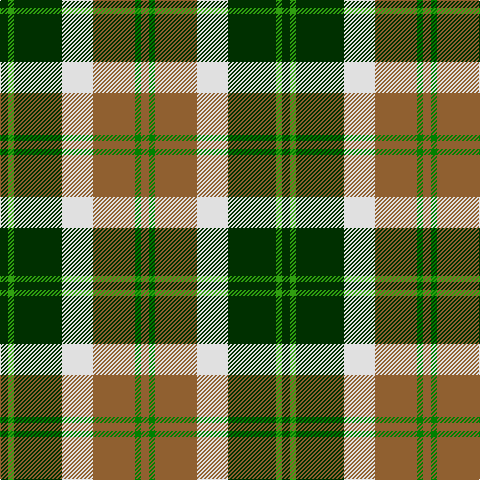

In pattern [GGGWRGR](/stripes/gggwrgr/).

This was sourced from weddslist.  It is a [7 stripe tartan](/stripes/stripes7/).

Original link http://www.weddslist.com/cgi-bin/tartans/pg.pl?source=sts

## Thread count
DG/8 G6 DG48 LN31 LT42 Ga6 LT/8

## Palette
Each colour and the base-6 reference it is a variant of.

| Colour | Shade | Base |
|---|---|---|
| DG | <code style="background-color:#003000;">#003000</code> `oklch(26.8% 0.091 142.5)` <small>#003000</small> | G <code style="background-color:#006100;">#006100</code> |
| G | <code style="background-color:#30A010;">#30A010</code> `oklch(61.9% 0.195 140.5)` <small>#30A010</small> | G <code style="background-color:#006100;">#006100</code> |
| Ga | <code style="background-color:#008000;">#008000</code> `oklch(52.0% 0.177 142.5)` <small>#008000</small> | G <code style="background-color:#006100;">#006100</code> |
| LN | <code style="background-color:#E0E0E0;">#E0E0E0</code> `oklch(90.7% 0.000 89.9)` <small>#E0E0E0</small> | W <code style="background-color:#F7F7F7;">#F7F7F7</code> |
| LT | <code style="background-color:#906030;">#906030</code> `oklch(53.1% 0.089 63.7)` <small>#906030</small> | R <code style="background-color:#CC0000;">#CC0000</code> |

# Sample pattern

## Nearest tartans

The nearest existing variants by ΔTartan distance, with this tartan at the top so the swatches line up against it.

ΔTartan

Tartan

Sett

—

<a href="/ttd/edit/#slug=dg8g6dg48w31o42g6o8">Bannockbane, Green</a> <a class="nn-out" href="/setts/s7/dg8g6dg48w31o42g6o8/" title="open its dictionary page">↗</a>

0.51

<a href="/ttd/edit/#slug=dg4g3dg24w15lo21g3lo4~x2">Bannockbane Dark Green</a> <a class="nn-out" href="/setts/s7/dg4g3dg24w15lo21g3lo4~x2/" title="open its dictionary page">↗</a>

0.80

<a href="/ttd/edit/#slug=g36lb4g8k29r24w7~x2">Entre Rios Province (Provisional</a> <a class="nn-out" href="/setts/s6/g36lb4g8k29r24w7~x2/" title="open its dictionary page">↗</a>

0.89

<a href="/ttd/edit/#slug=do21r2lg18r2lg18r2dg8w6do10~x2">Red Dirt Girl</a> <a class="nn-out" href="/setts/s9/do21r2lg18r2lg18r2dg8w6do10~x2/" title="open its dictionary page">↗</a>

0.96

<a href="/ttd/edit/#slug=k20w4r4g20w5g2g2~x2">Hackett (Personal)</a> <a class="nn-out" href="/setts/s7/k20w4r4g20w5g2g2~x2/" title="open its dictionary page">↗</a>

0.99

<a href="/ttd/edit/#slug=w16dg2k5r2k10dg11ly2dg11k2~x2">Unidentified #46</a> <a class="nn-out" href="/setts/s9/w16dg2k5r2k10dg11ly2dg11k2~x2/" title="open its dictionary page">↗</a>

0.99

<a href="/ttd/edit/#slug=g10dp42r5g42g42ly5g6">New Mexico (Fashion)</a> <a class="nn-out" href="/setts/s7/g10dp42r5g42g42ly5g6/" title="open its dictionary page">↗</a>

1.00

<a href="/ttd/edit/#slug=ly5k5g17k6o24k6ly3~x2">Cape Breton District Tartan Tartan Number: 1883. Earliest known date: 1957 In 1907, Mrs Lillian Crewe Walsh of Glace Bay, Cape Breton, wrote a poem in praise of Cape Breton. This poem was given by Mrs Walsh to Mrs Grant in 1957 and the tartan designed to accord with the poem. Grey for our Cape Breton Steel, Green for our lofty See products available Copyright © Blair Urquhart, Comrie, 2015</a> <a class="nn-out" href="/setts/s7/ly5k5g17k6o24k6ly3~x2/" title="open its dictionary page">↗</a>

1.01

<a href="/ttd/edit/#slug=dg9w2dg9k2lo14lo4w2r2~x4">MacShane (Clan)</a> <a class="nn-out" href="/setts/s8/dg9w2dg9k2lo14lo4w2r2~x4/" title="open its dictionary page">↗</a>

1.01

<a href="/ttd/edit/#slug=g7p3w1lg2g1lp2p1~x8">Lindley-Highfield of Ballumbie Castle</a> <a class="nn-out" href="/setts/s7/g7p3w1lg2g1lp2p1~x8/" title="open its dictionary page">↗</a>

1.05

<a href="/ttd/edit/#slug=g6lr2g10k3r1k3lo10lr2lo6~x4">Eire (District?)</a> <a class="nn-out" href="/setts/s9/g6lr2g10k3r1k3lo10lr2lo6~x4/" title="open its dictionary page">↗</a>

## Neighbour map

Every grey dot is one of 14299 variants placed by the first two principal components of the ΔTartan feature space (44% of its variance). Red is this tartan; blue dots are its nearest — click one to open its page.

<svg viewBox="0 0 640 380" role="img" style="max-width:100%;height:auto;border:1px solid #e0e0e0;border-radius:4px;display:block" xmlns="http://www.w3.org/2000/svg"><image href="/nn/cloud.v1.png" width="640" height="380"/><a href="/setts/s7/dg4g3dg24w15lo21g3lo4~x2/"><circle cx="144.8" cy="184.5" r="4" fill="#3465a4"><title>Bannockbane Dark Green</title></circle></a><a href="/setts/s6/g36lb4g8k29r24w7~x2/"><circle cx="144.7" cy="193.6" r="4" fill="#3465a4"><title>Entre Rios Province (Provisional</title></circle></a><a href="/setts/s9/do21r2lg18r2lg18r2dg8w6do10~x2/"><circle cx="151.6" cy="163.0" r="4" fill="#3465a4"><title>Red Dirt Girl</title></circle></a><a href="/setts/s7/k20w4r4g20w5g2g2~x2/"><circle cx="153.4" cy="166.0" r="4" fill="#3465a4"><title>Hackett (Personal)</title></circle></a><a href="/setts/s9/w16dg2k5r2k10dg11ly2dg11k2~x2/"><circle cx="124.7" cy="176.2" r="4" fill="#3465a4"><title>Unidentified #46</title></circle></a><a href="/setts/s7/g10dp42r5g42g42ly5g6/"><circle cx="171.8" cy="197.9" r="4" fill="#3465a4"><title>New Mexico (Fashion)</title></circle></a><a href="/setts/s7/ly5k5g17k6o24k6ly3~x2/"><circle cx="152.5" cy="207.8" r="4" fill="#3465a4"><title>Cape Breton District Tartan Tartan Number: 1883. Earliest known date: 1957 In 1907, Mrs Lillian Crewe Walsh of Glace Bay, Cape Breton, wrote a poem in praise of Cape Breton. This poem was given by Mrs Walsh to Mrs Grant in 1957 and the tartan designed to accord with the poem. Grey for our Cape Breton Steel, Green for our lofty See products available Copyright © Blair Urquhart, Comrie, 2015</title></circle></a><a href="/setts/s8/dg9w2dg9k2lo14lo4w2r2~x4/"><circle cx="128.0" cy="170.8" r="4" fill="#3465a4"><title>MacShane (Clan)</title></circle></a><a href="/setts/s7/g7p3w1lg2g1lp2p1~x8/"><circle cx="170.4" cy="187.1" r="4" fill="#3465a4"><title>Lindley-Highfield of Ballumbie Castle</title></circle></a><a href="/setts/s9/g6lr2g10k3r1k3lo10lr2lo6~x4/"><circle cx="135.7" cy="175.7" r="4" fill="#3465a4"><title>Eire (District?)</title></circle></a><circle cx="143.0" cy="184.1" r="5" fill="#c00000"/></svg>

ID: /setts/s7/dg8g6dg48w31o42g6o8/
