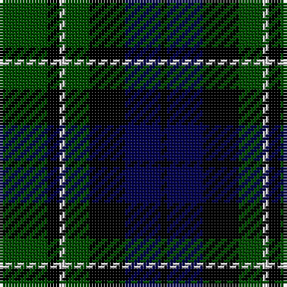

In pattern [GKWGKBK](/stripes/gkwgkbk/).

This was sourced from weddslist.  It is a [7 stripe tartan](/stripes/stripes7/).

Original link http://www.weddslist.com/cgi-bin/tartans/pg.pl?source=rb

## Thread count
G/16 K4 N2 G8 K12 DB12 K/2

## Palette
Each colour and the base-6 reference it is a variant of.

| Colour | Shade | Base |
|---|---|---|
| DB | <code style="background-color:#00004C;">#00004C</code> `oklch(18.8% 0.130 264.1)` <small>#00004C</small> | B <code style="background-color:#2A418A;">#2A418A</code> |
| G | <code style="background-color:#004C00;">#004C00</code> `oklch(36.1% 0.123 142.5)` <small>#004C00</small> | G <code style="background-color:#006100;">#006100</code> |
| K | <code style="background-color:#000000;">#000000</code> `oklch(0.0% 0.000 0.0)` <small>#000000</small> | K <code style="background-color:#000000;">#000000</code> |
| N | <code style="background-color:#D0D0D0;">#D0D0D0</code> `oklch(85.8% 0.000 89.9)` <small>#D0D0D0</small> | W <code style="background-color:#F7F7F7;">#F7F7F7</code> |

# Sample pattern

## Nearest tartans

The nearest existing variants by ΔTartan distance.

1. [MacCallum](/setts/s7/dg8k2b1dg4k6db6k1~x2/) — ΔT 0.78
1. [Scottish Airports](/setts/s6/dt4g18dt3k17dt18dp4~x2/) — ΔT 0.82
1. [Melville](/setts/s6/k5lr2dg18k17n16k3~x2/) — ΔT 0.90
1. [Melville](/setts/s6/k5lr2dg18k17n16k3/) — ΔT 0.90
1. [Graham W](/setts/s6/dg21lb2dg4k17dp14k3/) — ΔT 0.96
1. [Fletcher](/setts/s7/db6k1db6k8r1g8k2~x2/) — ΔT 0.97
1. [Graham W](/setts/s6/dg21lr2dg4k17n14k3~x2/) — ΔT 1.00
1. [Graham W](/setts/s6/dg21lr2dg4k17n14k3/) — ΔT 1.00
1. [Forbes LC](/setts/s7/db1k6db6k6dg6k1lb1/) — ΔT 1.03
1. [Mowat](/setts/s7/db48k6db10k46ly4k22g43/) — ΔT 1.06

## Neighbour map

Every grey dot is one of 14299 variants placed by the first two principal components of the ΔTartan feature space (44% of its variance). Red is this tartan; blue dots are its nearest — click one to open its page.

<svg viewBox="0 0 640 380" role="img" style="max-width:100%;height:auto;border:1px solid #e0e0e0;border-radius:4px;display:block" xmlns="http://www.w3.org/2000/svg"><image href="/nn/cloud.v1.png" width="640" height="380"/><a href="/setts/s7/dg8k2b1dg4k6db6k1~x2/"><circle cx="216.5" cy="256.2" r="4" fill="#3465a4"><title>MacCallum</title></circle></a><a href="/setts/s6/dt4g18dt3k17dt18dp4~x2/"><circle cx="162.3" cy="252.7" r="4" fill="#3465a4"><title>Scottish Airports</title></circle></a><a href="/setts/s6/k5lr2dg18k17n16k3~x2/"><circle cx="195.4" cy="234.6" r="4" fill="#3465a4"><title>Melville</title></circle></a><a href="/setts/s6/k5lr2dg18k17n16k3/"><circle cx="195.4" cy="234.6" r="4" fill="#3465a4"><title>Melville</title></circle></a><a href="/setts/s6/dg21lb2dg4k17dp14k3/"><circle cx="200.8" cy="222.2" r="4" fill="#3465a4"><title>Graham W</title></circle></a><a href="/setts/s7/db6k1db6k8r1g8k2~x2/"><circle cx="158.3" cy="232.2" r="4" fill="#3465a4"><title>Fletcher</title></circle></a><a href="/setts/s6/dg21lr2dg4k17n14k3~x2/"><circle cx="212.0" cy="226.9" r="4" fill="#3465a4"><title>Graham W</title></circle></a><a href="/setts/s6/dg21lr2dg4k17n14k3/"><circle cx="212.0" cy="226.9" r="4" fill="#3465a4"><title>Graham W</title></circle></a><a href="/setts/s7/db1k6db6k6dg6k1lb1/"><circle cx="212.6" cy="258.9" r="4" fill="#3465a4"><title>Forbes LC</title></circle></a><a href="/setts/s7/db48k6db10k46ly4k22g43/"><circle cx="192.7" cy="210.3" r="4" fill="#3465a4"><title>Mowat</title></circle></a><circle cx="194.4" cy="245.0" r="5" fill="#c00000"/></svg>

ID: /setts/s7/dg8k2lb1dg4k6db6k1~x2/
