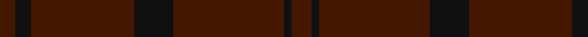
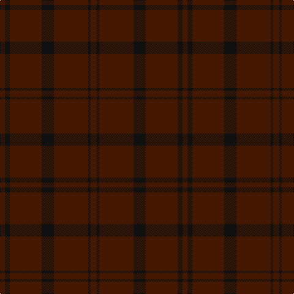

**Bands:** [BKBKBKB](/stripes/bkbkbkb/) · **Stripes:** [DO K DO K DO K DO](/stripes/stripes7/) DO K DO K DO K DO

This was sourced from register-of-tartans.  It is a [7 band tartan](/bands/bands7/).

Original link https://www.tartanregister.gov.uk/tartanDetails.aspx?ref=1020

## Register references

External register numbers recorded for this tartan.

- Scottish Register of Tartans: [1020](https://www.tartanregister.gov.uk/tartanDetails.aspx?ref=1020)
- Scottish Tartans Authority (ITI): 4745

## Thread count
DR/8 K8 DR52 K20 DR56 K4 DR/10

## Palette
Each colour and its ΔE from the base-6 reference it is a variant of.

| Colour | Shade | Base | ΔE (OKLab) |
|---|---|---|---|
| DR | <code style="background-color:#441800;">#441800</code> `#441800` | B <code style="background-color:#2A418A;">#2A418A</code> | 0.23 |
| K | <code style="background-color:#101010;">#101010</code> `#101010` | K <code style="background-color:#000000;">#000000</code> | 0.17 |

# Sample pattern

## Nearest tartans

The nearest existing variants by ΔTartan distance.

1. [Hebridean Cairn Fashion Tartan Tartan Number: 6822. Earliest known date: 2005 For a new House of Edgar Collection in wedding gray. See products available Copyright © Blair Urquhart, Comrie, 2015](/setts/s8/n2y3n3y3n10y2n18y1~x4/) — ΔT 2.09
1. [Ben Dubh (The Black Mount)](/setts/s6/dt4k2dt16k2dt16k1~x4/) — ΔT 2.77
1. [STLTH (Corporate)](/setts/s7/dt4k2dt4k45n2k3n2~x2/) — ΔT 3.07
1. [Taiheiyo Club, Inc.](/setts/s7/k46dg6k6dg6k42dg47k12/) — ΔT 3.07
1. [Hebridean Cairn (Fashion)](/setts/s8/n2o3n3o3n10o2n18o1~x4/) — ΔT 3.08
1. [Scottish Football Association (Corp)](/setts/s6/k120db4k12dt36dg3k6/) — ΔT 3.21
1. [Hebridean Cairn](/setts/s14/n18o2n10o3n3o3n2o3n3o3n10o2n18o1~x4/) — ΔT 3.34
1. [Dark Island](/setts/s16/k4dt2k43dt20k4dt2k2dt4k2dt2k4dt20k43dt2k4dt2~x2/) — ΔT 3.39
1. [Cairns, David (Personal)](/setts/s5/do11n1do4n8r1~x8/) — ΔT 3.45
1. [Hallstatt (Artefact)](/setts/s3/dy16y3dy2~x10/) — ΔT 3.46

## Neighbour map

Every grey dot is one of 14313 variants placed by the first two principal components of the ΔTartan feature space (44% of its variance). Red is this tartan; blue dots are its nearest — click one to open its page.

<svg viewBox="0 0 640 380" role="img" style="max-width:100%;height:auto;border:1px solid #e0e0e0;border-radius:4px;display:block" xmlns="http://www.w3.org/2000/svg"><image href="/nn/cloud.v1.png" width="640" height="380"/><a href="/setts/s8/n2y3n3y3n10y2n18y1~x4/"><circle cx="626.0" cy="322.5" r="4" fill="#3465a4"><title>Hebridean Cairn Fashion Tartan Tartan Number: 6822. Earliest known date: 2005 For a new House of Edgar Collection in wedding gray. See products available Copyright © Blair Urquhart, Comrie, 2015</title></circle></a><a href="/setts/s6/dt4k2dt16k2dt16k1~x4/"><circle cx="626.0" cy="366.0" r="4" fill="#3465a4"><title>Ben Dubh (The Black Mount)</title></circle></a><a href="/setts/s7/dt4k2dt4k45n2k3n2~x2/"><circle cx="626.0" cy="265.5" r="4" fill="#3465a4"><title>STLTH (Corporate)</title></circle></a><a href="/setts/s7/k46dg6k6dg6k42dg47k12/"><circle cx="576.1" cy="366.0" r="4" fill="#3465a4"><title>Taiheiyo Club, Inc.</title></circle></a><a href="/setts/s8/n2o3n3o3n10o2n18o1~x4/"><circle cx="626.0" cy="298.0" r="4" fill="#3465a4"><title>Hebridean Cairn (Fashion)</title></circle></a><a href="/setts/s6/k120db4k12dt36dg3k6/"><circle cx="626.0" cy="264.7" r="4" fill="#3465a4"><title>Scottish Football Association (Corp)</title></circle></a><a href="/setts/s14/n18o2n10o3n3o3n2o3n3o3n10o2n18o1~x4/"><circle cx="626.0" cy="279.9" r="4" fill="#3465a4"><title>Hebridean Cairn</title></circle></a><a href="/setts/s16/k4dt2k43dt20k4dt2k2dt4k2dt2k4dt20k43dt2k4dt2~x2/"><circle cx="626.0" cy="300.0" r="4" fill="#3465a4"><title>Dark Island</title></circle></a><a href="/setts/s5/do11n1do4n8r1~x8/"><circle cx="545.2" cy="340.0" r="4" fill="#3465a4"><title>Cairns, David (Personal)</title></circle></a><a href="/setts/s3/dy16y3dy2~x10/"><circle cx="626.0" cy="366.0" r="4" fill="#3465a4"><title>Hallstatt (Artefact)</title></circle></a><circle cx="626.0" cy="356.2" r="5" fill="#c00000"/></svg>

ID: /setts/s7/do5k2do28k10do26k4do4~x2/
