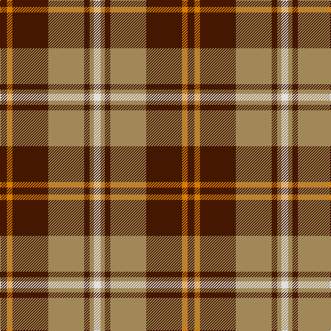

In pattern [BYBYBYW](/stripes/bybybyw/).

This was sourced from house-of-tartan.  It is a [7 stripe tartan](/stripes/stripes7/).

Original link http://www.house-of-tartan.scotland.net/house/TartanViewjs.asp?colr=Def&tnam=2196

## Thread count
DR/10 O8 DR52 LT52 DR8 LT6 LN/10

## Palette
Each colour and the base-6 reference it is a variant of.

| Colour | Shade | Base |
|---|---|---|
| DR | <code style="background-color:#441800;">#441800</code> `oklch(27.3% 0.076 46.3)` <small>#441800</small> | B <code style="background-color:#2A418A;">#2A418A</code> |
| LN | <code style="background-color:#E0E0E0;">#E0E0E0</code> `oklch(90.7% 0.000 89.9)` <small>#E0E0E0</small> | W <code style="background-color:#F7F7F7;">#F7F7F7</code> |
| LT | <code style="background-color:#A08858;">#A08858</code> `oklch(63.7% 0.071 84.0)` <small>#A08858</small> | Y <code style="background-color:#F2BF00;">#F2BF00</code> |
| O | <code style="background-color:#D87C00;">#D87C00</code> `oklch(67.3% 0.155 61.8)` <small>#D87C00</small> | Y <code style="background-color:#F2BF00;">#F2BF00</code> |

# Sample pattern

## Nearest tartans

The nearest existing variants by ΔTartan distance.

1. [Glenfinnan (Fashion)](/setts/s10/r5w2g3w2r10g10r2w1r2dg1~x4/) — ΔT 0.85
1. [Comyn](/setts/s8/k1r9dg2r2dg4lb1dg4r1~x2/) — ΔT 0.90
1. [Redwood Dress](/setts/s9/dg3r1w5r1dg2r1dg1r9do2~x4/) — ΔT 0.90
1. [Starr (1978) (Name)](/setts/s7/k2r4w1r10g12r2w2~x4/) — ΔT 0.95
1. [Invertere](/setts/s8/ly5dg14o4db4o27dg3o4ly5~x2/) — ΔT 0.97
1. [Celtic Combat](/setts/s6/k2o20k8dg18o3w2~x2/) — ΔT 1.00
1. [MacDuff](/setts/s7/r4k2r24k6db6g16r3~x2/) — ΔT 1.00
1. [Thomson Camel (Jedburgh Mill)](/setts/s6/r4k2lb10k10y28k3~x2/) — ΔT 1.03
1. [MacBean, MacElvain](/setts/s7/k2r12db6r3g12r4db1~x2/) — ΔT 1.05
1. [Cetoloni (Personal)](/setts/s6/db1r12g6ly1g6db1~x4/) — ΔT 1.06

## Neighbour map

Every grey dot is one of 14299 variants placed by the first two principal components of the ΔTartan feature space (44% of its variance). Red is this tartan; blue dots are its nearest — click one to open its page.

<svg viewBox="0 0 640 380" role="img" style="max-width:100%;height:auto;border:1px solid #e0e0e0;border-radius:4px;display:block" xmlns="http://www.w3.org/2000/svg"><image href="/nn/cloud.v1.png" width="640" height="380"/><a href="/setts/s10/r5w2g3w2r10g10r2w1r2dg1~x4/"><circle cx="261.9" cy="177.7" r="4" fill="#3465a4"><title>Glenfinnan (Fashion)</title></circle></a><a href="/setts/s8/k1r9dg2r2dg4lb1dg4r1~x2/"><circle cx="283.3" cy="191.8" r="4" fill="#3465a4"><title>Comyn</title></circle></a><a href="/setts/s9/dg3r1w5r1dg2r1dg1r9do2~x4/"><circle cx="228.5" cy="171.1" r="4" fill="#3465a4"><title>Redwood Dress</title></circle></a><a href="/setts/s7/k2r4w1r10g12r2w2~x4/"><circle cx="264.8" cy="177.1" r="4" fill="#3465a4"><title>Starr (1978) (Name)</title></circle></a><a href="/setts/s8/ly5dg14o4db4o27dg3o4ly5~x2/"><circle cx="271.1" cy="188.9" r="4" fill="#3465a4"><title>Invertere</title></circle></a><a href="/setts/s6/k2o20k8dg18o3w2~x2/"><circle cx="237.3" cy="204.2" r="4" fill="#3465a4"><title>Celtic Combat</title></circle></a><a href="/setts/s7/r4k2r24k6db6g16r3~x2/"><circle cx="261.2" cy="178.3" r="4" fill="#3465a4"><title>MacDuff</title></circle></a><a href="/setts/s6/r4k2lb10k10y28k3~x2/"><circle cx="261.2" cy="176.9" r="4" fill="#3465a4"><title>Thomson Camel (Jedburgh Mill)</title></circle></a><a href="/setts/s7/k2r12db6r3g12r4db1~x2/"><circle cx="250.2" cy="196.7" r="4" fill="#3465a4"><title>MacBean, MacElvain</title></circle></a><a href="/setts/s6/db1r12g6ly1g6db1~x4/"><circle cx="288.3" cy="197.8" r="4" fill="#3465a4"><title>Cetoloni (Personal)</title></circle></a><circle cx="263.2" cy="188.5" r="5" fill="#c00000"/></svg>

ID: /setts/s7/do5lo4do26lo26do4lo3w5~x2/
