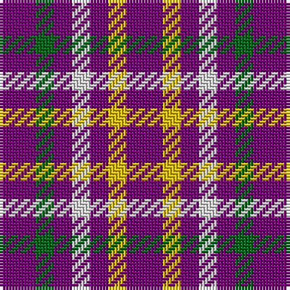

This page is one **sett** — a single exact thread-count. It belongs to the [tartan](/tartans/dp2g1dp1w1dp1ly1dp2/)
(the same proportion at any scale), whose colour order is pattern [BGBWBYB](/stripes/bgbwbyb/).

Sourced from house-of-tartan.  It is a [7 stripe tartan](/stripes/stripes7/).

Original link http://www.house-of-tartan.scotland.net/house/TartanViewjs.asp?colr=Def&tnam=109

## Thread count
P/12 Y6 P6 LN6 P6 G6 P/12

## Palette

Palette: <strong>Tartan Register</strong>
<table><thead><tr><th>Colour</th><th>Threads</th><th>Shade</th><th>Base</th><th>OKLCh</th></tr></thead><tbody><tr><td>P/</td><td style="text-align:right;font-variant-numeric:tabular-nums">12</td><td><code style="background-color:#780078;">#780078</code> <small style="color:#888">#780078</small></td><td>B <code style="background-color:#2A418A;">#2A418A</code></td><td><small style="color:#888">oklch(40.2% 0.185 328.4)</small></td></tr><tr><td>Y</td><td style="text-align:right;font-variant-numeric:tabular-nums">6</td><td><code style="background-color:#E8C000;">#E8C000</code> <small style="color:#888">#E8C000</small></td><td>Y <code style="background-color:#F2BF00;">#F2BF00</code></td><td><small style="color:#888">oklch(81.9% 0.168 93.7)</small></td></tr><tr><td>P</td><td style="text-align:right;font-variant-numeric:tabular-nums">6</td><td><code style="background-color:#780078;">#780078</code> <small style="color:#888">#780078</small></td><td>B <code style="background-color:#2A418A;">#2A418A</code></td><td><small style="color:#888">oklch(40.2% 0.185 328.4)</small></td></tr><tr><td>LN</td><td style="text-align:right;font-variant-numeric:tabular-nums">6</td><td><code style="background-color:#E0E0E0;">#E0E0E0</code> <small style="color:#888">#E0E0E0</small></td><td>W <code style="background-color:#F7F7F7;">#F7F7F7</code></td><td><small style="color:#888">oklch(90.7% 0.000 89.9)</small></td></tr><tr><td>P</td><td style="text-align:right;font-variant-numeric:tabular-nums">6</td><td><code style="background-color:#780078;">#780078</code> <small style="color:#888">#780078</small></td><td>B <code style="background-color:#2A418A;">#2A418A</code></td><td><small style="color:#888">oklch(40.2% 0.185 328.4)</small></td></tr><tr><td>G</td><td style="text-align:right;font-variant-numeric:tabular-nums">6</td><td><code style="background-color:#006818;">#006818</code> <small style="color:#888">#006818</small></td><td>G <code style="background-color:#006100;">#006100</code></td><td><small style="color:#888">oklch(45.0% 0.142 145.0)</small></td></tr><tr><td>P/</td><td style="text-align:right;font-variant-numeric:tabular-nums">12</td><td><code style="background-color:#780078;">#780078</code> <small style="color:#888">#780078</small></td><td>B <code style="background-color:#2A418A;">#2A418A</code></td><td><small style="color:#888">oklch(40.2% 0.185 328.4)</small></td></tr></tbody></table>

# Sample pattern

## Nearest tartans

The nearest existing variants by ΔTartan distance, with this tartan at the top so the swatches line up against it.

ΔTartan

Tartan

Sett

—

<a href="/ttd/edit/#slug=dp2g1dp1w1dp1ly1dp2~x6">Justus International Tartan Tartan Number: 109. Earliest known date: pre 2003 Y = Saffron. Seen at Grandfather Mountain Games by Bob Martin in 1981 or 1982 See products available Copyright © Blair Urquhart, Comrie, 2015</a> <a class="nn-out" href="/setts/s7/dp2g1dp1w1dp1ly1dp2~x6/" title="open its dictionary page">↗</a>

0.19

<a href="/ttd/edit/#slug=p2g1p1w1p1ly1p2~x24">Justus International</a> <a class="nn-out" href="/setts/s7/p2g1p1w1p1ly1p2~x24/" title="open its dictionary page">↗</a>

0.20

<a href="/ttd/edit/#slug=dp2dg1dp1w1dp1ly1dp2~x24">Justus International (Personal)</a> <a class="nn-out" href="/setts/s7/dp2dg1dp1w1dp1ly1dp2~x24/" title="open its dictionary page">↗</a>

1.74

<a href="/setts/s12/dp2dg1dp1w1dp1ly1dp2~x24/">Justus International (Personal)</a>

2.37

<a href="/ttd/edit/#slug=y5k2r2ly2y5~x10">Ikelman No 3</a> <a class="nn-out" href="/setts/s5/y5k2r2ly2y5~x10/" title="open its dictionary page">↗</a>

2.46

<a href="/ttd/edit/#slug=r5db6r1db6r1db6r5w5~x4">U.S. Coast Guard</a> <a class="nn-out" href="/setts/s8/r5db6r1db6r1db6r5w5~x4/" title="open its dictionary page">↗</a>

2.58

<a href="/ttd/edit/#slug=db6r1db6r5w5~x4">U.S. Coast Guard (Corporate)</a> <a class="nn-out" href="/setts/s5/db6r1db6r5w5~x4/" title="open its dictionary page">↗</a>

2.66

<a href="/ttd/edit/#slug=db11r4ly9db4ly2db11~x2">Unidentified Sample</a> <a class="nn-out" href="/setts/s6/db11r4ly9db4ly2db11~x2/" title="open its dictionary page">↗</a>

2.67

<a href="/ttd/edit/#slug=db7w1r7db4r2db4w2~x2">Coronation</a> <a class="nn-out" href="/setts/s7/db7w1r7db4r2db4w2~x2/" title="open its dictionary page">↗</a>

2.69

<a href="/ttd/edit/#slug=w15n25r10w5n25w7n16k9n17k10n23r9">North Carolina State University</a> <a class="nn-out" href="/setts/s12/w15n25r10w5n25w7n16k9n17k10n23r9/" title="open its dictionary page">↗</a>

2.70

<a href="/ttd/edit/#slug=dt5r2lp2r2dt5ly1r1ly1dt5~x8">Millar (Kirkcaldy) (Personal)</a> <a class="nn-out" href="/setts/s9/dt5r2lp2r2dt5ly1r1ly1dt5~x8/" title="open its dictionary page">↗</a>

## Neighbour map

Every grey dot is one of 14359 variants placed by the first two principal components of the ΔTartan feature space (44% of its variance). Red is this tartan; blue dots are its nearest — click one to open its page.

<svg viewBox="0 0 640 380" role="img" style="max-width:100%;height:auto;border:1px solid #e0e0e0;border-radius:4px;display:block" xmlns="http://www.w3.org/2000/svg"><image href="/nn/cloud.v1.png" width="640" height="380"/><a href="/setts/s7/p2g1p1w1p1ly1p2~x24/"><circle cx="231.0" cy="295.5" r="4" fill="#3465a4"><title>Justus International</title></circle></a><a href="/setts/s7/dp2dg1dp1w1dp1ly1dp2~x24/"><circle cx="226.7" cy="294.2" r="4" fill="#3465a4"><title>Justus International (Personal)</title></circle></a><a href="/setts/s12/dp2dg1dp1w1dp1ly1dp2~x24/"><circle cx="136.8" cy="270.6" r="4" fill="#3465a4"><title>Justus International (Personal)</title></circle></a><a href="/setts/s5/y5k2r2ly2y5~x10/"><circle cx="223.8" cy="290.7" r="4" fill="#3465a4"><title>Ikelman No 3</title></circle></a><a href="/setts/s8/r5db6r1db6r1db6r5w5~x4/"><circle cx="222.8" cy="255.0" r="4" fill="#3465a4"><title>U.S. Coast Guard</title></circle></a><a href="/setts/s5/db6r1db6r5w5~x4/"><circle cx="211.3" cy="278.5" r="4" fill="#3465a4"><title>U.S. Coast Guard (Corporate)</title></circle></a><a href="/setts/s6/db11r4ly9db4ly2db11~x2/"><circle cx="292.8" cy="266.5" r="4" fill="#3465a4"><title>Unidentified Sample</title></circle></a><a href="/setts/s7/db7w1r7db4r2db4w2~x2/"><circle cx="275.9" cy="244.1" r="4" fill="#3465a4"><title>Coronation</title></circle></a><a href="/setts/s12/w15n25r10w5n25w7n16k9n17k10n23r9/"><circle cx="231.8" cy="230.4" r="4" fill="#3465a4"><title>North Carolina State University</title></circle></a><a href="/setts/s9/dt5r2lp2r2dt5ly1r1ly1dt5~x8/"><circle cx="275.2" cy="234.0" r="4" fill="#3465a4"><title>Millar (Kirkcaldy) (Personal)</title></circle></a><circle cx="231.8" cy="297.4" r="5" fill="#c00000"/></svg>

ID: /setts/s7/dp2g1dp1w1dp1ly1dp2~x6/
