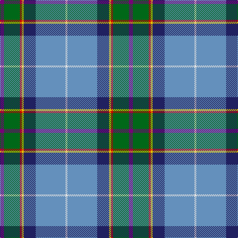

This page is one **sett** — a single exact thread-count. It belongs to the [tartan](/tartans/dp2g8r1ly1db6t15w1/)
(the same proportion at any scale), whose colour order is pattern [BGRYBBW](/stripes/bgrybbw/).

Sourced from house-of-tartan.  It is a [7 stripe tartan](/stripes/stripes7/).

Original link http://www.house-of-tartan.scotland.net/house/TartanViewjs.asp?colr=Def&tnam=186

## Thread count
P/8 G32 R4 Y4 DB24 B60 LN/4

## Palette

Palette: <strong>Tartan Register</strong> <small style="color:#888">(6 of 7 colours)</small>
<table><thead><tr><th>Colour</th><th>Threads</th><th>Shade</th><th>Base</th><th>OKLCh</th></tr></thead><tbody><tr><td>P/</td><td style="text-align:right;font-variant-numeric:tabular-nums">8</td><td><code style="background-color:#780078;">#780078</code> <small style="color:#888">#780078</small></td><td>B <code style="background-color:#2A418A;">#2A418A</code></td><td><small style="color:#888">oklch(40.2% 0.185 328.4)</small></td></tr><tr><td>G</td><td style="text-align:right;font-variant-numeric:tabular-nums">32</td><td><code style="background-color:#006818;">#006818</code> <small style="color:#888">#006818</small></td><td>G <code style="background-color:#006100;">#006100</code></td><td><small style="color:#888">oklch(45.0% 0.142 145.0)</small></td></tr><tr><td>R</td><td style="text-align:right;font-variant-numeric:tabular-nums">4</td><td><code style="background-color:#C80000;">#C80000</code> <small style="color:#888">#C80000</small></td><td>R <code style="background-color:#CC0000;">#CC0000</code></td><td><small style="color:#888">oklch(52.3% 0.215 29.2)</small></td></tr><tr><td>Y</td><td style="text-align:right;font-variant-numeric:tabular-nums">4</td><td><code style="background-color:#E8C000;">#E8C000</code> <small style="color:#888">#E8C000</small></td><td>Y <code style="background-color:#F2BF00;">#F2BF00</code></td><td><small style="color:#888">oklch(81.9% 0.168 93.7)</small></td></tr><tr><td>DB</td><td style="text-align:right;font-variant-numeric:tabular-nums">24</td><td><code style="background-color:#202060;">#202060</code> <small style="color:#888">#202060</small></td><td>B <code style="background-color:#2A418A;">#2A418A</code></td><td><small style="color:#888">oklch(28.9% 0.111 276.9)</small></td></tr><tr><td>B</td><td style="text-align:right;font-variant-numeric:tabular-nums">60</td><td><code style="background-color:#6490BC;">#6490BC</code> <small style="color:#888">#6490BC</small></td><td>B <code style="background-color:#2A418A;">#2A418A</code></td><td><small style="color:#888">oklch(63.9% 0.082 249.2)</small></td></tr><tr><td>LN/</td><td style="text-align:right;font-variant-numeric:tabular-nums">4</td><td><code style="background-color:#E0E0E0;">#E0E0E0</code> <small style="color:#888">#E0E0E0</small></td><td>W <code style="background-color:#F7F7F7;">#F7F7F7</code></td><td><small style="color:#888">oklch(90.7% 0.000 89.9)</small></td></tr></tbody></table>

# Sample pattern

## Nearest tartans

The nearest existing variants by ΔTartan distance, with this tartan at the top so the swatches line up against it.

ΔTartan

Tartan

Sett

—

<a href="/ttd/edit/#slug=dp2g8r1ly1db6t15w1~x4">Manx National District Tartan Tartan Number: 186. Earliest known date: pre 2003 Thread count of the sample donated by Dr. D.G. Teall in 1987, when the cloth was commercially available on the island. It differs slightly from the sett recorded by Stewart in 1959, but the design is essentially the same. D C Stewart's Nomindex (Name Index) notes. Th is seven-colour tartan was designed by Miss Patricia 'Paddy' McQaid as the Manx National Tartan at the instigation in 1958 of the Rt. Hon the Lord Sempill who was Chairman of Ellynyn ny Gael - a Manx Gaelic Society. The colours were explained as follows: light blue of the sky, dark blue of the sea, green of the hills &amp; valleys, white of the cottages, purple of the heather, gold of the gorse in bloom and reddish brown of the bracken. The tartan was registered with the Tartans Society on 3rd November 1959 and Paddy McQuaid held the sole rights to production for some years. The tartan was very popular with the Royal Family of the day. See products available Copyright © Blair Urquhart, Comrie, 2015</a> <a class="nn-out" href="/setts/s7/dp2g8r1ly1db6t15w1~x4/" title="open its dictionary page">↗</a>

0.75

<a href="/ttd/edit/#slug=dp2g6r1ly1db3t10w1~x2">Manx National District Tartan Tartan Number: 185. Earliest known date: pre 2003 These are the specifications supplied by the designer. See products available Copyright © Blair Urquhart, Comrie, 2015</a> <a class="nn-out" href="/setts/s7/dp2g6r1ly1db3t10w1~x2/" title="open its dictionary page">↗</a>

0.77

<a href="/ttd/edit/#slug=p8g31r4y4db17b64w4">Manx National</a> <a class="nn-out" href="/setts/s7/p8g31r4y4db17b64w4/" title="open its dictionary page">↗</a>

0.92

<a href="/ttd/edit/#slug=p2g6r1y1db3b10w1~x2">Manx National</a> <a class="nn-out" href="/setts/s7/p2g6r1y1db3b10w1~x2/" title="open its dictionary page">↗</a>

1.07

<a href="/ttd/edit/#slug=r4b3lr2k2lr12k2db10t25w2~x2">O'Reilly (Estimated threadcount)</a> <a class="nn-out" href="/setts/s9/r4b3lr2k2lr12k2db10t25w2~x2/" title="open its dictionary page">↗</a>

1.10

<a href="/ttd/edit/#slug=o2b30ly3b2o16r2g16w2~x2">WCWM 3947</a> <a class="nn-out" href="/setts/s8/o2b30ly3b2o16r2g16w2~x2/" title="open its dictionary page">↗</a>

1.18

<a href="/ttd/edit/#slug=db24r8g8r2g8k1ly2~x2">Scout Mapping Service #1 (Corporate)</a> <a class="nn-out" href="/setts/s7/db24r8g8r2g8k1ly2~x2/" title="open its dictionary page">↗</a>

1.19

<a href="/ttd/edit/#slug=ly1lt2n15k2lt2k2g12w2lt1~x2">Hek Family (Sunningdale, Berwick on Tweed)</a> <a class="nn-out" href="/setts/s9/ly1lt2n15k2lt2k2g12w2lt1~x2/" title="open its dictionary page">↗</a>

1.22

<a href="/ttd/edit/#slug=o3db1o11w1k5n14lo3~x4">Glen Lyon (Fashion)</a> <a class="nn-out" href="/setts/s7/o3db1o11w1k5n14lo3~x4/" title="open its dictionary page">↗</a>

1.23

<a href="/ttd/edit/#slug=dp4g13db5ly3t6ly3db5n6db28w2~x2">Highland, Blue (Corporate)</a> <a class="nn-out" href="/setts/s10/dp4g13db5ly3t6ly3db5n6db28w2~x2/" title="open its dictionary page">↗</a>

1.25

<a href="/ttd/edit/#slug=k4t6w4t6do8t37lr12do46o6lo4">MacLeroy and Troine 1987</a> <a class="nn-out" href="/setts/s10/k4t6w4t6do8t37lr12do46o6lo4/" title="open its dictionary page">↗</a>

## Neighbour map

Every grey dot is one of 14299 variants placed by the first two principal components of the ΔTartan feature space (44% of its variance). Red is this tartan; blue dots are its nearest — click one to open its page.

<svg viewBox="0 0 640 380" role="img" style="max-width:100%;height:auto;border:1px solid #e0e0e0;border-radius:4px;display:block" xmlns="http://www.w3.org/2000/svg"><image href="/nn/cloud.v1.png" width="640" height="380"/><a href="/setts/s7/dp2g6r1ly1db3t10w1~x2/"><circle cx="145.9" cy="151.0" r="4" fill="#3465a4"><title>Manx National District Tartan Tartan Number: 185. Earliest known date: pre 2003 These are the specifications supplied by the designer. See products available Copyright © Blair Urquhart, Comrie, 2015</title></circle></a><a href="/setts/s7/p8g31r4y4db17b64w4/"><circle cx="209.5" cy="116.3" r="4" fill="#3465a4"><title>Manx National</title></circle></a><a href="/setts/s7/p2g6r1y1db3b10w1~x2/"><circle cx="138.3" cy="141.6" r="4" fill="#3465a4"><title>Manx National</title></circle></a><a href="/setts/s9/r4b3lr2k2lr12k2db10t25w2~x2/"><circle cx="161.5" cy="122.5" r="4" fill="#3465a4"><title>O'Reilly (Estimated threadcount)</title></circle></a><a href="/setts/s8/o2b30ly3b2o16r2g16w2~x2/"><circle cx="216.3" cy="139.4" r="4" fill="#3465a4"><title>WCWM 3947</title></circle></a><a href="/setts/s7/db24r8g8r2g8k1ly2~x2/"><circle cx="204.8" cy="118.5" r="4" fill="#3465a4"><title>Scout Mapping Service #1 (Corporate)</title></circle></a><a href="/setts/s9/ly1lt2n15k2lt2k2g12w2lt1~x2/"><circle cx="182.4" cy="123.9" r="4" fill="#3465a4"><title>Hek Family (Sunningdale, Berwick on Tweed)</title></circle></a><a href="/setts/s7/o3db1o11w1k5n14lo3~x4/"><circle cx="181.5" cy="164.0" r="4" fill="#3465a4"><title>Glen Lyon (Fashion)</title></circle></a><a href="/setts/s10/dp4g13db5ly3t6ly3db5n6db28w2~x2/"><circle cx="205.6" cy="122.4" r="4" fill="#3465a4"><title>Highland, Blue (Corporate)</title></circle></a><a href="/setts/s10/k4t6w4t6do8t37lr12do46o6lo4/"><circle cx="183.8" cy="127.3" r="4" fill="#3465a4"><title>MacLeroy and Troine 1987</title></circle></a><circle cx="186.1" cy="130.8" r="5" fill="#c00000"/></svg>

ID: /setts/s7/dp2g8r1ly1db6t15w1~x4/
