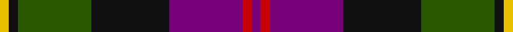
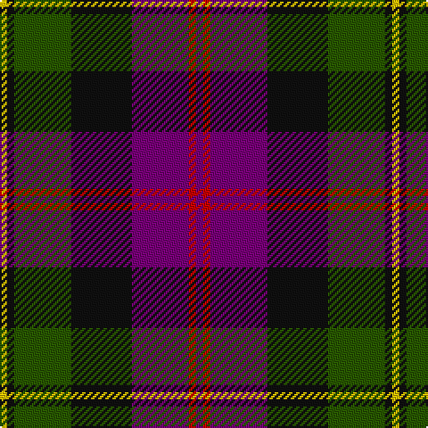

In pattern [BRBKGKY](/stripes/brbkgky/).

This was sourced from register-of-tartans.  It is a [7 stripe tartan](/stripes/stripes7/).

Original link https://www.tartanregister.gov.uk/tartanDetails.aspx?ref=4804

## Attestations

This cloth appears in 2 source records; the oldest owns this page.

- 01/01/2000 — Zangenberg (Personal) (register-of-tartans, [record](https://www.tartanregister.gov.uk/tartanDetails.aspx?ref=4804))
- 2000 — Zangenberg (Personal) (tartans-authority, [record](http://www.tartansauthority.com/tartan-ferret/display/4045/))

## Register references

External register numbers recorded for this tartan.

- Scottish Register of Tartans: [4804](https://www.tartanregister.gov.uk/tartanDetails.aspx?ref=4804)
- Scottish Tartans Authority (ITI): 4045

## Thread count
Y/4 K4 G32 K34 P32 Ra4 P/4

## Palette
Each colour and the base-6 reference it is a variant of.

| Colour | Shade | Base |
|---|---|---|
| G | <code style="background-color:#285800;">#285800</code> `oklch(41.0% 0.122 135.8)` <small>#285800</small> | G <code style="background-color:#006100;">#006100</code> |
| K | <code style="background-color:#101010;">#101010</code> `oklch(17.3% 0.000 89.9)` <small>#101010</small> | K <code style="background-color:#000000;">#000000</code> |
| P | <code style="background-color:#780078;">#780078</code> `oklch(40.2% 0.185 328.4)` <small>#780078</small> | B <code style="background-color:#2A418A;">#2A418A</code> |
| R | <code style="background-color:#C8002C;">#C8002C</code> `oklch(52.6% 0.212 22.0)` <small>#C8002C</small> | R <code style="background-color:#CC0000;">#CC0000</code> |
| Ra | <code style="background-color:#C80000;">#C80000</code> `oklch(52.3% 0.215 29.2)` <small>#C80000</small> | R <code style="background-color:#CC0000;">#CC0000</code> |
| Y | <code style="background-color:#E8C000;">#E8C000</code> `oklch(81.9% 0.168 93.7)` <small>#E8C000</small> | Y <code style="background-color:#F2BF00;">#F2BF00</code> |

# Sample pattern

## Nearest tartans

The nearest existing variants by ΔTartan distance.

1. [Akins](/setts/s8/m21r3m3r3m3db19g22b3~x2/) — ΔT 0.69
1. [Colquhoun #3](/setts/s7/dp6k3dp21k23w3dg24r3~x2/) — ΔT 0.80
1. [Scotch House 2000, antique](/setts/s8/db22r3db2r3db2k17o18dg4~x2/) — ΔT 0.90
1. [Gold Brothers](/setts/s6/db6g27db3k19dp27w3~x2/) — ΔT 0.92
1. [Land's End (Unnamed Maroon)](/setts/s9/k23y2m3db7m3y2dg15m21y5~x2/) — ΔT 0.96
1. [Patterson, John (Personal)](/setts/s6/g3db12w1dg12r12dg2~x2/) — ΔT 0.97
1. [Manson (Name)](/setts/s9/dg1r11dg3k4dg4r1k2db11w1~x2/) — ΔT 0.98
1. [Patterson, John (Personal)](/setts/s6/dg3db12w1dg12r12dg2~x2/) — ΔT 0.98
1. [MacInroy (Rattray)](/setts/s10/k3dg17k9r2db17r2db2r17dg2w2~x2/) — ΔT 0.99
1. [Law Society of Scotland (Corporate)](/setts/s10/r6g3r24t7r4t7k18g4k7g3/) — ΔT 0.99

## Neighbour map

Every grey dot is one of 14299 variants placed by the first two principal components of the ΔTartan feature space (44% of its variance). Red is this tartan; blue dots are its nearest — click one to open its page.

<svg viewBox="0 0 640 380" role="img" style="max-width:100%;height:auto;border:1px solid #e0e0e0;border-radius:4px;display:block" xmlns="http://www.w3.org/2000/svg"><image href="/nn/cloud.v1.png" width="640" height="380"/><a href="/setts/s8/m21r3m3r3m3db19g22b3~x2/"><circle cx="158.8" cy="190.3" r="4" fill="#3465a4"><title>Akins</title></circle></a><a href="/setts/s7/dp6k3dp21k23w3dg24r3~x2/"><circle cx="158.2" cy="206.7" r="4" fill="#3465a4"><title>Colquhoun #3</title></circle></a><a href="/setts/s8/db22r3db2r3db2k17o18dg4~x2/"><circle cx="167.8" cy="174.0" r="4" fill="#3465a4"><title>Scotch House 2000, antique</title></circle></a><a href="/setts/s6/db6g27db3k19dp27w3~x2/"><circle cx="141.0" cy="206.8" r="4" fill="#3465a4"><title>Gold Brothers</title></circle></a><a href="/setts/s9/k23y2m3db7m3y2dg15m21y5~x2/"><circle cx="171.3" cy="179.4" r="4" fill="#3465a4"><title>Land's End (Unnamed Maroon)</title></circle></a><a href="/setts/s6/g3db12w1dg12r12dg2~x2/"><circle cx="169.2" cy="199.7" r="4" fill="#3465a4"><title>Patterson, John (Personal)</title></circle></a><a href="/setts/s9/dg1r11dg3k4dg4r1k2db11w1~x2/"><circle cx="154.0" cy="164.7" r="4" fill="#3465a4"><title>Manson (Name)</title></circle></a><a href="/setts/s6/dg3db12w1dg12r12dg2~x2/"><circle cx="163.3" cy="195.6" r="4" fill="#3465a4"><title>Patterson, John (Personal)</title></circle></a><a href="/setts/s10/k3dg17k9r2db17r2db2r17dg2w2~x2/"><circle cx="133.5" cy="171.8" r="4" fill="#3465a4"><title>MacInroy (Rattray)</title></circle></a><a href="/setts/s10/r6g3r24t7r4t7k18g4k7g3/"><circle cx="164.5" cy="187.3" r="4" fill="#3465a4"><title>Law Society of Scotland (Corporate)</title></circle></a><circle cx="172.5" cy="194.8" r="5" fill="#c00000"/></svg>

ID: /setts/s7/dp2r2dp16k17dg16k2ly2~x2/
