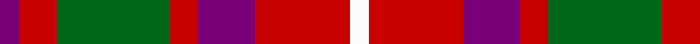
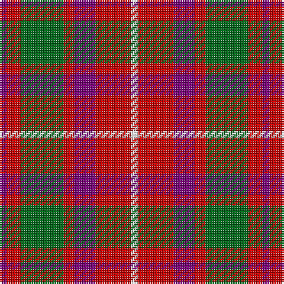

This page is one **sett** — a single exact thread-count. It belongs to the [tartan](/tartans/dp2r4g12r3dp6r10w2/)
(the same proportion at any scale), whose colour order is pattern [BRGRBRW](/stripes/brgrbrw/).

Sourced from tartans-authority.  It is a [7 stripe tartan](/stripes/stripes7/).

Original link http://www.tartansauthority.com/tartan-ferret/display/543/

## Thread count
P/4 R8 G24 R6 P12 R20 W/4

## Palette

Palette: <strong>Tartan Register</strong>
<table><thead><tr><th>Colour</th><th>Threads</th><th>Shade</th><th>Base</th><th>OKLCh</th></tr></thead><tbody><tr><td>P/</td><td style="text-align:right;font-variant-numeric:tabular-nums">4</td><td><code style="background-color:#780078;">#780078</code> <small style="color:#888">#780078</small></td><td>B <code style="background-color:#2A418A;">#2A418A</code></td><td><small style="color:#888">oklch(40.2% 0.185 328.4)</small></td></tr><tr><td>R</td><td style="text-align:right;font-variant-numeric:tabular-nums">8</td><td><code style="background-color:#C80000;">#C80000</code> <small style="color:#888">#C80000</small></td><td>R <code style="background-color:#CC0000;">#CC0000</code></td><td><small style="color:#888">oklch(52.3% 0.215 29.2)</small></td></tr><tr><td>G</td><td style="text-align:right;font-variant-numeric:tabular-nums">24</td><td><code style="background-color:#006818;">#006818</code> <small style="color:#888">#006818</small></td><td>G <code style="background-color:#006100;">#006100</code></td><td><small style="color:#888">oklch(45.0% 0.142 145.0)</small></td></tr><tr><td>R</td><td style="text-align:right;font-variant-numeric:tabular-nums">6</td><td><code style="background-color:#C80000;">#C80000</code> <small style="color:#888">#C80000</small></td><td>R <code style="background-color:#CC0000;">#CC0000</code></td><td><small style="color:#888">oklch(52.3% 0.215 29.2)</small></td></tr><tr><td>P</td><td style="text-align:right;font-variant-numeric:tabular-nums">12</td><td><code style="background-color:#780078;">#780078</code> <small style="color:#888">#780078</small></td><td>B <code style="background-color:#2A418A;">#2A418A</code></td><td><small style="color:#888">oklch(40.2% 0.185 328.4)</small></td></tr><tr><td>R</td><td style="text-align:right;font-variant-numeric:tabular-nums">20</td><td><code style="background-color:#C80000;">#C80000</code> <small style="color:#888">#C80000</small></td><td>R <code style="background-color:#CC0000;">#CC0000</code></td><td><small style="color:#888">oklch(52.3% 0.215 29.2)</small></td></tr><tr><td>W/</td><td style="text-align:right;font-variant-numeric:tabular-nums">4</td><td><code style="background-color:#FCFCFC;">#FCFCFC</code> <small style="color:#888">#FCFCFC</small></td><td>W <code style="background-color:#F7F7F7;">#F7F7F7</code></td><td><small style="color:#888">oklch(99.1% 0.000 89.9)</small></td></tr></tbody></table>

# Sample pattern

## Nearest tartans

The nearest existing variants by ΔTartan distance, with this tartan at the top so the swatches line up against it.

ΔTartan

Tartan

Sett

—

<a href="/ttd/edit/#slug=dp2r4g12r3dp6r10w2~x2">MacKintosh-Geddes (Personal?)</a> <a class="nn-out" href="/setts/s7/dp2r4g12r3dp6r10w2~x2/" title="open its dictionary page">↗</a>

0.76

<a href="/ttd/edit/#slug=r16o2r11o6k4w2k4o16~x2">Sidney (Nova Scotia) Canadian Tartan Tartan Number: 1291. Earliest known date: 1986 The Falkirk Tartan. An ornamental twill weave check of natural light and dark wool was discovered at Falkirk in the neck of a jar containing Roman coins. The find is thought to have been buried about 260 A.D. The black and white check is woven today as the Shepherd tartan. See products available Copyright © Blair Urquhart, Comrie, 2015</a> <a class="nn-out" href="/setts/s8/r16o2r11o6k4w2k4o16~x2/" title="open its dictionary page">↗</a>

0.95

<a href="/ttd/edit/#slug=o6ly3o20o20o3o3lb6~x2">Banff</a> <a class="nn-out" href="/setts/s7/o6ly3o20o20o3o3lb6~x2/" title="open its dictionary page">↗</a>

1.12

<a href="/ttd/edit/#slug=dy11db1dy11w10db1r11db1r11~x2">St. Andrews (Queens University) (Cor</a> <a class="nn-out" href="/setts/s8/dy11db1dy11w10db1r11db1r11~x2/" title="open its dictionary page">↗</a>

1.14

<a href="/ttd/edit/#slug=m10dy60dt13lo24dt24dy8">Bronte House Check</a> <a class="nn-out" href="/setts/s6/m10dy60dt13lo24dt24dy8/" title="open its dictionary page">↗</a>

1.14

<a href="/ttd/edit/#slug=y1k1r8dg8k6y4r8k1y1~x8">Montrose (Graham)</a> <a class="nn-out" href="/setts/s9/y1k1r8dg8k6y4r8k1y1~x8/" title="open its dictionary page">↗</a>

1.17

<a href="/ttd/edit/#slug=r8r1dg4r1db4~x2">Moray of Abercairney #2</a> <a class="nn-out" href="/setts/s5/r8r1dg4r1db4~x2/" title="open its dictionary page">↗</a>

1.20

<a href="/ttd/edit/#slug=o16k4w2k4o6o11o2o16~x2">Sydney (Nova Scotia) (District)</a> <a class="nn-out" href="/setts/s8/o16k4w2k4o6o11o2o16~x2/" title="open its dictionary page">↗</a>

1.20

<a href="/ttd/edit/#slug=r6g1r6db1g3k3g3~x4">MacTavish</a> <a class="nn-out" href="/setts/s7/r6g1r6db1g3k3g3~x4/" title="open its dictionary page">↗</a>

1.22

<a href="/ttd/edit/#slug=y28k3r22k8w3k8r22k3y28k3~x2">Henkel</a> <a class="nn-out" href="/setts/s10/y28k3r22k8w3k8r22k3y28k3~x2/" title="open its dictionary page">↗</a>

1.23

<a href="/ttd/edit/#slug=ly4r27k12db15ly4~x2">Aberdeen University (1992)</a> <a class="nn-out" href="/setts/s5/ly4r27k12db15ly4~x2/" title="open its dictionary page">↗</a>

## Neighbour map

Every grey dot is one of 14299 variants placed by the first two principal components of the ΔTartan feature space (44% of its variance). Red is this tartan; blue dots are its nearest — click one to open its page.

<svg viewBox="0 0 640 380" role="img" style="max-width:100%;height:auto;border:1px solid #e0e0e0;border-radius:4px;display:block" xmlns="http://www.w3.org/2000/svg"><image href="/nn/cloud.v1.png" width="640" height="380"/><a href="/setts/s8/r16o2r11o6k4w2k4o16~x2/"><circle cx="236.5" cy="202.4" r="4" fill="#3465a4"><title>Sidney (Nova Scotia) Canadian Tartan Tartan Number: 1291. Earliest known date: 1986 The Falkirk Tartan. An ornamental twill weave check of natural light and dark wool was discovered at Falkirk in the neck of a jar containing Roman coins. The find is thought to have been buried about 260 A.D. The black and white check is woven today as the Shepherd tartan. See products available Copyright © Blair Urquhart, Comrie, 2015</title></circle></a><a href="/setts/s7/o6ly3o20o20o3o3lb6~x2/"><circle cx="248.2" cy="199.2" r="4" fill="#3465a4"><title>Banff</title></circle></a><a href="/setts/s8/dy11db1dy11w10db1r11db1r11~x2/"><circle cx="200.6" cy="190.2" r="4" fill="#3465a4"><title>St. Andrews (Queens University) (Cor</title></circle></a><a href="/setts/s6/m10dy60dt13lo24dt24dy8/"><circle cx="248.8" cy="222.4" r="4" fill="#3465a4"><title>Bronte House Check</title></circle></a><a href="/setts/s9/y1k1r8dg8k6y4r8k1y1~x8/"><circle cx="192.3" cy="199.0" r="4" fill="#3465a4"><title>Montrose (Graham)</title></circle></a><a href="/setts/s5/r8r1dg4r1db4~x2/"><circle cx="239.8" cy="231.3" r="4" fill="#3465a4"><title>Moray of Abercairney #2</title></circle></a><a href="/setts/s8/o16k4w2k4o6o11o2o16~x2/"><circle cx="244.3" cy="213.2" r="4" fill="#3465a4"><title>Sydney (Nova Scotia) (District)</title></circle></a><a href="/setts/s7/r6g1r6db1g3k3g3~x4/"><circle cx="247.0" cy="240.2" r="4" fill="#3465a4"><title>MacTavish</title></circle></a><a href="/setts/s10/y28k3r22k8w3k8r22k3y28k3~x2/"><circle cx="226.4" cy="180.6" r="4" fill="#3465a4"><title>Henkel</title></circle></a><a href="/setts/s5/ly4r27k12db15ly4~x2/"><circle cx="188.0" cy="222.2" r="4" fill="#3465a4"><title>Aberdeen University (1992)</title></circle></a><circle cx="201.3" cy="222.3" r="5" fill="#c00000"/></svg>

ID: /setts/s7/dp2r4g12r3dp6r10w2~x2/
