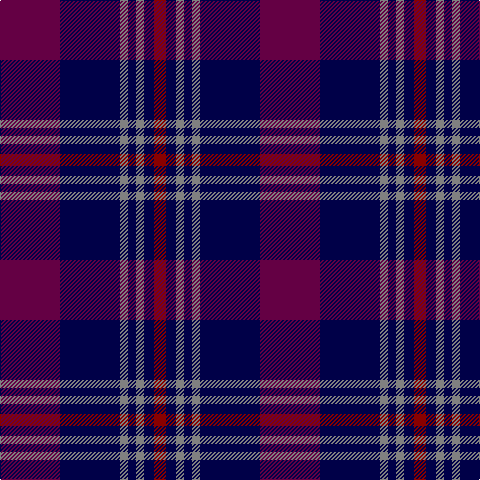

This page is one **sett** — a single exact thread-count. It belongs to the [tartan](/tartans/dp30db30y4db4y4db5r6/)
(the same proportion at any scale), whose colour order is pattern [BBGBGBR](/stripes/bbgbgbr/).

Sourced from register-of-tartans.  It is a [7 stripe tartan](/stripes/stripes7/).

Original link https://www.tartanregister.gov.uk/tartanDetails.aspx?ref=11632

## Register references

External register numbers recorded for this tartan.

- Scottish Register of Tartans: [11632](https://www.tartanregister.gov.uk/tartanDetails.aspx?ref=11632)

## Thread count
DRa/60 DB60 N8 DB8 N8 DB10 DR/12

## Palette

Palette: <strong>Tartan Register</strong> <small style="color:#888">(3 of 4 colours)</small>
<table><thead><tr><th>Colour</th><th>Threads</th><th>Shade</th><th>Base</th><th>OKLCh</th></tr></thead><tbody><tr><td>DRa/</td><td style="text-align:right;font-variant-numeric:tabular-nums">60</td><td><code style="background-color:#640044;">#640044</code> <small style="color:#888">#640044</small></td><td>B <code style="background-color:#2A418A;">#2A418A</code></td><td><small style="color:#888">oklch(33.4% 0.141 347.0)</small></td></tr><tr><td>DB</td><td style="text-align:right;font-variant-numeric:tabular-nums">60</td><td><code style="background-color:#000048;">#000048</code> <small style="color:#888">#000048</small></td><td>B <code style="background-color:#2A418A;">#2A418A</code></td><td><small style="color:#888">oklch(18.2% 0.126 264.1)</small></td></tr><tr><td>N</td><td style="text-align:right;font-variant-numeric:tabular-nums">8</td><td><code style="background-color:#808080;">#808080</code> <small style="color:#888">#808080</small></td><td>G <code style="background-color:#006100;">#006100</code></td><td><small style="color:#888">oklch(60.0% 0.000 89.9)</small></td></tr><tr><td>DB</td><td style="text-align:right;font-variant-numeric:tabular-nums">8</td><td><code style="background-color:#000048;">#000048</code> <small style="color:#888">#000048</small></td><td>B <code style="background-color:#2A418A;">#2A418A</code></td><td><small style="color:#888">oklch(18.2% 0.126 264.1)</small></td></tr><tr><td>N</td><td style="text-align:right;font-variant-numeric:tabular-nums">8</td><td><code style="background-color:#808080;">#808080</code> <small style="color:#888">#808080</small></td><td>G <code style="background-color:#006100;">#006100</code></td><td><small style="color:#888">oklch(60.0% 0.000 89.9)</small></td></tr><tr><td>DB</td><td style="text-align:right;font-variant-numeric:tabular-nums">10</td><td><code style="background-color:#000048;">#000048</code> <small style="color:#888">#000048</small></td><td>B <code style="background-color:#2A418A;">#2A418A</code></td><td><small style="color:#888">oklch(18.2% 0.126 264.1)</small></td></tr><tr><td>DR/</td><td style="text-align:right;font-variant-numeric:tabular-nums">12</td><td><code style="background-color:#880000;">#880000</code> <small style="color:#888">#880000</small></td><td>R <code style="background-color:#CC0000;">#CC0000</code></td><td><small style="color:#888">oklch(39.4% 0.162 29.2)</small></td></tr></tbody></table>

# Sample pattern

## Nearest tartans

The nearest existing variants by ΔTartan distance, with this tartan at the top so the swatches line up against it.

ΔTartan

Tartan

Sett

—

<a href="/ttd/edit/#slug=dp30db30y4db4y4db5r6~x2">Komissarov, Dmitry (Personal)</a> <a class="nn-out" href="/setts/s7/dp30db30y4db4y4db5r6~x2/" title="open its dictionary page">↗</a>

1.15

<a href="/ttd/edit/#slug=k1r1k1db7k1g1k1~x8">Eglinton</a> <a class="nn-out" href="/setts/s7/k1r1k1db7k1g1k1~x8/" title="open its dictionary page">↗</a>

1.20

<a href="/ttd/edit/#slug=k21db8r4db2r2db23k4w2~x2">Murdoch Clebration (Personal)</a> <a class="nn-out" href="/setts/s8/k21db8r4db2r2db23k4w2~x2/" title="open its dictionary page">↗</a>

1.25

<a href="/ttd/edit/#slug=k4r5k4dp28k4g5k4~x2">Montgomrie/Montgomery of Eglinton</a> <a class="nn-out" href="/setts/s7/k4r5k4dp28k4g5k4~x2/" title="open its dictionary page">↗</a>

1.25

<a href="/ttd/edit/#slug=db6w3db21k16dp6k3dp6~x2">Heritage of Scotland</a> <a class="nn-out" href="/setts/s7/db6w3db21k16dp6k3dp6~x2/" title="open its dictionary page">↗</a>

1.34

<a href="/ttd/edit/#slug=dp22lo10dp6lr18dp50db71k6">Charleston Police Department</a> <a class="nn-out" href="/setts/s7/dp22lo10dp6lr18dp50db71k6/" title="open its dictionary page">↗</a>

1.36

<a href="/ttd/edit/#slug=k1db7k4lb1k4p1~x4">Scottish Express International</a> <a class="nn-out" href="/setts/s6/k1db7k4lb1k4p1~x4/" title="open its dictionary page">↗</a>

1.39

<a href="/ttd/edit/#slug=oi5db12dbi4o4dbi22db3dbi4oi5">Daks, Muted blue</a> <a class="nn-out" href="/setts/s8/oi5db12dbi4o4dbi22db3dbi4oi5/" title="open its dictionary page">↗</a>

1.41

<a href="/ttd/edit/#slug=dp12r8k64dp75r8">Laurel Cadre, The</a> <a class="nn-out" href="/setts/s5/dp12r8k64dp75r8/" title="open its dictionary page">↗</a>

1.45

<a href="/ttd/edit/#slug=dp46dpi15k12p8g8dp8~x2">Haut Name Tartan Tartan Number: 10389. Earliest known date: 1st March 2011 Designed for the Haut family living in Liff by Dundee to celebrate their German and Irish roots and the Scottish identity of their children. See products available Copyright © Blair Urquhart, Comrie, 2015</a> <a class="nn-out" href="/setts/s6/dp46dpi15k12p8g8dp8~x2/" title="open its dictionary page">↗</a>

1.46

<a href="/ttd/edit/#slug=n9db1n1db1n1db7k7r2~x4">Caledonian Hotel (Corporate)</a> <a class="nn-out" href="/setts/s8/n9db1n1db1n1db7k7r2~x4/" title="open its dictionary page">↗</a>

## Neighbour map

Every grey dot is one of 14359 variants placed by the first two principal components of the ΔTartan feature space (44% of its variance). Red is this tartan; blue dots are its nearest — click one to open its page.

<svg viewBox="0 0 640 380" role="img" style="max-width:100%;height:auto;border:1px solid #e0e0e0;border-radius:4px;display:block" xmlns="http://www.w3.org/2000/svg"><image href="/nn/cloud.v1.png" width="640" height="380"/><a href="/setts/s7/k1r1k1db7k1g1k1~x8/"><circle cx="333.9" cy="228.4" r="4" fill="#3465a4"><title>Eglinton</title></circle></a><a href="/setts/s8/k21db8r4db2r2db23k4w2~x2/"><circle cx="308.6" cy="199.4" r="4" fill="#3465a4"><title>Murdoch Clebration (Personal)</title></circle></a><a href="/setts/s7/k4r5k4dp28k4g5k4~x2/"><circle cx="332.5" cy="228.3" r="4" fill="#3465a4"><title>Montgomrie/Montgomery of Eglinton</title></circle></a><a href="/setts/s7/db6w3db21k16dp6k3dp6~x2/"><circle cx="226.2" cy="237.7" r="4" fill="#3465a4"><title>Heritage of Scotland</title></circle></a><a href="/setts/s7/dp22lo10dp6lr18dp50db71k6/"><circle cx="262.0" cy="200.9" r="4" fill="#3465a4"><title>Charleston Police Department</title></circle></a><a href="/setts/s6/k1db7k4lb1k4p1~x4/"><circle cx="285.7" cy="258.2" r="4" fill="#3465a4"><title>Scottish Express International</title></circle></a><a href="/setts/s8/oi5db12dbi4o4dbi22db3dbi4oi5/"><circle cx="281.0" cy="240.0" r="4" fill="#3465a4"><title>Daks, Muted blue</title></circle></a><a href="/setts/s5/dp12r8k64dp75r8/"><circle cx="367.2" cy="260.0" r="4" fill="#3465a4"><title>Laurel Cadre, The</title></circle></a><a href="/setts/s6/dp46dpi15k12p8g8dp8~x2/"><circle cx="294.7" cy="237.3" r="4" fill="#3465a4"><title>Haut Name Tartan Tartan Number: 10389. Earliest known date: 1st March 2011 Designed for the Haut family living in Liff by Dundee to celebrate their German and Irish roots and the Scottish identity of their children. See products available Copyright © Blair Urquhart, Comrie, 2015</title></circle></a><a href="/setts/s8/n9db1n1db1n1db7k7r2~x4/"><circle cx="239.9" cy="225.7" r="4" fill="#3465a4"><title>Caledonian Hotel (Corporate)</title></circle></a><circle cx="292.1" cy="227.1" r="5" fill="#c00000"/></svg>

ID: /setts/s7/dp30db30y4db4y4db5r6~x2/
