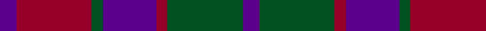

**Bands:** [BGRBGRB](/stripes/bgrbgrb/) · **Stripes:** [DP DG R DP DG R DP](/stripes/stripes7/) DP DG R DP DG R DP

This was sourced from register-of-tartans.  It is a [7 band tartan](/bands/bands7/).

Original link https://www.tartanregister.gov.uk/tartanDetails.aspx?ref=3733

## Register references

External register numbers recorded for this tartan.

- Scottish Register of Tartans: [3733](https://www.tartanregister.gov.uk/tartanDetails.aspx?ref=3733)
- Scottish Tartans Authority (ITI): 177
- Scottish Tartans World Register: 177

## Thread count
P/6 DR28 G4 P20 DR4 G28 P/6

## Palette
Each colour and its ΔE from the base-6 reference it is a variant of.

| Colour | Shade | Base | ΔE (OKLab) |
|---|---|---|---|
| DR | <code style="background-color:#960028;">#960028</code> `#960028` | R <code style="background-color:#CC0000;">#CC0000</code> | 0.12 |
| G | <code style="background-color:#005020;">#005020</code> `#005020` | G <code style="background-color:#006100;">#006100</code> | 0.07 |
| P | <code style="background-color:#5A008C;">#5A008C</code> `#5A008C` | B <code style="background-color:#2A418A;">#2A418A</code> | 0.13 |

# Sample pattern

## Nearest tartans

The nearest existing variants by ΔTartan distance.

1. [Scottish Netball (1986) (Corporate)](/setts/s7/dp3g14m2dp10g2m14dp3~x2/) — ΔT 0.60
1. [Scottish Netball Association](/setts/s7/p3g14r2p10g2r14p3~x2/) — ΔT 1.11
1. [Little's Chauffeur Drive](/setts/s6/db1n8w1db4m8w1~x6/) — ΔT 1.33
1. [Chindecella Ruadh (Personal)](/setts/s8/r10db4r4db4r23n19db19n4~x2/) — ΔT 1.36
1. [Crook](/setts/s9/k4m14b2y16m3k3m3b12y4~x2/) — ΔT 1.37
1. [MacNab (Macgregor - Hastie)](/setts/s6/dg3dp3dg19dp18r19dp3~x2/) — ΔT 1.40
1. [Bristol Gramar School Check (School)](/setts/s6/r4n3n12db8n2r4/) — ΔT 1.45
1. [Remony (Red)](/setts/s8/r17db2r2db13r2db2g17db2~x2/) — ΔT 1.46
1. [MacBean of Tomatin (Clan)](/setts/s7/db3r19db13r5g21r8db3~x2/) — ΔT 1.49
1. [Grammar School at Leeds (School)](/setts/s6/n32w4n4k24dp29k4/) — ΔT 1.49

## Neighbour map

Every grey dot is one of 14313 variants placed by the first two principal components of the ΔTartan feature space (44% of its variance). Red is this tartan; blue dots are its nearest — click one to open its page.

<svg viewBox="0 0 640 380" role="img" style="max-width:100%;height:auto;border:1px solid #e0e0e0;border-radius:4px;display:block" xmlns="http://www.w3.org/2000/svg"><image href="/nn/cloud.v1.png" width="640" height="380"/><a href="/setts/s7/dp3g14m2dp10g2m14dp3~x2/"><circle cx="239.8" cy="249.9" r="4" fill="#3465a4"><title>Scottish Netball (1986) (Corporate)</title></circle></a><a href="/setts/s7/p3g14r2p10g2r14p3~x2/"><circle cx="220.2" cy="240.3" r="4" fill="#3465a4"><title>Scottish Netball Association</title></circle></a><a href="/setts/s6/db1n8w1db4m8w1~x6/"><circle cx="208.4" cy="228.8" r="4" fill="#3465a4"><title>Little's Chauffeur Drive</title></circle></a><a href="/setts/s8/r10db4r4db4r23n19db19n4~x2/"><circle cx="290.6" cy="277.5" r="4" fill="#3465a4"><title>Chindecella Ruadh (Personal)</title></circle></a><a href="/setts/s9/k4m14b2y16m3k3m3b12y4~x2/"><circle cx="201.4" cy="224.9" r="4" fill="#3465a4"><title>Crook</title></circle></a><a href="/setts/s6/dg3dp3dg19dp18r19dp3~x2/"><circle cx="226.3" cy="251.0" r="4" fill="#3465a4"><title>MacNab (Macgregor - Hastie)</title></circle></a><a href="/setts/s6/r4n3n12db8n2r4/"><circle cx="197.4" cy="265.4" r="4" fill="#3465a4"><title>Bristol Gramar School Check (School)</title></circle></a><a href="/setts/s8/r17db2r2db13r2db2g17db2~x2/"><circle cx="248.3" cy="222.1" r="4" fill="#3465a4"><title>Remony (Red)</title></circle></a><a href="/setts/s7/db3r19db13r5g21r8db3~x2/"><circle cx="256.4" cy="257.5" r="4" fill="#3465a4"><title>MacBean of Tomatin (Clan)</title></circle></a><a href="/setts/s6/n32w4n4k24dp29k4/"><circle cx="207.4" cy="228.9" r="4" fill="#3465a4"><title>Grammar School at Leeds (School)</title></circle></a><circle cx="243.6" cy="256.5" r="5" fill="#c00000"/></svg>

ID: /setts/s7/dp3dg14r2dp10dg2r14dp3~x2/
