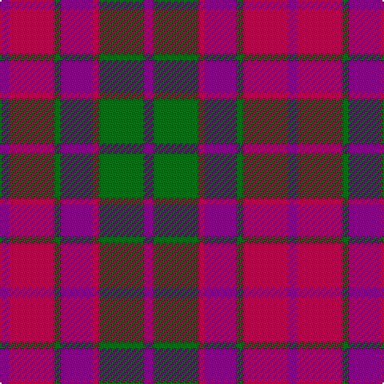

In pattern [BGRBGRB](/stripes/bgrbgrb/).

This was sourced from tartans-authority.  It is a [7 stripe tartan](/stripes/stripes7/).

Original link http://www.tartansauthority.com/tartan-ferret/display/177/

## Also known as

This cloth is also recorded under:

- Scottish Netball Association

## Attestations

This cloth appears in 2 source records; the oldest owns this page.

- 1986 — Scottish Netball (1986) (Corporate) (tartans-authority, [record](http://www.tartansauthority.com/tartan-ferret/display/177/))
- undated — Scottish Netball Association Corporate Tartan Tartan Number: 177. Earliest known date: 1986 Designed for the World Netball Championship held in 1987. See products available Copyright © Blair Urquhart, Comrie, 2015 (house-of-tartan, [record](http://www.house-of-tartan.scotland.net/house/TartanViewjs.asp?colr=Def&tnam=177))

## Thread count
P/6 R28 G4 P20 R4 G28 P/6

## Palette
Each colour and the base-6 reference it is a variant of.

| Colour | Shade | Base |
|---|---|---|
| G | <code style="background-color:#006818;">#006818</code> `oklch(45.0% 0.142 145.0)` <small>#006818</small> | G <code style="background-color:#006100;">#006100</code> |
| P | <code style="background-color:#780078;">#780078</code> `oklch(40.2% 0.185 328.4)` <small>#780078</small> | B <code style="background-color:#2A418A;">#2A418A</code> |
| R | <code style="background-color:#A00048;">#A00048</code> `oklch(45.4% 0.182 5.3)` <small>#A00048</small> | R <code style="background-color:#CC0000;">#CC0000</code> |

# Sample pattern

## Nearest tartans

The nearest existing variants by ΔTartan distance, with this tartan at the top so the swatches line up against it.

ΔTartan

Tartan

Sett

—

<a href="/ttd/edit/#slug=dp3g14m2dp10g2m14dp3~x2">Scottish Netball (1986) (Corporate)</a> <a class="nn-out" href="/setts/s7/dp3g14m2dp10g2m14dp3~x2/" title="open its dictionary page">↗</a>

0.60

<a href="/ttd/edit/#slug=dp3dg14r2dp10dg2r14dp3~x2">Scottish Netball Association</a> <a class="nn-out" href="/setts/s7/dp3dg14r2dp10dg2r14dp3~x2/" title="open its dictionary page">↗</a>

0.77

<a href="/ttd/edit/#slug=p3r14g2p10r2g14p3~x2">Scottish Netball Association</a> <a class="nn-out" href="/setts/s7/p3r14g2p10r2g14p3~x2/" title="open its dictionary page">↗</a>

1.09

<a href="/ttd/edit/#slug=dp4r3dp26r26g26r4~x2">Unidentified Artifact Tartan Tartan Number: 463. Earliest known date: 0 Wilson's of Bannockburn 'New Broad Sett' perhaps. See products available Copyright © Blair Urquhart, Comrie, 2015</a> <a class="nn-out" href="/setts/s6/dp4r3dp26r26g26r4~x2/" title="open its dictionary page">↗</a>

1.17

<a href="/ttd/edit/#slug=dg3dp3dg19dp18r19dp3~x2">MacNab (Macgregor - Hastie)</a> <a class="nn-out" href="/setts/s6/dg3dp3dg19dp18r19dp3~x2/" title="open its dictionary page">↗</a>

1.32

<a href="/ttd/edit/#slug=r4g26r26p26r3p4~x2">Unidentified 16</a> <a class="nn-out" href="/setts/s6/r4g26r26p26r3p4~x2/" title="open its dictionary page">↗</a>

1.35

<a href="/ttd/edit/#slug=db1n8w1db4m8w1~x6">Little's Chauffeur Drive</a> <a class="nn-out" href="/setts/s6/db1n8w1db4m8w1~x6/" title="open its dictionary page">↗</a>

1.36

<a href="/ttd/edit/#slug=dp4r3dp26r26dg26r4~x2">Unidentified #21</a> <a class="nn-out" href="/setts/s6/dp4r3dp26r26dg26r4~x2/" title="open its dictionary page">↗</a>

1.37

<a href="/ttd/edit/#slug=r14g2dp10r2g14dp3g14r2dp10g2r14dp3~x2">Unidentified Scarlett #12</a> <a class="nn-out" href="/setts/s12/r14g2dp10r2g14dp3g14r2dp10g2r14dp3~x2/" title="open its dictionary page">↗</a>

1.40

<a href="/ttd/edit/#slug=r4db24r21r21r4~x2">Ferguson Britt Red (Corporate)</a> <a class="nn-out" href="/setts/s5/r4db24r21r21r4~x2/" title="open its dictionary page">↗</a>

1.46

<a href="/ttd/edit/#slug=r4n3n12db8n2r4">Bristol Gramar School Check (School)</a> <a class="nn-out" href="/setts/s6/r4n3n12db8n2r4/" title="open its dictionary page">↗</a>

## Neighbour map

Every grey dot is one of 14299 variants placed by the first two principal components of the ΔTartan feature space (44% of its variance). Red is this tartan; blue dots are its nearest — click one to open its page.

<svg viewBox="0 0 640 380" role="img" style="max-width:100%;height:auto;border:1px solid #e0e0e0;border-radius:4px;display:block" xmlns="http://www.w3.org/2000/svg"><image href="/nn/cloud.v1.png" width="640" height="380"/><a href="/setts/s7/dp3dg14r2dp10dg2r14dp3~x2/"><circle cx="243.6" cy="256.5" r="4" fill="#3465a4"><title>Scottish Netball Association</title></circle></a><a href="/setts/s7/p3r14g2p10r2g14p3~x2/"><circle cx="220.1" cy="240.3" r="4" fill="#3465a4"><title>Scottish Netball Association</title></circle></a><a href="/setts/s6/dp4r3dp26r26g26r4~x2/"><circle cx="249.6" cy="235.9" r="4" fill="#3465a4"><title>Unidentified Artifact Tartan Tartan Number: 463. Earliest known date: 0 Wilson's of Bannockburn 'New Broad Sett' perhaps. See products available Copyright © Blair Urquhart, Comrie, 2015</title></circle></a><a href="/setts/s6/dg3dp3dg19dp18r19dp3~x2/"><circle cx="226.3" cy="251.0" r="4" fill="#3465a4"><title>MacNab (Macgregor - Hastie)</title></circle></a><a href="/setts/s6/r4g26r26p26r3p4~x2/"><circle cx="240.3" cy="231.3" r="4" fill="#3465a4"><title>Unidentified 16</title></circle></a><a href="/setts/s6/db1n8w1db4m8w1~x6/"><circle cx="208.4" cy="228.8" r="4" fill="#3465a4"><title>Little's Chauffeur Drive</title></circle></a><a href="/setts/s6/dp4r3dp26r26dg26r4~x2/"><circle cx="232.6" cy="229.3" r="4" fill="#3465a4"><title>Unidentified #21</title></circle></a><a href="/setts/s12/r14g2dp10r2g14dp3g14r2dp10g2r14dp3~x2/"><circle cx="228.1" cy="225.3" r="4" fill="#3465a4"><title>Unidentified Scarlett #12</title></circle></a><a href="/setts/s5/r4db24r21r21r4~x2/"><circle cx="240.6" cy="283.9" r="4" fill="#3465a4"><title>Ferguson Britt Red (Corporate)</title></circle></a><a href="/setts/s6/r4n3n12db8n2r4/"><circle cx="197.5" cy="265.4" r="4" fill="#3465a4"><title>Bristol Gramar School Check (School)</title></circle></a><circle cx="239.7" cy="250.0" r="5" fill="#c00000"/></svg>

ID: /setts/s7/dp3g14m2dp10g2m14dp3~x2/
