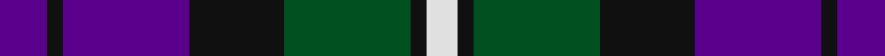

This page is one **sett** — a single exact thread-count. It belongs to the [tartan](/tartans/p3k1p8k6g8k1ln2/)
(the same proportion at any scale), whose colour order is pattern [BKBKGKW](/stripes/bkbkgkw/).

Sourced from register-of-tartans.  It is a [7 stripe tartan](/stripes/stripes7/).

Original link https://www.tartanregister.gov.uk/tartanDetails.aspx?ref=162

## Register references

External register numbers recorded for this tartan.

- Scottish Register of Tartans: [162](https://www.tartanregister.gov.uk/tartanDetails.aspx?ref=162)
- Scottish Tartans World Register: 302

## Thread count
P/6 K2 P16 K12 G16 K2 LN/4

## Palette
Each colour and the base-6 reference it is a variant of.

| Colour | Shade | Base |
|---|---|---|
| G | <code style="background-color:#005020;">#005020</code> `oklch(37.7% 0.105 149.6)` <small>#005020</small> | G <code style="background-color:#006100;">#006100</code> |
| K | <code style="background-color:#101010;">#101010</code> `oklch(17.3% 0.000 89.9)` <small>#101010</small> | K <code style="background-color:#000000;">#000000</code> |
| LN | <code style="background-color:#E0E0E0;">#E0E0E0</code> `oklch(90.7% 0.000 89.9)` <small>#E0E0E0</small> | W <code style="background-color:#F7F7F7;">#F7F7F7</code> |
| P | <code style="background-color:#5A008C;">#5A008C</code> `oklch(37.0% 0.191 306.3)` <small>#5A008C</small> | B <code style="background-color:#2A418A;">#2A418A</code> |

# Sample pattern

## Nearest tartans

The nearest existing variants by ΔTartan distance, with this tartan at the top so the swatches line up against it.

ΔTartan

Tartan

Sett

—

<a href="/ttd/edit/#slug=dp3k1dp8k6dg8k1w2~x2">Baillie (Highland Society)</a> <a class="nn-out" href="/setts/s7/dp3k1dp8k6dg8k1w2~x2/" title="open its dictionary page">↗</a>

0.54

<a href="/ttd/edit/#slug=db9k7o5r1o5k1o2~x4">Greyhound Grenadiers (Corporate)</a> <a class="nn-out" href="/setts/s7/db9k7o5r1o5k1o2~x4/" title="open its dictionary page">↗</a>

0.89

<a href="/ttd/edit/#slug=r7k4db28k24t24k4db4~x2">MacCorquodale</a> <a class="nn-out" href="/setts/s7/r7k4db28k24t24k4db4~x2/" title="open its dictionary page">↗</a>

0.98

<a href="/ttd/edit/#slug=db3db1g5db3r9db1r1db2~x4">Unidentified #61</a> <a class="nn-out" href="/setts/s8/db3db1g5db3r9db1r1db2~x4/" title="open its dictionary page">↗</a>

1.00

<a href="/ttd/edit/#slug=ly6dg3ly3dg22k23dp23k4~x2">Gordon of Esslemont</a> <a class="nn-out" href="/setts/s7/ly6dg3ly3dg22k23dp23k4~x2/" title="open its dictionary page">↗</a>

1.02

<a href="/ttd/edit/#slug=k6lb3k8db7lo2db7lb1~x4">St. Johnstone F.C. (Sports)</a> <a class="nn-out" href="/setts/s7/k6lb3k8db7lo2db7lb1~x4/" title="open its dictionary page">↗</a>

1.02

<a href="/ttd/edit/#slug=n32w4n4k24dp29k4">Grammar School at Leeds (School)</a> <a class="nn-out" href="/setts/s6/n32w4n4k24dp29k4/" title="open its dictionary page">↗</a>

1.05

<a href="/ttd/edit/#slug=o4db19o3k20o24db3~x2">Edinburgh International Conference Centre</a> <a class="nn-out" href="/setts/s6/o4db19o3k20o24db3~x2/" title="open its dictionary page">↗</a>

1.05

<a href="/ttd/edit/#slug=dp17k18w2g17k3g17w2k18dp17g3~x2">Wilson's No.076</a> <a class="nn-out" href="/setts/s10/dp17k18w2g17k3g17w2k18dp17g3~x2/" title="open its dictionary page">↗</a>

1.07

<a href="/ttd/edit/#slug=r8b32k24db24k3b3~x2">MacCorquodale #2</a> <a class="nn-out" href="/setts/s6/r8b32k24db24k3b3~x2/" title="open its dictionary page">↗</a>

1.07

<a href="/ttd/edit/#slug=ly5db24k8db18ly6dy3">Cala Homes (Corporate)</a> <a class="nn-out" href="/setts/s6/ly5db24k8db18ly6dy3/" title="open its dictionary page">↗</a>

## Neighbour map

Every grey dot is one of 14299 variants placed by the first two principal components of the ΔTartan feature space (44% of its variance). Red is this tartan; blue dots are its nearest — click one to open its page.

<svg viewBox="0 0 640 380" role="img" style="max-width:100%;height:auto;border:1px solid #e0e0e0;border-radius:4px;display:block" xmlns="http://www.w3.org/2000/svg"><image href="/nn/cloud.v1.png" width="640" height="380"/><a href="/setts/s7/db9k7o5r1o5k1o2~x4/"><circle cx="185.6" cy="220.7" r="4" fill="#3465a4"><title>Greyhound Grenadiers (Corporate)</title></circle></a><a href="/setts/s7/r7k4db28k24t24k4db4~x2/"><circle cx="144.2" cy="219.1" r="4" fill="#3465a4"><title>MacCorquodale</title></circle></a><a href="/setts/s8/db3db1g5db3r9db1r1db2~x4/"><circle cx="217.9" cy="207.9" r="4" fill="#3465a4"><title>Unidentified #61</title></circle></a><a href="/setts/s7/ly6dg3ly3dg22k23dp23k4~x2/"><circle cx="148.7" cy="217.0" r="4" fill="#3465a4"><title>Gordon of Esslemont</title></circle></a><a href="/setts/s7/k6lb3k8db7lo2db7lb1~x4/"><circle cx="180.7" cy="242.7" r="4" fill="#3465a4"><title>St. Johnstone F.C. (Sports)</title></circle></a><a href="/setts/s6/n32w4n4k24dp29k4/"><circle cx="207.5" cy="228.9" r="4" fill="#3465a4"><title>Grammar School at Leeds (School)</title></circle></a><a href="/setts/s6/o4db19o3k20o24db3~x2/"><circle cx="153.4" cy="222.8" r="4" fill="#3465a4"><title>Edinburgh International Conference Centre</title></circle></a><a href="/setts/s10/dp17k18w2g17k3g17w2k18dp17g3~x2/"><circle cx="155.3" cy="206.7" r="4" fill="#3465a4"><title>Wilson's No.076</title></circle></a><a href="/setts/s6/r8b32k24db24k3b3~x2/"><circle cx="200.8" cy="228.6" r="4" fill="#3465a4"><title>MacCorquodale #2</title></circle></a><a href="/setts/s6/ly5db24k8db18ly6dy3/"><circle cx="142.8" cy="211.7" r="4" fill="#3465a4"><title>Cala Homes (Corporate)</title></circle></a><circle cx="177.2" cy="225.7" r="5" fill="#c00000"/></svg>

ID: /setts/s7/dp3k1dp8k6dg8k1w2~x2/
