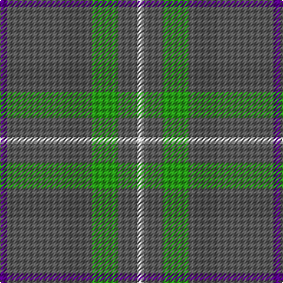

This page is one **sett** — a single exact thread-count. It belongs to the [tartan](/tartans/dp3n24ni10n2g11n8w3/)
(the same proportion at any scale), whose colour order is pattern [BBBBGBW](/stripes/bbbbgbw/).

Sourced from register-of-tartans.  It is a [7 stripe tartan](/stripes/stripes7/).

Original link https://www.tartanregister.gov.uk/tartanDetails.aspx?ref=11536

## Register references

External register numbers recorded for this tartan.

- Scottish Register of Tartans: [11536](https://www.tartanregister.gov.uk/tartanDetails.aspx?ref=11536)

## Thread count
P/6 Na48 N20 Na4 G22 Na16 LN/6

## Palette

Palette: <strong>Tartan Register</strong> <small style="color:#888">(4 of 5 colours)</small>
<table><thead><tr><th>Colour</th><th>Threads</th><th>Shade</th><th>Base</th><th>OKLCh</th></tr></thead><tbody><tr><td>P/</td><td style="text-align:right;font-variant-numeric:tabular-nums">6</td><td><code style="background-color:#5A008C;">#5A008C</code> <small style="color:#888">#5A008C</small></td><td>B <code style="background-color:#2A418A;">#2A418A</code></td><td><small style="color:#888">oklch(37.0% 0.191 306.3)</small></td></tr><tr><td>Na</td><td style="text-align:right;font-variant-numeric:tabular-nums">48</td><td><code style="background-color:#5C5C5C;">#5C5C5C</code> <small style="color:#888">#5C5C5C</small></td><td>B <code style="background-color:#2A418A;">#2A418A</code></td><td><small style="color:#888">oklch(47.5% 0.000 89.9)</small></td></tr><tr><td>N</td><td style="text-align:right;font-variant-numeric:tabular-nums">20</td><td><code style="background-color:#505050;">#505050</code> <small style="color:#888">#505050</small></td><td>B <code style="background-color:#2A418A;">#2A418A</code></td><td><small style="color:#888">oklch(43.1% 0.000 89.9)</small></td></tr><tr><td>Na</td><td style="text-align:right;font-variant-numeric:tabular-nums">4</td><td><code style="background-color:#5C5C5C;">#5C5C5C</code> <small style="color:#888">#5C5C5C</small></td><td>B <code style="background-color:#2A418A;">#2A418A</code></td><td><small style="color:#888">oklch(47.5% 0.000 89.9)</small></td></tr><tr><td>G</td><td style="text-align:right;font-variant-numeric:tabular-nums">22</td><td><code style="background-color:#289C18;">#289C18</code> <small style="color:#888">#289C18</small></td><td>G <code style="background-color:#006100;">#006100</code></td><td><small style="color:#888">oklch(60.6% 0.191 141.6)</small></td></tr><tr><td>Na</td><td style="text-align:right;font-variant-numeric:tabular-nums">16</td><td><code style="background-color:#5C5C5C;">#5C5C5C</code> <small style="color:#888">#5C5C5C</small></td><td>B <code style="background-color:#2A418A;">#2A418A</code></td><td><small style="color:#888">oklch(47.5% 0.000 89.9)</small></td></tr><tr><td>LN/</td><td style="text-align:right;font-variant-numeric:tabular-nums">6</td><td><code style="background-color:#E0E0E0;">#E0E0E0</code> <small style="color:#888">#E0E0E0</small></td><td>W <code style="background-color:#F7F7F7;">#F7F7F7</code></td><td><small style="color:#888">oklch(90.7% 0.000 89.9)</small></td></tr></tbody></table>

# Sample pattern

## Nearest tartans

The nearest existing variants by ΔTartan distance, with this tartan at the top so the swatches line up against it.

ΔTartan

Tartan

Sett

—

<a href="/ttd/edit/#slug=dp3n24ni10n2g11n8w3~x2">Hesco</a> <a class="nn-out" href="/setts/s7/dp3n24ni10n2g11n8w3~x2/" title="open its dictionary page">↗</a>

1.13

<a href="/ttd/edit/#slug=r1g4lo1g3r4n15w1~x4">Bressuire (District)</a> <a class="nn-out" href="/setts/s7/r1g4lo1g3r4n15w1~x4/" title="open its dictionary page">↗</a>

1.21

<a href="/ttd/edit/#slug=g8dr2g13r4g12t22g5y3~x2">Kildare</a> <a class="nn-out" href="/setts/s8/g8dr2g13r4g12t22g5y3~x2/" title="open its dictionary page">↗</a>

1.30

<a href="/ttd/edit/#slug=dy46g23b23r4ly4~x2">McMoosie Htg (Fashion)</a> <a class="nn-out" href="/setts/s5/dy46g23b23r4ly4~x2/" title="open its dictionary page">↗</a>

1.34

<a href="/ttd/edit/#slug=y19r3t19r11y19ly2db4~x2">Rotary Corporate Tartan Tartan Number: 2187. Earliest known date: 1995 The tartan was designed by K. Lumsden of the Scottish Tartans Society in conjuntion with the Rotary Club of Glasgow. It was decided to use as a base the City of Glasgow Tartan; the colours being brightened and the gold and the deep blue of the Rotary Wheel added. The actual shades are specific Rotary colours. The tartan is currently available only from Geoffrey (Tailor) Highland Crafts, The Royal Mile, Edinburgh. See products available Copyright © Blair Urquhart, Comrie, 2015</a> <a class="nn-out" href="/setts/s7/y19r3t19r11y19ly2db4~x2/" title="open its dictionary page">↗</a>

1.37

<a href="/ttd/edit/#slug=dg20k2dg20dp25w2n3~x2">Lawrence of Broughty Ferry</a> <a class="nn-out" href="/setts/s6/dg20k2dg20dp25w2n3~x2/" title="open its dictionary page">↗</a>

1.41

<a href="/ttd/edit/#slug=ri4y2db4y35t27r3~x2">Royal Deeside (District)</a> <a class="nn-out" href="/setts/s6/ri4y2db4y35t27r3~x2/" title="open its dictionary page">↗</a>

1.41

<a href="/ttd/edit/#slug=g8k2g13lr4g12n22g5lo3~x2">Taylor</a> <a class="nn-out" href="/setts/s8/g8k2g13lr4g12n22g5lo3~x2/" title="open its dictionary page">↗</a>

1.41

<a href="/ttd/edit/#slug=r3o18g10o2db10o2db10o2g10o18w3~x2">Fraser hunting</a> <a class="nn-out" href="/setts/s11/r3o18g10o2db10o2db10o2g10o18w3~x2/" title="open its dictionary page">↗</a>

1.42

<a href="/ttd/edit/#slug=g8w3n6db11n30db5~x2">Devlin, Craig (Personal)</a> <a class="nn-out" href="/setts/s6/g8w3n6db11n30db5~x2/" title="open its dictionary page">↗</a>

1.43

<a href="/ttd/edit/#slug=t4r1ly1t12do4y10ly1r3~x4">Hawaii (District)</a> <a class="nn-out" href="/setts/s8/t4r1ly1t12do4y10ly1r3~x4/" title="open its dictionary page">↗</a>

## Neighbour map

Every grey dot is one of 14359 variants placed by the first two principal components of the ΔTartan feature space (44% of its variance). Red is this tartan; blue dots are its nearest — click one to open its page.

<svg viewBox="0 0 640 380" role="img" style="max-width:100%;height:auto;border:1px solid #e0e0e0;border-radius:4px;display:block" xmlns="http://www.w3.org/2000/svg"><image href="/nn/cloud.v1.png" width="640" height="380"/><a href="/setts/s7/r1g4lo1g3r4n15w1~x4/"><circle cx="332.3" cy="183.6" r="4" fill="#3465a4"><title>Bressuire (District)</title></circle></a><a href="/setts/s8/g8dr2g13r4g12t22g5y3~x2/"><circle cx="349.4" cy="239.1" r="4" fill="#3465a4"><title>Kildare</title></circle></a><a href="/setts/s5/dy46g23b23r4ly4~x2/"><circle cx="283.4" cy="239.6" r="4" fill="#3465a4"><title>McMoosie Htg (Fashion)</title></circle></a><a href="/setts/s7/y19r3t19r11y19ly2db4~x2/"><circle cx="265.0" cy="226.0" r="4" fill="#3465a4"><title>Rotary Corporate Tartan Tartan Number: 2187. Earliest known date: 1995 The tartan was designed by K. Lumsden of the Scottish Tartans Society in conjuntion with the Rotary Club of Glasgow. It was decided to use as a base the City of Glasgow Tartan; the colours being brightened and the gold and the deep blue of the Rotary Wheel added. The actual shades are specific Rotary colours. The tartan is currently available only from Geoffrey (Tailor) Highland Crafts, The Royal Mile, Edinburgh. See products available Copyright © Blair Urquhart, Comrie, 2015</title></circle></a><a href="/setts/s6/dg20k2dg20dp25w2n3~x2/"><circle cx="360.5" cy="237.8" r="4" fill="#3465a4"><title>Lawrence of Broughty Ferry</title></circle></a><a href="/setts/s6/ri4y2db4y35t27r3~x2/"><circle cx="341.4" cy="187.2" r="4" fill="#3465a4"><title>Royal Deeside (District)</title></circle></a><a href="/setts/s8/g8k2g13lr4g12n22g5lo3~x2/"><circle cx="336.0" cy="237.6" r="4" fill="#3465a4"><title>Taylor</title></circle></a><a href="/setts/s11/r3o18g10o2db10o2db10o2g10o18w3~x2/"><circle cx="249.3" cy="208.3" r="4" fill="#3465a4"><title>Fraser hunting</title></circle></a><a href="/setts/s6/g8w3n6db11n30db5~x2/"><circle cx="357.4" cy="242.9" r="4" fill="#3465a4"><title>Devlin, Craig (Personal)</title></circle></a><a href="/setts/s8/t4r1ly1t12do4y10ly1r3~x4/"><circle cx="249.5" cy="191.4" r="4" fill="#3465a4"><title>Hawaii (District)</title></circle></a><circle cx="323.9" cy="218.0" r="5" fill="#c00000"/></svg>

ID: /setts/s7/dp3n24ni10n2g11n8w3~x2/
