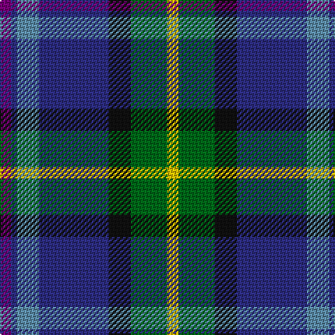

In pattern [BBBBKGY](/stripes/bbbbkgy/).

This was sourced from register-of-tartans.  It is a [7 stripe tartan](/stripes/stripes7/).

Original link https://www.tartanregister.gov.uk/tartanDetails.aspx?ref=3500

## Register references

External register numbers recorded for this tartan.

- Scottish Register of Tartans: [3500](https://www.tartanregister.gov.uk/tartanDetails.aspx?ref=3500)
- Scottish Tartans World Register: 2560

## Thread count
Y/8 G26 K16 DB50 B16 DB4 P/8

## Palette
Each colour and the base-6 reference it is a variant of.

| Colour | Shade | Base |
|---|---|---|
| B | <code style="background-color:#5C8CA8;">#5C8CA8</code> `oklch(61.7% 0.067 235.0)` <small>#5C8CA8</small> | B <code style="background-color:#2A418A;">#2A418A</code> |
| DB | <code style="background-color:#2C2C80;">#2C2C80</code> `oklch(35.0% 0.138 276.6)` <small>#2C2C80</small> | B <code style="background-color:#2A418A;">#2A418A</code> |
| G | <code style="background-color:#006818;">#006818</code> `oklch(45.0% 0.142 145.0)` <small>#006818</small> | G <code style="background-color:#006100;">#006100</code> |
| K | <code style="background-color:#101010;">#101010</code> `oklch(17.3% 0.000 89.9)` <small>#101010</small> | K <code style="background-color:#000000;">#000000</code> |
| P | <code style="background-color:#780078;">#780078</code> `oklch(40.2% 0.185 328.4)` <small>#780078</small> | B <code style="background-color:#2A418A;">#2A418A</code> |
| Y | <code style="background-color:#E8C000;">#E8C000</code> `oklch(81.9% 0.168 93.7)` <small>#E8C000</small> | Y <code style="background-color:#F2BF00;">#F2BF00</code> |

# Sample pattern

## Nearest tartans

The nearest existing variants by ΔTartan distance, with this tartan at the top so the swatches line up against it.

ΔTartan

Tartan

Sett

—

<a href="/ttd/edit/#slug=dp4db2t8db25k8g13ly4~x2">Renfrewshire</a> <a class="nn-out" href="/setts/s7/dp4db2t8db25k8g13ly4~x2/" title="open its dictionary page">↗</a>

0.55

<a href="/ttd/edit/#slug=m4db2t7db20k7g10ly4~x2">Renfrewshire District Tartan Tartan Number: 2560. Earliest known date: 1998 Designed for anyone residing in the County of Renfrewshire See products available Copyright © Blair Urquhart, Comrie, 2015</a> <a class="nn-out" href="/setts/s7/m4db2t7db20k7g10ly4~x2/" title="open its dictionary page">↗</a>

0.68

<a href="/ttd/edit/#slug=t26db13k13w2g8k5r3t3~x2">Moran (Coilessan) (Personal)</a> <a class="nn-out" href="/setts/s8/t26db13k13w2g8k5r3t3~x2/" title="open its dictionary page">↗</a>

0.71

<a href="/ttd/edit/#slug=p4db2t8db25k8g13ly4~x2">Renfrewshire Tartan</a> <a class="nn-out" href="/setts/s7/p4db2t8db25k8g13ly4~x2/" title="open its dictionary page">↗</a>

0.85

<a href="/ttd/edit/#slug=ly4g22r3k17r3db37w3~x2">Souza Nery (Personal)</a> <a class="nn-out" href="/setts/s7/ly4g22r3k17r3db37w3~x2/" title="open its dictionary page">↗</a>

0.85

<a href="/ttd/edit/#slug=t6db17dp4db2k11g3ly4~x2">East Lothian</a> <a class="nn-out" href="/setts/s7/t6db17dp4db2k11g3ly4~x2/" title="open its dictionary page">↗</a>

0.88

<a href="/ttd/edit/#slug=t26k10dt19r6ly2db9~x2">Meeson Dress Personal Tartan Tartan Number: 6026. Earliest known date: 2007 Formal Dress version. The gray was originally woven with a melange or marled yarn. See products available Copyright © Blair Urquhart, Comrie, 2015</a> <a class="nn-out" href="/setts/s6/t26k10dt19r6ly2db9~x2/" title="open its dictionary page">↗</a>

0.98

<a href="/ttd/edit/#slug=k29r3dt24n6k8w4n8o6~x2">Yates (Personal)</a> <a class="nn-out" href="/setts/s8/k29r3dt24n6k8w4n8o6~x2/" title="open its dictionary page">↗</a>

1.00

<a href="/ttd/edit/#slug=b11db5g4w3r3k16db28b2~x2">Scottish Italian</a> <a class="nn-out" href="/setts/s8/b11db5g4w3r3k16db28b2~x2/" title="open its dictionary page">↗</a>

1.01

<a href="/ttd/edit/#slug=k16w6k4b64m19k8g42ly6">Unidentified (Woven sample)</a> <a class="nn-out" href="/setts/s8/k16w6k4b64m19k8g42ly6/" title="open its dictionary page">↗</a>

1.02

<a href="/ttd/edit/#slug=t3r3k5g8w2k13db13t26w3~x2">Moran (Virgin Islands) (Personal)</a> <a class="nn-out" href="/setts/s9/t3r3k5g8w2k13db13t26w3~x2/" title="open its dictionary page">↗</a>

## Neighbour map

Every grey dot is one of 14299 variants placed by the first two principal components of the ΔTartan feature space (44% of its variance). Red is this tartan; blue dots are its nearest — click one to open its page.

<svg viewBox="0 0 640 380" role="img" style="max-width:100%;height:auto;border:1px solid #e0e0e0;border-radius:4px;display:block" xmlns="http://www.w3.org/2000/svg"><image href="/nn/cloud.v1.png" width="640" height="380"/><a href="/setts/s7/m4db2t7db20k7g10ly4~x2/"><circle cx="139.2" cy="183.8" r="4" fill="#3465a4"><title>Renfrewshire District Tartan Tartan Number: 2560. Earliest known date: 1998 Designed for anyone residing in the County of Renfrewshire See products available Copyright © Blair Urquhart, Comrie, 2015</title></circle></a><a href="/setts/s8/t26db13k13w2g8k5r3t3~x2/"><circle cx="150.9" cy="159.3" r="4" fill="#3465a4"><title>Moran (Coilessan) (Personal)</title></circle></a><a href="/setts/s7/p4db2t8db25k8g13ly4~x2/"><circle cx="149.3" cy="164.6" r="4" fill="#3465a4"><title>Renfrewshire Tartan</title></circle></a><a href="/setts/s7/ly4g22r3k17r3db37w3~x2/"><circle cx="176.3" cy="155.4" r="4" fill="#3465a4"><title>Souza Nery (Personal)</title></circle></a><a href="/setts/s7/t6db17dp4db2k11g3ly4~x2/"><circle cx="135.7" cy="186.2" r="4" fill="#3465a4"><title>East Lothian</title></circle></a><a href="/setts/s6/t26k10dt19r6ly2db9~x2/"><circle cx="138.9" cy="195.2" r="4" fill="#3465a4"><title>Meeson Dress Personal Tartan Tartan Number: 6026. Earliest known date: 2007 Formal Dress version. The gray was originally woven with a melange or marled yarn. See products available Copyright © Blair Urquhart, Comrie, 2015</title></circle></a><a href="/setts/s8/k29r3dt24n6k8w4n8o6~x2/"><circle cx="174.7" cy="178.6" r="4" fill="#3465a4"><title>Yates (Personal)</title></circle></a><a href="/setts/s8/b11db5g4w3r3k16db28b2~x2/"><circle cx="208.4" cy="156.1" r="4" fill="#3465a4"><title>Scottish Italian</title></circle></a><a href="/setts/s8/k16w6k4b64m19k8g42ly6/"><circle cx="161.8" cy="135.5" r="4" fill="#3465a4"><title>Unidentified (Woven sample)</title></circle></a><a href="/setts/s9/t3r3k5g8w2k13db13t26w3~x2/"><circle cx="133.4" cy="145.1" r="4" fill="#3465a4"><title>Moran (Virgin Islands) (Personal)</title></circle></a><circle cx="168.2" cy="173.8" r="5" fill="#c00000"/></svg>

ID: /setts/s7/dp4db2t8db25k8g13ly4~x2/
