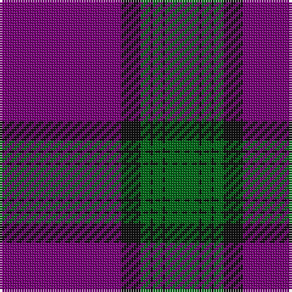

**Bands:** [GKGKGKB](/stripes/gkgkgkb/) · **Stripes:** [G K G K G K DP](/stripes/stripes7/) G K G K G K DP

This was sourced from tartans-authority.  It is a [7 band tartan](/bands/bands7/).

Original link http://www.tartansauthority.com/tartan-ferret/display/8049/

## Thread count
P/50 K8 G4 K1 G4 K1 G/14

## Palette
Each colour and its ΔE from the base-6 reference it is a variant of.

| Colour | Shade | Base | ΔE (OKLab) |
|---|---|---|---|
| G | <code style="background-color:#006818;">#006818</code> `#006818` | G <code style="background-color:#006100;">#006100</code> | 0.02 |
| K | <code style="background-color:#101010;">#101010</code> `#101010` | K <code style="background-color:#000000;">#000000</code> | 0.17 |
| P | <code style="background-color:#780078;">#780078</code> `#780078` | B <code style="background-color:#2A418A;">#2A418A</code> | 0.17 |

# Sample pattern

## Nearest tartans

The nearest existing variants by ΔTartan distance.

1. [McBrayer Blue (Personal)](/setts/s8/db57k1r12db1g12r14db1r2~x2/) — ΔT 1.01
1. [Falkirk Football Club (Corporate)](/setts/s9/db5r16db4k3db4k3db43r15w1~x2/) — ΔT 1.23
1. [Salvation Army, dress](/setts/s7/db80r21k2ly4k2r16db10~x2/) — ΔT 1.28
1. [Salvation Army Dress (Corporate)](/setts/s8/db74k2r15k2ly4k2r16db10~x2/) — ΔT 1.40
1. [University of Edinburgh](/setts/s7/k8r26k22n110w4k5w4/) — ΔT 1.65
1. [Clan Gregor Tartan Tartan Number: 3089. Earliest known date: See products available Copyright © Blair Urquhart, Comrie, 2015](/setts/s6/db25r8db3r4k1w3~x2/) — ΔT 1.71
1. [Fraser, Isabella](/setts/s7/g2r21db60r48db2r3g2~x2/) — ΔT 1.74
1. [Knights Templar - Grand Priory (Corp](/setts/s8/db1r2w1db30r30k1r2w1~x2/) — ΔT 1.74
1. [Lion Brand Sportswear](/setts/s7/lr4dt1r15dt42r6dt4lo1~x2/) — ΔT 1.75
1. [Canadian Legion Branch 50](/setts/s7/r68db9lb10db13lo1db1lo2~x2/) — ΔT 1.75

## Neighbour map

Every grey dot is one of 14299 variants placed by the first two principal components of the ΔTartan feature space (44% of its variance). Red is this tartan; blue dots are its nearest — click one to open its page.

<svg viewBox="0 0 640 380" role="img" style="max-width:100%;height:auto;border:1px solid #e0e0e0;border-radius:4px;display:block" xmlns="http://www.w3.org/2000/svg"><image href="/nn/cloud.v1.png" width="640" height="380"/><a href="/setts/s8/db57k1r12db1g12r14db1r2~x2/"><circle cx="433.3" cy="115.1" r="4" fill="#3465a4"><title>McBrayer Blue (Personal)</title></circle></a><a href="/setts/s9/db5r16db4k3db4k3db43r15w1~x2/"><circle cx="419.8" cy="121.1" r="4" fill="#3465a4"><title>Falkirk Football Club (Corporate)</title></circle></a><a href="/setts/s7/db80r21k2ly4k2r16db10~x2/"><circle cx="475.8" cy="132.3" r="4" fill="#3465a4"><title>Salvation Army, dress</title></circle></a><a href="/setts/s8/db74k2r15k2ly4k2r16db10~x2/"><circle cx="472.3" cy="122.3" r="4" fill="#3465a4"><title>Salvation Army Dress (Corporate)</title></circle></a><a href="/setts/s7/k8r26k22n110w4k5w4/"><circle cx="432.6" cy="155.0" r="4" fill="#3465a4"><title>University of Edinburgh</title></circle></a><a href="/setts/s6/db25r8db3r4k1w3~x2/"><circle cx="416.5" cy="157.8" r="4" fill="#3465a4"><title>Clan Gregor Tartan Tartan Number: 3089. Earliest known date: See products available Copyright © Blair Urquhart, Comrie, 2015</title></circle></a><a href="/setts/s7/g2r21db60r48db2r3g2~x2/"><circle cx="410.6" cy="154.9" r="4" fill="#3465a4"><title>Fraser, Isabella</title></circle></a><a href="/setts/s8/db1r2w1db30r30k1r2w1~x2/"><circle cx="383.2" cy="118.5" r="4" fill="#3465a4"><title>Knights Templar - Grand Priory (Corp</title></circle></a><a href="/setts/s7/lr4dt1r15dt42r6dt4lo1~x2/"><circle cx="495.8" cy="156.0" r="4" fill="#3465a4"><title>Lion Brand Sportswear</title></circle></a><a href="/setts/s7/r68db9lb10db13lo1db1lo2~x2/"><circle cx="484.4" cy="109.3" r="4" fill="#3465a4"><title>Canadian Legion Branch 50</title></circle></a><circle cx="470.8" cy="138.6" r="5" fill="#c00000"/></svg>

ID: /setts/s7/dp50k8g4k1g4k1g14/
