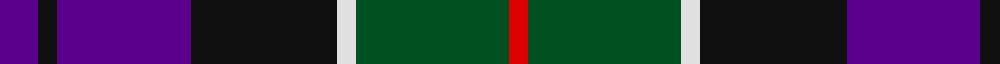

This page is one **sett** — a single exact thread-count. It belongs to the [tartan](/tartans/dp6k3dp21k23w3dg24r3/)
(the same proportion at any scale), whose colour order is pattern [BKBKWGR](/stripes/bkbkwgr/).

Sourced from register-of-tartans.  It is a [7 stripe tartan](/stripes/stripes7/).

Original link https://www.tartanregister.gov.uk/tartanDetails.aspx?ref=716

## Also known as

This cloth is also recorded under:

- Colquhoun #3

## Register references

External register numbers recorded for this tartan.

- Scottish Register of Tartans: [716](https://www.tartanregister.gov.uk/tartanDetails.aspx?ref=716)
- Scottish Tartans World Register: 275

## Thread count
P/12 K6 P42 K46 LN6 G48 R/6

## Palette

Palette: <strong>Tartan Register</strong>
<table><thead><tr><th>Colour</th><th>Threads</th><th>Shade</th><th>Base</th><th>OKLCh</th></tr></thead><tbody><tr><td>P/</td><td style="text-align:right;font-variant-numeric:tabular-nums">12</td><td><code style="background-color:#5A008C;">#5A008C</code> <small style="color:#888">#5A008C</small></td><td>B <code style="background-color:#2A418A;">#2A418A</code></td><td><small style="color:#888">oklch(37.0% 0.191 306.3)</small></td></tr><tr><td>K</td><td style="text-align:right;font-variant-numeric:tabular-nums">6</td><td><code style="background-color:#101010;">#101010</code> <small style="color:#888">#101010</small></td><td>K <code style="background-color:#000000;">#000000</code></td><td><small style="color:#888">oklch(17.3% 0.000 89.9)</small></td></tr><tr><td>P</td><td style="text-align:right;font-variant-numeric:tabular-nums">42</td><td><code style="background-color:#5A008C;">#5A008C</code> <small style="color:#888">#5A008C</small></td><td>B <code style="background-color:#2A418A;">#2A418A</code></td><td><small style="color:#888">oklch(37.0% 0.191 306.3)</small></td></tr><tr><td>K</td><td style="text-align:right;font-variant-numeric:tabular-nums">46</td><td><code style="background-color:#101010;">#101010</code> <small style="color:#888">#101010</small></td><td>K <code style="background-color:#000000;">#000000</code></td><td><small style="color:#888">oklch(17.3% 0.000 89.9)</small></td></tr><tr><td>LN</td><td style="text-align:right;font-variant-numeric:tabular-nums">6</td><td><code style="background-color:#E0E0E0;">#E0E0E0</code> <small style="color:#888">#E0E0E0</small></td><td>W <code style="background-color:#F7F7F7;">#F7F7F7</code></td><td><small style="color:#888">oklch(90.7% 0.000 89.9)</small></td></tr><tr><td>G</td><td style="text-align:right;font-variant-numeric:tabular-nums">48</td><td><code style="background-color:#005020;">#005020</code> <small style="color:#888">#005020</small></td><td>G <code style="background-color:#006100;">#006100</code></td><td><small style="color:#888">oklch(37.7% 0.105 149.6)</small></td></tr><tr><td>R/</td><td style="text-align:right;font-variant-numeric:tabular-nums">6</td><td><code style="background-color:#DC0000;">#DC0000</code> <small style="color:#888">#DC0000</small></td><td>R <code style="background-color:#CC0000;">#CC0000</code></td><td><small style="color:#888">oklch(56.2% 0.230 29.2)</small></td></tr></tbody></table>

# Sample pattern

## Nearest tartans

The nearest existing variants by ΔTartan distance, with this tartan at the top so the swatches line up against it.

ΔTartan

Tartan

Sett

—

<a href="/ttd/edit/#slug=dp6k3dp21k23w3dg24r3~x2">Colquhoun #3</a> <a class="nn-out" href="/setts/s7/dp6k3dp21k23w3dg24r3~x2/" title="open its dictionary page">↗</a>

0.68

<a href="/ttd/edit/#slug=db6g27db3k19dp27w3~x2">Gold Brothers</a> <a class="nn-out" href="/setts/s6/db6g27db3k19dp27w3~x2/" title="open its dictionary page">↗</a>

0.70

<a href="/ttd/edit/#slug=r5g19w3k19db19k3db2~x2">Fruin Colquhoun (Commemorative?)</a> <a class="nn-out" href="/setts/s7/r5g19w3k19db19k3db2~x2/" title="open its dictionary page">↗</a>

0.77

<a href="/ttd/edit/#slug=k4b21dy10y4k20r6b3~x2">Swankie (Personal)</a> <a class="nn-out" href="/setts/s7/k4b21dy10y4k20r6b3~x2/" title="open its dictionary page">↗</a>

0.80

<a href="/ttd/edit/#slug=dp2r2dp16k17dg16k2ly2~x2">Zangenberg (Personal)</a> <a class="nn-out" href="/setts/s7/dp2r2dp16k17dg16k2ly2~x2/" title="open its dictionary page">↗</a>

0.86

<a href="/ttd/edit/#slug=r1o5k5db1k1db6ly1~x8">Lopez-Gasparotto</a> <a class="nn-out" href="/setts/s7/r1o5k5db1k1db6ly1~x8/" title="open its dictionary page">↗</a>

0.86

<a href="/ttd/edit/#slug=r3g16w2k16db16k2db2~x2">Colquhoun Clan Tartan Tartan Number: 274. Earliest known date: 1810-15 The Bonnie Banks and Braes of Loch Lomand were the setting for the interesting and sometimes violent history of the Colquhouns of Luss. Their tartan is well documented, appearing in the earliest collections, and certified by the Chief, with his seal and signature, in the archives of the Highland Society of London. (c.1816). The Clan tartan, in its present form, was woven by Wilson's of Bannockburn at the beginning of the 19th century and recorded in the firms pattern books dated 1819. Wilson often used purple in place of blue and produced proportionately equivalent patterns in different weights of cloth. Logan recorded a similar sett in 1831. The Vestiarium Scoticum shows a pattern with the white stripe next to the blue but this is regarded as an error. See products available Copyright © Blair Urquhart, Comrie, 2015</a> <a class="nn-out" href="/setts/s7/r3g16w2k16db16k2db2~x2/" title="open its dictionary page">↗</a>

0.89

<a href="/ttd/edit/#slug=db22r3db2r3db2k17o18dg4~x2">Scotch House 2000, antique</a> <a class="nn-out" href="/setts/s8/db22r3db2r3db2k17o18dg4~x2/" title="open its dictionary page">↗</a>

0.89

<a href="/ttd/edit/#slug=r4db24k12g14k4lb3~x2">MacPhail Hunting #2</a> <a class="nn-out" href="/setts/s6/r4db24k12g14k4lb3~x2/" title="open its dictionary page">↗</a>

0.95

<a href="/ttd/edit/#slug=k1dg8w1k8w1db8r1~x4">Caie (2013)</a> <a class="nn-out" href="/setts/s7/k1dg8w1k8w1db8r1~x4/" title="open its dictionary page">↗</a>

0.96

<a href="/ttd/edit/#slug=r2k1db8k8g8k1t2~x2">Argyll</a> <a class="nn-out" href="/setts/s7/r2k1db8k8g8k1t2~x2/" title="open its dictionary page">↗</a>

## Neighbour map

Every grey dot is one of 14299 variants placed by the first two principal components of the ΔTartan feature space (44% of its variance). Red is this tartan; blue dots are its nearest — click one to open its page.

<svg viewBox="0 0 640 380" role="img" style="max-width:100%;height:auto;border:1px solid #e0e0e0;border-radius:4px;display:block" xmlns="http://www.w3.org/2000/svg"><image href="/nn/cloud.v1.png" width="640" height="380"/><a href="/setts/s6/db6g27db3k19dp27w3~x2/"><circle cx="141.0" cy="206.8" r="4" fill="#3465a4"><title>Gold Brothers</title></circle></a><a href="/setts/s7/r5g19w3k19db19k3db2~x2/"><circle cx="148.1" cy="203.1" r="4" fill="#3465a4"><title>Fruin Colquhoun (Commemorative?)</title></circle></a><a href="/setts/s7/k4b21dy10y4k20r6b3~x2/"><circle cx="147.4" cy="213.4" r="4" fill="#3465a4"><title>Swankie (Personal)</title></circle></a><a href="/setts/s7/dp2r2dp16k17dg16k2ly2~x2/"><circle cx="172.5" cy="194.8" r="4" fill="#3465a4"><title>Zangenberg (Personal)</title></circle></a><a href="/setts/s7/r1o5k5db1k1db6ly1~x8/"><circle cx="132.1" cy="209.5" r="4" fill="#3465a4"><title>Lopez-Gasparotto</title></circle></a><a href="/setts/s7/r3g16w2k16db16k2db2~x2/"><circle cx="150.2" cy="205.8" r="4" fill="#3465a4"><title>Colquhoun Clan Tartan Tartan Number: 274. Earliest known date: 1810-15 The Bonnie Banks and Braes of Loch Lomand were the setting for the interesting and sometimes violent history of the Colquhouns of Luss. Their tartan is well documented, appearing in the earliest collections, and certified by the Chief, with his seal and signature, in the archives of the Highland Society of London. (c.1816). The Clan tartan, in its present form, was woven by Wilson's of Bannockburn at the beginning of the 19th century and recorded in the firms pattern books dated 1819. Wilson often used purple in place of blue and produced proportionately equivalent patterns in different weights of cloth. Logan recorded a similar sett in 1831. The Vestiarium Scoticum shows a pattern with the white stripe next to the blue but this is regarded as an error. See products available Copyright © Blair Urquhart, Comrie, 2015</title></circle></a><a href="/setts/s8/db22r3db2r3db2k17o18dg4~x2/"><circle cx="167.8" cy="174.0" r="4" fill="#3465a4"><title>Scotch House 2000, antique</title></circle></a><a href="/setts/s6/r4db24k12g14k4lb3~x2/"><circle cx="172.5" cy="220.7" r="4" fill="#3465a4"><title>MacPhail Hunting #2</title></circle></a><a href="/setts/s7/k1dg8w1k8w1db8r1~x4/"><circle cx="151.6" cy="205.8" r="4" fill="#3465a4"><title>Caie (2013)</title></circle></a><a href="/setts/s7/r2k1db8k8g8k1t2~x2/"><circle cx="150.9" cy="216.8" r="4" fill="#3465a4"><title>Argyll</title></circle></a><circle cx="158.2" cy="206.7" r="5" fill="#c00000"/></svg>

ID: /setts/s7/dp6k3dp21k23w3dg24r3~x2/
