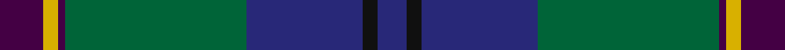
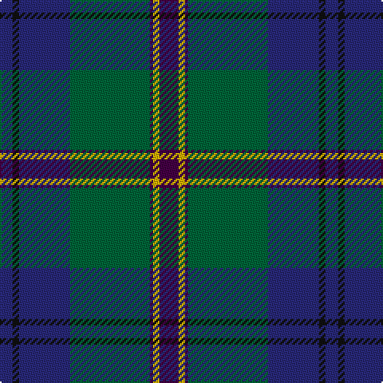

This page is one **sett** — a single exact thread-count. It belongs to the [tartan](/tartans/dp6ly2dp1g25db16k2db4/)
(the same proportion at any scale), whose colour order is pattern [BKBGBYB](/stripes/bkbgbyb/).

Sourced from register-of-tartans.  It is a [7 stripe tartan](/stripes/stripes7/).

Original link https://www.tartanregister.gov.uk/tartanDetails.aspx?ref=2238

3 attestations — the source records this cloth was collapsed from (oldest owns this page)

<ul>
<li>01/01/2000 — Lowry (register-of-tartans, <a href="https://www.tartanregister.gov.uk/tartanDetails.aspx?ref=2238">record</a>)</li>
<li>2000 — Lowry (Name) (tartans-authority, <a href="http://www.tartansauthority.com/tartan-ferret/display/4220/">record</a>)</li>
<li>undated — Lowry Clan Tartan Tartan Number: 3203. Earliest known date: 2000 One of a set of three similar designs for Laurie, Lawrie and Lowry, designed by Peter MacDonald for Iain Laurie. See products available Copyright © Blair Urquhart, Comrie, 2015 (house-of-tartan, <a href="http://www.house-of-tartan.scotland.net/house/TartanViewjs.asp?colr=Def&tnam=3203">record</a>)</li>
</ul>

## Register references

External register numbers recorded for this tartan.

- Scottish Register of Tartans: [2238](https://www.tartanregister.gov.uk/tartanDetails.aspx?ref=2238)
- Scottish Tartans Authority (ITI): 4220
- Scottish Tartans World Register: 2922

## Thread count
DP/12 Y4 DP2 G50 DB32 K4 DB/8

## Palette

Palette: <strong>Tartan Register</strong> <small style="color:#888">(3 of 5 colours)</small>
<table><thead><tr><th>Colour</th><th>Threads</th><th>Shade</th><th>Base</th><th>OKLCh</th></tr></thead><tbody><tr><td>DP/</td><td style="text-align:right;font-variant-numeric:tabular-nums">12</td><td><code style="background-color:#440044;">#440044</code> <small style="color:#888">#440044</small></td><td>B <code style="background-color:#2A418A;">#2A418A</code></td><td><small style="color:#888">oklch(27.1% 0.125 328.4)</small></td></tr><tr><td>Y</td><td style="text-align:right;font-variant-numeric:tabular-nums">4</td><td><code style="background-color:#D8B000;">#D8B000</code> <small style="color:#888">#D8B000</small></td><td>Y <code style="background-color:#F2BF00;">#F2BF00</code></td><td><small style="color:#888">oklch(77.1% 0.158 92.3)</small></td></tr><tr><td>DP</td><td style="text-align:right;font-variant-numeric:tabular-nums">2</td><td><code style="background-color:#440044;">#440044</code> <small style="color:#888">#440044</small></td><td>B <code style="background-color:#2A418A;">#2A418A</code></td><td><small style="color:#888">oklch(27.1% 0.125 328.4)</small></td></tr><tr><td>G</td><td style="text-align:right;font-variant-numeric:tabular-nums">50</td><td><code style="background-color:#006438;">#006438</code> <small style="color:#888">#006438</small></td><td>G <code style="background-color:#006100;">#006100</code></td><td><small style="color:#888">oklch(44.2% 0.108 155.6)</small></td></tr><tr><td>DB</td><td style="text-align:right;font-variant-numeric:tabular-nums">32</td><td><code style="background-color:#282878;">#282878</code> <small style="color:#888">#282878</small></td><td>B <code style="background-color:#2A418A;">#2A418A</code></td><td><small style="color:#888">oklch(33.3% 0.133 276.4)</small></td></tr><tr><td>K</td><td style="text-align:right;font-variant-numeric:tabular-nums">4</td><td><code style="background-color:#101010;">#101010</code> <small style="color:#888">#101010</small></td><td>K <code style="background-color:#000000;">#000000</code></td><td><small style="color:#888">oklch(17.3% 0.000 89.9)</small></td></tr><tr><td>DB/</td><td style="text-align:right;font-variant-numeric:tabular-nums">8</td><td><code style="background-color:#282878;">#282878</code> <small style="color:#888">#282878</small></td><td>B <code style="background-color:#2A418A;">#2A418A</code></td><td><small style="color:#888">oklch(33.3% 0.133 276.4)</small></td></tr></tbody></table>

# Sample pattern

## Nearest tartans

The nearest existing variants by ΔTartan distance, with this tartan at the top so the swatches line up against it.

ΔTartan

Tartan

Sett

—

<a href="/ttd/edit/#slug=dp6ly2dp1g25db16k2db4~x2">Lowry</a> <a class="nn-out" href="/setts/s7/dp6ly2dp1g25db16k2db4~x2/" title="open its dictionary page">↗</a>

0.30

<a href="/ttd/edit/#slug=dp6o2dp1g25db16k2db4~x2">Lawrie Clan Tartan Tartan Number: 3202. Earliest known date: 2000 One of a set of three similar designs for Laurie, Lawrie and Lowry, designed by Peter MacDonald for Iain Laurie. See products available Copyright © Blair Urquhart, Comrie, 2015</a> <a class="nn-out" href="/setts/s7/dp6o2dp1g25db16k2db4~x2/" title="open its dictionary page">↗</a>

0.34

<a href="/ttd/edit/#slug=dp6r2dp1g25db16k2db4~x2">Laurie Clan Tartan Tartan Number: 3201. Earliest known date: 2000 One of a set of three similar designs for Laurie, Lawrie and Lowry, designed by Peter MacDonald for Iain Laurie. See products available Copyright © Blair Urquhart, Comrie, 2015</a> <a class="nn-out" href="/setts/s7/dp6r2dp1g25db16k2db4~x2/" title="open its dictionary page">↗</a>

0.40

<a href="/ttd/edit/#slug=dp6y2dp1g25db16k2db4~x2">Lawrie</a> <a class="nn-out" href="/setts/s7/dp6y2dp1g25db16k2db4~x2/" title="open its dictionary page">↗</a>

0.57

<a href="/ttd/edit/#slug=db48w2k20dg22r3dg4~x2">MacFadzean</a> <a class="nn-out" href="/setts/s6/db48w2k20dg22r3dg4~x2/" title="open its dictionary page">↗</a>

0.71

<a href="/ttd/edit/#slug=db4k2db16w1k8dg24r4~x2">Colquhoun</a> <a class="nn-out" href="/setts/s7/db4k2db16w1k8dg24r4~x2/" title="open its dictionary page">↗</a>

0.74

<a href="/ttd/edit/#slug=dp6r2dp1dg25db16k2db4~x2">Laurie</a> <a class="nn-out" href="/setts/s7/dp6r2dp1dg25db16k2db4~x2/" title="open its dictionary page">↗</a>

0.86

<a href="/ttd/edit/#slug=lb2dt19k4dt4k4g9db2k1~x4">Dollar Academy (1999)</a> <a class="nn-out" href="/setts/s8/lb2dt19k4dt4k4g9db2k1~x4/" title="open its dictionary page">↗</a>

0.87

<a href="/ttd/edit/#slug=k6dbi3g28w1db28dbi2w3~x2">Weisfeld (Name)</a> <a class="nn-out" href="/setts/s7/k6dbi3g28w1db28dbi2w3~x2/" title="open its dictionary page">↗</a>

1.06

<a href="/ttd/edit/#slug=r4dg4k2dg29db21k3db3ly3~x2">Peter of Lee (Chief) (Personal)</a> <a class="nn-out" href="/setts/s8/r4dg4k2dg29db21k3db3ly3~x2/" title="open its dictionary page">↗</a>

1.07

<a href="/ttd/edit/#slug=dp4db5dp3db50k15g3k5g32w2g3">Spirit of Morningside (Fashion)</a> <a class="nn-out" href="/setts/s10/dp4db5dp3db50k15g3k5g32w2g3/" title="open its dictionary page">↗</a>

## Neighbour map

Every grey dot is one of 14359 variants placed by the first two principal components of the ΔTartan feature space (44% of its variance). Red is this tartan; blue dots are its nearest — click one to open its page.

<svg viewBox="0 0 640 380" role="img" style="max-width:100%;height:auto;border:1px solid #e0e0e0;border-radius:4px;display:block" xmlns="http://www.w3.org/2000/svg"><image href="/nn/cloud.v1.png" width="640" height="380"/><a href="/setts/s7/dp6o2dp1g25db16k2db4~x2/"><circle cx="304.5" cy="170.4" r="4" fill="#3465a4"><title>Lawrie Clan Tartan Tartan Number: 3202. Earliest known date: 2000 One of a set of three similar designs for Laurie, Lawrie and Lowry, designed by Peter MacDonald for Iain Laurie. See products available Copyright © Blair Urquhart, Comrie, 2015</title></circle></a><a href="/setts/s7/dp6r2dp1g25db16k2db4~x2/"><circle cx="299.5" cy="166.8" r="4" fill="#3465a4"><title>Laurie Clan Tartan Tartan Number: 3201. Earliest known date: 2000 One of a set of three similar designs for Laurie, Lawrie and Lowry, designed by Peter MacDonald for Iain Laurie. See products available Copyright © Blair Urquhart, Comrie, 2015</title></circle></a><a href="/setts/s7/dp6y2dp1g25db16k2db4~x2/"><circle cx="310.8" cy="172.0" r="4" fill="#3465a4"><title>Lawrie</title></circle></a><a href="/setts/s6/db48w2k20dg22r3dg4~x2/"><circle cx="314.5" cy="183.4" r="4" fill="#3465a4"><title>MacFadzean</title></circle></a><a href="/setts/s7/db4k2db16w1k8dg24r4~x2/"><circle cx="265.3" cy="175.7" r="4" fill="#3465a4"><title>Colquhoun</title></circle></a><a href="/setts/s7/dp6r2dp1dg25db16k2db4~x2/"><circle cx="324.3" cy="178.7" r="4" fill="#3465a4"><title>Laurie</title></circle></a><a href="/setts/s8/lb2dt19k4dt4k4g9db2k1~x4/"><circle cx="306.2" cy="182.9" r="4" fill="#3465a4"><title>Dollar Academy (1999)</title></circle></a><a href="/setts/s7/k6dbi3g28w1db28dbi2w3~x2/"><circle cx="268.7" cy="152.5" r="4" fill="#3465a4"><title>Weisfeld (Name)</title></circle></a><a href="/setts/s8/r4dg4k2dg29db21k3db3ly3~x2/"><circle cx="297.5" cy="177.0" r="4" fill="#3465a4"><title>Peter of Lee (Chief) (Personal)</title></circle></a><a href="/setts/s10/dp4db5dp3db50k15g3k5g32w2g3/"><circle cx="293.2" cy="135.9" r="4" fill="#3465a4"><title>Spirit of Morningside (Fashion)</title></circle></a><circle cx="303.8" cy="170.1" r="5" fill="#c00000"/></svg>

ID: /setts/s7/dp6ly2dp1g25db16k2db4~x2/
