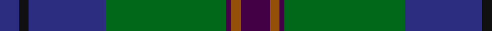

**Bands:** [BKBGBRB](/stripes/bkbgbrb/) · **Stripes:** [DB K DB G DP O DP](/stripes/stripes7/) DB K DB G DP O DP

This was sourced from house-of-tartan.  It is a [7 band tartan](/bands/bands7/).

Original link http://www.house-of-tartan.scotland.net/house/TartanViewjs.asp?colr=Def&tnam=3202

## Thread count
DB/8 K4 DB32 G50 DP2 T4 DP/12

## Palette
Each colour and its ΔE from the base-6 reference it is a variant of.

| Colour | Shade | Base | ΔE (OKLab) |
|---|---|---|---|
| DB | <code style="background-color:#2C2C80;">#2C2C80</code> `#2C2C80` | B <code style="background-color:#2A418A;">#2A418A</code> | 0.06 |
| DP | <code style="background-color:#440044;">#440044</code> `#440044` | B <code style="background-color:#2A418A;">#2A418A</code> | 0.18 |
| G | <code style="background-color:#006818;">#006818</code> `#006818` | G <code style="background-color:#006100;">#006100</code> | 0.02 |
| K | <code style="background-color:#101010;">#101010</code> `#101010` | K <code style="background-color:#000000;">#000000</code> | 0.17 |
| P | <code style="background-color:#780078;">#780078</code> `#780078` | B <code style="background-color:#2A418A;">#2A418A</code> | 0.17 |
| T | <code style="background-color:#945008;">#945008</code> `#945008` | R <code style="background-color:#CC0000;">#CC0000</code> | 0.13 |

# Sample pattern

## Nearest tartans

The nearest existing variants by ΔTartan distance.

1. [Laurie Clan Tartan Tartan Number: 3201. Earliest known date: 2000 One of a set of three similar designs for Laurie, Lawrie and Lowry, designed by Peter MacDonald for Iain Laurie. See products available Copyright © Blair Urquhart, Comrie, 2015](/setts/s7/dp6r2dp1g25db16k2db4~x2/) — ΔT 0.22
1. [Lowry](/setts/s7/dp6ly2dp1g25db16k2db4~x2/) — ΔT 0.30
1. [Lawrie](/setts/s7/dp6y2dp1g25db16k2db4~x2/) — ΔT 0.57
1. [Colquhoun](/setts/s7/db4k2db16w1k8dg24r4~x2/) — ΔT 0.64
1. [MacFadzean](/setts/s6/db48w2k20dg22r3dg4~x2/) — ΔT 0.74
1. [Laurie](/setts/s7/dp6r2dp1dg25db16k2db4~x2/) — ΔT 0.88
1. [Dollar Academy (1999)](/setts/s8/lb2dt19k4dt4k4g9db2k1~x4/) — ΔT 0.89
1. [Weisfeld (Name)](/setts/s7/k6db3g28w1db28db2w3~x2/) — ΔT 0.97
1. [Chan (Name?)](/setts/s8/ly2k1dt30k13dg13r2dg13r2~x2/) — ΔT 0.99
1. [Johnstone/Johnston](/setts/s8/k3db3k3db22dg26k2db1ly3~x2/) — ΔT 1.03

## Neighbour map

Every grey dot is one of 14313 variants placed by the first two principal components of the ΔTartan feature space (44% of its variance). Red is this tartan; blue dots are its nearest — click one to open its page.

<svg viewBox="0 0 640 380" role="img" style="max-width:100%;height:auto;border:1px solid #e0e0e0;border-radius:4px;display:block" xmlns="http://www.w3.org/2000/svg"><image href="/nn/cloud.v1.png" width="640" height="380"/><a href="/setts/s7/dp6r2dp1g25db16k2db4~x2/"><circle cx="299.7" cy="166.2" r="4" fill="#3465a4"><title>Laurie Clan Tartan Tartan Number: 3201. Earliest known date: 2000 One of a set of three similar designs for Laurie, Lawrie and Lowry, designed by Peter MacDonald for Iain Laurie. See products available Copyright © Blair Urquhart, Comrie, 2015</title></circle></a><a href="/setts/s7/dp6ly2dp1g25db16k2db4~x2/"><circle cx="304.0" cy="169.6" r="4" fill="#3465a4"><title>Lowry</title></circle></a><a href="/setts/s7/dp6y2dp1g25db16k2db4~x2/"><circle cx="311.0" cy="171.5" r="4" fill="#3465a4"><title>Lawrie</title></circle></a><a href="/setts/s7/db4k2db16w1k8dg24r4~x2/"><circle cx="265.4" cy="175.0" r="4" fill="#3465a4"><title>Colquhoun</title></circle></a><a href="/setts/s6/db48w2k20dg22r3dg4~x2/"><circle cx="314.6" cy="182.8" r="4" fill="#3465a4"><title>MacFadzean</title></circle></a><a href="/setts/s7/dp6r2dp1dg25db16k2db4~x2/"><circle cx="324.4" cy="178.1" r="4" fill="#3465a4"><title>Laurie</title></circle></a><a href="/setts/s8/lb2dt19k4dt4k4g9db2k1~x4/"><circle cx="306.2" cy="182.3" r="4" fill="#3465a4"><title>Dollar Academy (1999)</title></circle></a><a href="/setts/s7/k6db3g28w1db28db2w3~x2/"><circle cx="268.8" cy="151.9" r="4" fill="#3465a4"><title>Weisfeld (Name)</title></circle></a><a href="/setts/s8/ly2k1dt30k13dg13r2dg13r2~x2/"><circle cx="284.4" cy="169.0" r="4" fill="#3465a4"><title>Chan (Name?)</title></circle></a><a href="/setts/s8/k3db3k3db22dg26k2db1ly3~x2/"><circle cx="321.1" cy="171.0" r="4" fill="#3465a4"><title>Johnstone/Johnston</title></circle></a><circle cx="304.7" cy="169.8" r="5" fill="#c00000"/></svg>

ID: /setts/s7/dp6o2dp1g25db16k2db4~x2/
