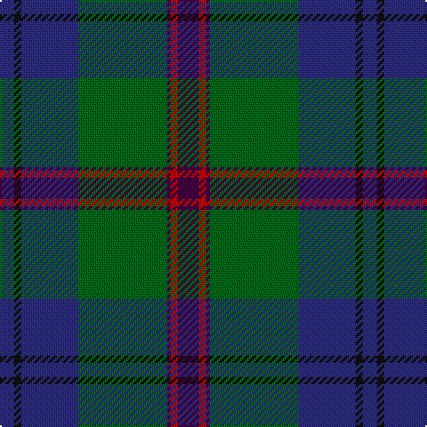

This page is one **sett** — a single exact thread-count. It belongs to the [tartan](/tartans/dp6r2dp1g25db16k2db4/)
(the same proportion at any scale), whose colour order is pattern [BKBGBRB](/stripes/bkbgbrb/).

Sourced from house-of-tartan.  It is a [7 stripe tartan](/stripes/stripes7/).

Original link http://www.house-of-tartan.scotland.net/house/TartanViewjs.asp?colr=Def&tnam=3201

## Thread count
DP/12 R4 DP2 G50 DB32 K4 DB/8

## Palette

Palette: <strong>Tartan Register</strong>
<table><thead><tr><th>Colour</th><th>Threads</th><th>Shade</th><th>Base</th><th>OKLCh</th></tr></thead><tbody><tr><td>DP/</td><td style="text-align:right;font-variant-numeric:tabular-nums">12</td><td><code style="background-color:#440044;">#440044</code> <small style="color:#888">#440044</small></td><td>B <code style="background-color:#2A418A;">#2A418A</code></td><td><small style="color:#888">oklch(27.1% 0.125 328.4)</small></td></tr><tr><td>R</td><td style="text-align:right;font-variant-numeric:tabular-nums">4</td><td><code style="background-color:#C80000;">#C80000</code> <small style="color:#888">#C80000</small></td><td>R <code style="background-color:#CC0000;">#CC0000</code></td><td><small style="color:#888">oklch(52.3% 0.215 29.2)</small></td></tr><tr><td>DP</td><td style="text-align:right;font-variant-numeric:tabular-nums">2</td><td><code style="background-color:#440044;">#440044</code> <small style="color:#888">#440044</small></td><td>B <code style="background-color:#2A418A;">#2A418A</code></td><td><small style="color:#888">oklch(27.1% 0.125 328.4)</small></td></tr><tr><td>G</td><td style="text-align:right;font-variant-numeric:tabular-nums">50</td><td><code style="background-color:#006818;">#006818</code> <small style="color:#888">#006818</small></td><td>G <code style="background-color:#006100;">#006100</code></td><td><small style="color:#888">oklch(45.0% 0.142 145.0)</small></td></tr><tr><td>DB</td><td style="text-align:right;font-variant-numeric:tabular-nums">32</td><td><code style="background-color:#2C2C80;">#2C2C80</code> <small style="color:#888">#2C2C80</small></td><td>B <code style="background-color:#2A418A;">#2A418A</code></td><td><small style="color:#888">oklch(35.0% 0.138 276.6)</small></td></tr><tr><td>K</td><td style="text-align:right;font-variant-numeric:tabular-nums">4</td><td><code style="background-color:#101010;">#101010</code> <small style="color:#888">#101010</small></td><td>K <code style="background-color:#000000;">#000000</code></td><td><small style="color:#888">oklch(17.3% 0.000 89.9)</small></td></tr><tr><td>DB/</td><td style="text-align:right;font-variant-numeric:tabular-nums">8</td><td><code style="background-color:#2C2C80;">#2C2C80</code> <small style="color:#888">#2C2C80</small></td><td>B <code style="background-color:#2A418A;">#2A418A</code></td><td><small style="color:#888">oklch(35.0% 0.138 276.6)</small></td></tr></tbody></table>

# Sample pattern

## Nearest tartans

The nearest existing variants by ΔTartan distance, with this tartan at the top so the swatches line up against it.

ΔTartan

Tartan

Sett

—

<a href="/ttd/edit/#slug=dp6r2dp1g25db16k2db4~x2">Laurie Clan Tartan Tartan Number: 3201. Earliest known date: 2000 One of a set of three similar designs for Laurie, Lawrie and Lowry, designed by Peter MacDonald for Iain Laurie. See products available Copyright © Blair Urquhart, Comrie, 2015</a> <a class="nn-out" href="/setts/s7/dp6r2dp1g25db16k2db4~x2/" title="open its dictionary page">↗</a>

0.22

<a href="/ttd/edit/#slug=dp6o2dp1g25db16k2db4~x2">Lawrie Clan Tartan Tartan Number: 3202. Earliest known date: 2000 One of a set of three similar designs for Laurie, Lawrie and Lowry, designed by Peter MacDonald for Iain Laurie. See products available Copyright © Blair Urquhart, Comrie, 2015</a> <a class="nn-out" href="/setts/s7/dp6o2dp1g25db16k2db4~x2/" title="open its dictionary page">↗</a>

0.34

<a href="/ttd/edit/#slug=dp6ly2dp1g25db16k2db4~x2">Lowry</a> <a class="nn-out" href="/setts/s7/dp6ly2dp1g25db16k2db4~x2/" title="open its dictionary page">↗</a>

0.60

<a href="/ttd/edit/#slug=db4k2db16w1k8dg24r4~x2">Colquhoun</a> <a class="nn-out" href="/setts/s7/db4k2db16w1k8dg24r4~x2/" title="open its dictionary page">↗</a>

0.66

<a href="/ttd/edit/#slug=dp6y2dp1g25db16k2db4~x2">Lawrie</a> <a class="nn-out" href="/setts/s7/dp6y2dp1g25db16k2db4~x2/" title="open its dictionary page">↗</a>

0.74

<a href="/ttd/edit/#slug=db48w2k20dg22r3dg4~x2">MacFadzean</a> <a class="nn-out" href="/setts/s6/db48w2k20dg22r3dg4~x2/" title="open its dictionary page">↗</a>

0.86

<a href="/ttd/edit/#slug=k6dbi3g28w1db28dbi2w3~x2">Weisfeld (Name)</a> <a class="nn-out" href="/setts/s7/k6dbi3g28w1db28dbi2w3~x2/" title="open its dictionary page">↗</a>

0.95

<a href="/ttd/edit/#slug=lb2dt19k4dt4k4g9db2k1~x4">Dollar Academy (1999)</a> <a class="nn-out" href="/setts/s8/lb2dt19k4dt4k4g9db2k1~x4/" title="open its dictionary page">↗</a>

1.00

<a href="/ttd/edit/#slug=db18dp2db16k13g3k2g42lo3~x2">McFadden (Personal)</a> <a class="nn-out" href="/setts/s8/db18dp2db16k13g3k2g42lo3~x2/" title="open its dictionary page">↗</a>

1.00

<a href="/ttd/edit/#slug=r2db16w1k16g30r1g2~x2">Sinclair Hunting (VS)</a> <a class="nn-out" href="/setts/s7/r2db16w1k16g30r1g2~x2/" title="open its dictionary page">↗</a>

1.00

<a href="/ttd/edit/#slug=dp6r2dp1dg25db16k2db4~x2">Laurie</a> <a class="nn-out" href="/setts/s7/dp6r2dp1dg25db16k2db4~x2/" title="open its dictionary page">↗</a>

## Neighbour map

Every grey dot is one of 14359 variants placed by the first two principal components of the ΔTartan feature space (44% of its variance). Red is this tartan; blue dots are its nearest — click one to open its page.

<svg viewBox="0 0 640 380" role="img" style="max-width:100%;height:auto;border:1px solid #e0e0e0;border-radius:4px;display:block" xmlns="http://www.w3.org/2000/svg"><image href="/nn/cloud.v1.png" width="640" height="380"/><a href="/setts/s7/dp6o2dp1g25db16k2db4~x2/"><circle cx="304.5" cy="170.4" r="4" fill="#3465a4"><title>Lawrie Clan Tartan Tartan Number: 3202. Earliest known date: 2000 One of a set of three similar designs for Laurie, Lawrie and Lowry, designed by Peter MacDonald for Iain Laurie. See products available Copyright © Blair Urquhart, Comrie, 2015</title></circle></a><a href="/setts/s7/dp6ly2dp1g25db16k2db4~x2/"><circle cx="303.8" cy="170.1" r="4" fill="#3465a4"><title>Lowry</title></circle></a><a href="/setts/s7/db4k2db16w1k8dg24r4~x2/"><circle cx="265.3" cy="175.7" r="4" fill="#3465a4"><title>Colquhoun</title></circle></a><a href="/setts/s7/dp6y2dp1g25db16k2db4~x2/"><circle cx="310.8" cy="172.0" r="4" fill="#3465a4"><title>Lawrie</title></circle></a><a href="/setts/s6/db48w2k20dg22r3dg4~x2/"><circle cx="314.5" cy="183.4" r="4" fill="#3465a4"><title>MacFadzean</title></circle></a><a href="/setts/s7/k6dbi3g28w1db28dbi2w3~x2/"><circle cx="268.7" cy="152.5" r="4" fill="#3465a4"><title>Weisfeld (Name)</title></circle></a><a href="/setts/s8/lb2dt19k4dt4k4g9db2k1~x4/"><circle cx="306.2" cy="182.9" r="4" fill="#3465a4"><title>Dollar Academy (1999)</title></circle></a><a href="/setts/s8/db18dp2db16k13g3k2g42lo3~x2/"><circle cx="270.3" cy="160.7" r="4" fill="#3465a4"><title>McFadden (Personal)</title></circle></a><a href="/setts/s7/r2db16w1k16g30r1g2~x2/"><circle cx="292.1" cy="150.6" r="4" fill="#3465a4"><title>Sinclair Hunting (VS)</title></circle></a><a href="/setts/s7/dp6r2dp1dg25db16k2db4~x2/"><circle cx="324.3" cy="178.7" r="4" fill="#3465a4"><title>Laurie</title></circle></a><circle cx="299.5" cy="166.8" r="5" fill="#c00000"/></svg>

ID: /setts/s7/dp6r2dp1g25db16k2db4~x2/
