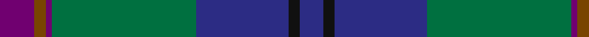

This page is one **sett** — a single exact thread-count. It belongs to the [tartan](/tartans/p6t2p1g25db16k2db4/)
(the same proportion at any scale), whose colour order is pattern [BGBGBKB](/stripes/bgbgbkb/).

Sourced from register-of-tartans.  It is a [7 stripe tartan](/stripes/stripes7/).

Original link https://www.tartanregister.gov.uk/tartanDetails.aspx?ref=2070

2 attestations — the source records this cloth was collapsed from (oldest owns this page)

<ul>
<li>01/01/2000 — Lawrie (register-of-tartans, <a href="https://www.tartanregister.gov.uk/tartanDetails.aspx?ref=2070">record</a>)</li>
<li>2000 — Lawrie (Name) (tartans-authority, <a href="http://www.tartansauthority.com/tartan-ferret/display/4219/">record</a>)</li>
</ul>

## Register references

External register numbers recorded for this tartan.

- Scottish Register of Tartans: [2070](https://www.tartanregister.gov.uk/tartanDetails.aspx?ref=2070)
- Scottish Tartans Authority (ITI): 4219

## Thread count
P/12 T4 P2 G50 DB32 K4 DB/8

## Palette
Each colour and the base-6 reference it is a variant of.

| Colour | Shade | Base |
|---|---|---|
| DB | <code style="background-color:#2C2C84;">#2C2C84</code> `oklch(35.4% 0.143 276.2)` <small>#2C2C84</small> | B <code style="background-color:#2A418A;">#2A418A</code> |
| G | <code style="background-color:#007040;">#007040</code> `oklch(47.9% 0.117 155.8)` <small>#007040</small> | G <code style="background-color:#006100;">#006100</code> |
| K | <code style="background-color:#101010;">#101010</code> `oklch(17.3% 0.000 89.9)` <small>#101010</small> | K <code style="background-color:#000000;">#000000</code> |
| P | <code style="background-color:#700070;">#700070</code> `oklch(38.3% 0.176 328.4)` <small>#700070</small> | B <code style="background-color:#2A418A;">#2A418A</code> |
| T | <code style="background-color:#784400;">#784400</code> `oklch(44.0% 0.100 63.4)` <small>#784400</small> | G <code style="background-color:#006100;">#006100</code> |

# Sample pattern

## Nearest tartans

The nearest existing variants by ΔTartan distance, with this tartan at the top so the swatches line up against it.

ΔTartan

Tartan

Sett

—

<a href="/ttd/edit/#slug=dp6y2dp1g25db16k2db4~x2">Lawrie</a> <a class="nn-out" href="/setts/s7/dp6y2dp1g25db16k2db4~x2/" title="open its dictionary page">↗</a>

0.40

<a href="/ttd/edit/#slug=dp6ly2dp1g25db16k2db4~x2">Lowry</a> <a class="nn-out" href="/setts/s7/dp6ly2dp1g25db16k2db4~x2/" title="open its dictionary page">↗</a>

0.53

<a href="/ttd/edit/#slug=dp6r2dp1dg25db16k2db4~x2">Laurie</a> <a class="nn-out" href="/setts/s7/dp6r2dp1dg25db16k2db4~x2/" title="open its dictionary page">↗</a>

0.57

<a href="/ttd/edit/#slug=dp6o2dp1g25db16k2db4~x2">Lawrie Clan Tartan Tartan Number: 3202. Earliest known date: 2000 One of a set of three similar designs for Laurie, Lawrie and Lowry, designed by Peter MacDonald for Iain Laurie. See products available Copyright © Blair Urquhart, Comrie, 2015</a> <a class="nn-out" href="/setts/s7/dp6o2dp1g25db16k2db4~x2/" title="open its dictionary page">↗</a>

0.67

<a href="/ttd/edit/#slug=dp6r2dp1g25db16k2db4~x2">Laurie Clan Tartan Tartan Number: 3201. Earliest known date: 2000 One of a set of three similar designs for Laurie, Lawrie and Lowry, designed by Peter MacDonald for Iain Laurie. See products available Copyright © Blair Urquhart, Comrie, 2015</a> <a class="nn-out" href="/setts/s7/dp6r2dp1g25db16k2db4~x2/" title="open its dictionary page">↗</a>

0.70

<a href="/ttd/edit/#slug=db48w2k20dg22r3dg4~x2">MacFadzean</a> <a class="nn-out" href="/setts/s6/db48w2k20dg22r3dg4~x2/" title="open its dictionary page">↗</a>

0.98

<a href="/ttd/edit/#slug=db4k2db16w1k8dg24r4~x2">Colquhoun</a> <a class="nn-out" href="/setts/s7/db4k2db16w1k8dg24r4~x2/" title="open its dictionary page">↗</a>

1.04

<a href="/ttd/edit/#slug=lb2dt19k4dt4k4g9db2k1~x4">Dollar Academy (1999)</a> <a class="nn-out" href="/setts/s8/lb2dt19k4dt4k4g9db2k1~x4/" title="open its dictionary page">↗</a>

1.09

<a href="/ttd/edit/#slug=t13g2t12k8r1dt35lo1~x2">Spirit of South Lanarkshire (Distric</a> <a class="nn-out" href="/setts/s7/t13g2t12k8r1dt35lo1~x2/" title="open its dictionary page">↗</a>

1.12

<a href="/ttd/edit/#slug=k6db3g28w1db28db2w3~x2">Weisfeld (Name)</a> <a class="nn-out" href="/setts/s7/k6db3g28w1db28db2w3~x2/" title="open its dictionary page">↗</a>

1.14

<a href="/ttd/edit/#slug=db12t6g30db9r8ly1~x2">Wright , Anne (Personal)</a> <a class="nn-out" href="/setts/s6/db12t6g30db9r8ly1~x2/" title="open its dictionary page">↗</a>

## Neighbour map

Every grey dot is one of 14299 variants placed by the first two principal components of the ΔTartan feature space (44% of its variance). Red is this tartan; blue dots are its nearest — click one to open its page.

<svg viewBox="0 0 640 380" role="img" style="max-width:100%;height:auto;border:1px solid #e0e0e0;border-radius:4px;display:block" xmlns="http://www.w3.org/2000/svg"><image href="/nn/cloud.v1.png" width="640" height="380"/><a href="/setts/s7/dp6ly2dp1g25db16k2db4~x2/"><circle cx="304.0" cy="169.6" r="4" fill="#3465a4"><title>Lowry</title></circle></a><a href="/setts/s7/dp6r2dp1dg25db16k2db4~x2/"><circle cx="324.4" cy="178.2" r="4" fill="#3465a4"><title>Laurie</title></circle></a><a href="/setts/s7/dp6o2dp1g25db16k2db4~x2/"><circle cx="304.7" cy="169.9" r="4" fill="#3465a4"><title>Lawrie Clan Tartan Tartan Number: 3202. Earliest known date: 2000 One of a set of three similar designs for Laurie, Lawrie and Lowry, designed by Peter MacDonald for Iain Laurie. See products available Copyright © Blair Urquhart, Comrie, 2015</title></circle></a><a href="/setts/s7/dp6r2dp1g25db16k2db4~x2/"><circle cx="299.7" cy="166.3" r="4" fill="#3465a4"><title>Laurie Clan Tartan Tartan Number: 3201. Earliest known date: 2000 One of a set of three similar designs for Laurie, Lawrie and Lowry, designed by Peter MacDonald for Iain Laurie. See products available Copyright © Blair Urquhart, Comrie, 2015</title></circle></a><a href="/setts/s6/db48w2k20dg22r3dg4~x2/"><circle cx="314.7" cy="182.8" r="4" fill="#3465a4"><title>MacFadzean</title></circle></a><a href="/setts/s7/db4k2db16w1k8dg24r4~x2/"><circle cx="265.5" cy="175.1" r="4" fill="#3465a4"><title>Colquhoun</title></circle></a><a href="/setts/s8/lb2dt19k4dt4k4g9db2k1~x4/"><circle cx="306.3" cy="182.4" r="4" fill="#3465a4"><title>Dollar Academy (1999)</title></circle></a><a href="/setts/s7/t13g2t12k8r1dt35lo1~x2/"><circle cx="327.3" cy="140.1" r="4" fill="#3465a4"><title>Spirit of South Lanarkshire (Distric</title></circle></a><a href="/setts/s7/k6db3g28w1db28db2w3~x2/"><circle cx="268.8" cy="152.0" r="4" fill="#3465a4"><title>Weisfeld (Name)</title></circle></a><a href="/setts/s6/db12t6g30db9r8ly1~x2/"><circle cx="289.1" cy="175.8" r="4" fill="#3465a4"><title>Wright , Anne (Personal)</title></circle></a><circle cx="311.0" cy="171.6" r="5" fill="#c00000"/></svg>

ID: /setts/s7/dp6y2dp1g25db16k2db4~x2/
