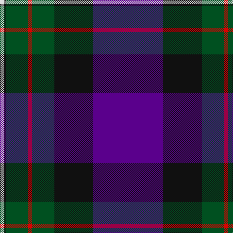

**Bands:** [BKGRGKW](/stripes/bkgrgkw/) · **Stripes:** [DP K DG R DG K W](/stripes/stripes7/) DP K DG R DG K W

This was sourced from register-of-tartans.  It is a [7 band tartan](/bands/bands7/).

Original link https://www.tartanregister.gov.uk/tartanDetails.aspx?ref=1170

## Register references

External register numbers recorded for this tartan.

- Scottish Register of Tartans: [1170](https://www.tartanregister.gov.uk/tartanDetails.aspx?ref=1170)
- Scottish Tartans World Register: 338

## Thread count
LN/8 K4 G46 R8 G46 K80 P/144

## Palette
Each colour and its ΔE from the base-6 reference it is a variant of.

| Colour | Shade | Base | ΔE (OKLab) |
|---|---|---|---|
| G | <code style="background-color:#005020;">#005020</code> `#005020` | G <code style="background-color:#006100;">#006100</code> | 0.07 |
| K | <code style="background-color:#101010;">#101010</code> `#101010` | K <code style="background-color:#000000;">#000000</code> | 0.17 |
| LN | <code style="background-color:#E0E0E0;">#E0E0E0</code> `#E0E0E0` | W <code style="background-color:#F7F7F7;">#F7F7F7</code> | 0.07 |
| P | <code style="background-color:#5A008C;">#5A008C</code> `#5A008C` | B <code style="background-color:#2A418A;">#2A418A</code> | 0.13 |
| R | <code style="background-color:#DC0000;">#DC0000</code> `#DC0000` | R <code style="background-color:#CC0000;">#CC0000</code> | 0.03 |

# Sample pattern

## Nearest tartans

The nearest existing variants by ΔTartan distance.

1. [Diaspora](/setts/s6/db3dg1r22k12db28lb3~x2/) — ΔT 0.59
1. [Diaspora (Fashion)](/setts/s5/lb3db28k12r22dg1~x2/) — ΔT 0.99
1. [205 (Scottish) Field Hospital (Mil.)](/setts/s6/o3r18k2dg18k24r1~x2/) — ΔT 1.17
1. [Diaspora](/setts/s6/dt3dg1r24dt16db28w3~x2/) — ΔT 1.23
1. [Royal Marines Condor](/setts/s7/k8r4k36db48r6g3lo2~x2/) — ΔT 1.24
1. [Heather Mead (Personal)](/setts/s8/m13dg16dg4dp4dg4dp34lo1dp1~x2/) — ΔT 1.27
1. [Alexander](/setts/s7/db24k8g8dp2g8k1w2~x2/) — ΔT 1.36
1. [Pipers' Trail (Corporate)](/setts/s6/lo4b8dp4k53db54w2/) — ΔT 1.37
1. [Naysmith (Name)](/setts/s6/r6db32k18g28k1lb2~x2/) — ΔT 1.45
1. [Hakkarain Personal Finnish Tartan Tartan Number: 6110. Earliest known date: 2003 A personal tartan designed by Jari Hakkarainen of Porvoo in Finland. See products available Copyright © Blair Urquhart, Comrie, 2015](/setts/s6/db37o18k37r2k2r2~x2/) — ΔT 1.46

## Neighbour map

Every grey dot is one of 14313 variants placed by the first two principal components of the ΔTartan feature space (44% of its variance). Red is this tartan; blue dots are its nearest — click one to open its page.

<svg viewBox="0 0 640 380" role="img" style="max-width:100%;height:auto;border:1px solid #e0e0e0;border-radius:4px;display:block" xmlns="http://www.w3.org/2000/svg"><image href="/nn/cloud.v1.png" width="640" height="380"/><a href="/setts/s6/db3dg1r22k12db28lb3~x2/"><circle cx="281.9" cy="165.6" r="4" fill="#3465a4"><title>Diaspora</title></circle></a><a href="/setts/s5/lb3db28k12r22dg1~x2/"><circle cx="264.4" cy="179.8" r="4" fill="#3465a4"><title>Diaspora (Fashion)</title></circle></a><a href="/setts/s6/o3r18k2dg18k24r1~x2/"><circle cx="247.0" cy="179.6" r="4" fill="#3465a4"><title>205 (Scottish) Field Hospital (Mil.)</title></circle></a><a href="/setts/s6/dt3dg1r24dt16db28w3~x2/"><circle cx="243.4" cy="158.3" r="4" fill="#3465a4"><title>Diaspora</title></circle></a><a href="/setts/s7/k8r4k36db48r6g3lo2~x2/"><circle cx="320.7" cy="163.3" r="4" fill="#3465a4"><title>Royal Marines Condor</title></circle></a><a href="/setts/s8/m13dg16dg4dp4dg4dp34lo1dp1~x2/"><circle cx="342.7" cy="143.2" r="4" fill="#3465a4"><title>Heather Mead (Personal)</title></circle></a><a href="/setts/s7/db24k8g8dp2g8k1w2~x2/"><circle cx="254.9" cy="159.1" r="4" fill="#3465a4"><title>Alexander</title></circle></a><a href="/setts/s6/lo4b8dp4k53db54w2/"><circle cx="295.2" cy="149.2" r="4" fill="#3465a4"><title>Pipers' Trail (Corporate)</title></circle></a><a href="/setts/s6/r6db32k18g28k1lb2~x2/"><circle cx="234.2" cy="167.2" r="4" fill="#3465a4"><title>Naysmith (Name)</title></circle></a><a href="/setts/s6/db37o18k37r2k2r2~x2/"><circle cx="272.8" cy="195.7" r="4" fill="#3465a4"><title>Hakkarain Personal Finnish Tartan Tartan Number: 6110. Earliest known date: 2003 A personal tartan designed by Jari Hakkarainen of Porvoo in Finland. See products available Copyright © Blair Urquhart, Comrie, 2015</title></circle></a><circle cx="281.4" cy="144.3" r="5" fill="#c00000"/></svg>

ID: /setts/s7/dp72k40dg23r4dg23k2w4~x2/
