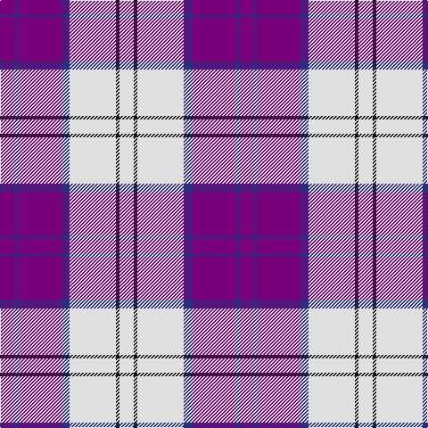

This page is one **sett** — a single exact thread-count. It belongs to the [tartan](/tartans/dp8db2dp24db5w26k2w8/)
(the same proportion at any scale), whose colour order is pattern [BBBBWKW](/stripes/bbbbwkw/).

Sourced from house-of-tartan.  It is a [7 stripe tartan](/stripes/stripes7/).

Original link http://www.house-of-tartan.scotland.net/house/TartanViewjs.asp?colr=Def&tnam=8189

## Thread count
P/16 DB4 P48 DB10 LN52 K4 LN/16

## Palette

Palette: <strong>Tartan Register</strong>
<table><thead><tr><th>Colour</th><th>Threads</th><th>Shade</th><th>Base</th><th>OKLCh</th></tr></thead><tbody><tr><td>P/</td><td style="text-align:right;font-variant-numeric:tabular-nums">16</td><td><code style="background-color:#780078;">#780078</code> <small style="color:#888">#780078</small></td><td>B <code style="background-color:#2A418A;">#2A418A</code></td><td><small style="color:#888">oklch(40.2% 0.185 328.4)</small></td></tr><tr><td>DB</td><td style="text-align:right;font-variant-numeric:tabular-nums">4</td><td><code style="background-color:#2C2C80;">#2C2C80</code> <small style="color:#888">#2C2C80</small></td><td>B <code style="background-color:#2A418A;">#2A418A</code></td><td><small style="color:#888">oklch(35.0% 0.138 276.6)</small></td></tr><tr><td>P</td><td style="text-align:right;font-variant-numeric:tabular-nums">48</td><td><code style="background-color:#780078;">#780078</code> <small style="color:#888">#780078</small></td><td>B <code style="background-color:#2A418A;">#2A418A</code></td><td><small style="color:#888">oklch(40.2% 0.185 328.4)</small></td></tr><tr><td>DB</td><td style="text-align:right;font-variant-numeric:tabular-nums">10</td><td><code style="background-color:#2C2C80;">#2C2C80</code> <small style="color:#888">#2C2C80</small></td><td>B <code style="background-color:#2A418A;">#2A418A</code></td><td><small style="color:#888">oklch(35.0% 0.138 276.6)</small></td></tr><tr><td>LN</td><td style="text-align:right;font-variant-numeric:tabular-nums">52</td><td><code style="background-color:#E0E0E0;">#E0E0E0</code> <small style="color:#888">#E0E0E0</small></td><td>W <code style="background-color:#F7F7F7;">#F7F7F7</code></td><td><small style="color:#888">oklch(90.7% 0.000 89.9)</small></td></tr><tr><td>K</td><td style="text-align:right;font-variant-numeric:tabular-nums">4</td><td><code style="background-color:#101010;">#101010</code> <small style="color:#888">#101010</small></td><td>K <code style="background-color:#000000;">#000000</code></td><td><small style="color:#888">oklch(17.3% 0.000 89.9)</small></td></tr><tr><td>LN/</td><td style="text-align:right;font-variant-numeric:tabular-nums">16</td><td><code style="background-color:#E0E0E0;">#E0E0E0</code> <small style="color:#888">#E0E0E0</small></td><td>W <code style="background-color:#F7F7F7;">#F7F7F7</code></td><td><small style="color:#888">oklch(90.7% 0.000 89.9)</small></td></tr></tbody></table>

# Sample pattern

## Nearest tartans

The nearest existing variants by ΔTartan distance, with this tartan at the top so the swatches line up against it.

ΔTartan

Tartan

Sett

—

<a href="/ttd/edit/#slug=dp8db2dp24db5w26k2w8~x2">Lennox Purple Dress District Tartan Tartan Number: 8189. Earliest known date: pre 2003 Families with the surname 'Lennox' are usually considered related to Clans Stewart or MacFarlane. Some of this surname also choose to wear the distinctive and ancient 'Lennox' tartan. D W Stewart reproduced the sett from a 'lost' portrait of the Countess of Lennox dating from the 16th century./Threadcount and colours aren't 100% original. Generated manually./ See products available Copyright © Blair Urquhart, Comrie, 2015</a> <a class="nn-out" href="/setts/s7/dp8db2dp24db5w26k2w8~x2/" title="open its dictionary page">↗</a>

0.57

<a href="/ttd/edit/#slug=w5k3w31p26w4p10t4~x2">MacPherson, dress (purple)</a> <a class="nn-out" href="/setts/s7/w5k3w31p26w4p10t4~x2/" title="open its dictionary page">↗</a>

0.59

<a href="/ttd/edit/#slug=w5k3w31dp26w4dp10t4~x2">MacPherson Dress Purple</a> <a class="nn-out" href="/setts/s7/w5k3w31dp26w4dp10t4~x2/" title="open its dictionary page">↗</a>

1.06

<a href="/ttd/edit/#slug=w8k4w54db18m6db8m49w6">Merida Dance</a> <a class="nn-out" href="/setts/s8/w8k4w54db18m6db8m49w6/" title="open its dictionary page">↗</a>

1.16

<a href="/ttd/edit/#slug=w5dp2w34dp34k2dp2t4~x2">Cunningham Dress Purple (Dance)</a> <a class="nn-out" href="/setts/s7/w5dp2w34dp34k2dp2t4~x2/" title="open its dictionary page">↗</a>

1.17

<a href="/ttd/edit/#slug=w8k6w54db16m6db8m49w6">Meridia Dance</a> <a class="nn-out" href="/setts/s8/w8k6w54db16m6db8m49w6/" title="open its dictionary page">↗</a>

1.21

<a href="/ttd/edit/#slug=w4dbi2w1r2w16dbi16r16dbi12db1w4~x2">Spirit of Russia, The</a> <a class="nn-out" href="/setts/s10/w4dbi2w1r2w16dbi16r16dbi12db1w4~x2/" title="open its dictionary page">↗</a>

1.26

<a href="/ttd/edit/#slug=dp42lb2w2lb2dp5t12w32dp4~x2">Longniddry Dress (Dance)</a> <a class="nn-out" href="/setts/s8/dp42lb2w2lb2dp5t12w32dp4~x2/" title="open its dictionary page">↗</a>

1.28

<a href="/ttd/edit/#slug=w4db2w1r2w16db16r16db12k1w4~x2">Spirit of Russia, The</a> <a class="nn-out" href="/setts/s10/w4db2w1r2w16db16r16db12k1w4~x2/" title="open its dictionary page">↗</a>

1.28

<a href="/ttd/edit/#slug=dp42db2w2db2dp5t12w32dp4~x2">Longniddry Dress District Tartan Tartan Number: 88. Earliest known date: pre 2003 A dancers tartan from D.C. Dalgleish weavers of Selkirk See products available Copyright © Blair Urquhart, Comrie, 2015</a> <a class="nn-out" href="/setts/s8/dp42db2w2db2dp5t12w32dp4~x2/" title="open its dictionary page">↗</a>

1.30

<a href="/setts/s8/wi32db3r4db3r8db32w3db4~x2/">Clemens and August (Personal)</a>

## Neighbour map

Every grey dot is one of 14359 variants placed by the first two principal components of the ΔTartan feature space (44% of its variance). Red is this tartan; blue dots are its nearest — click one to open its page.

<svg viewBox="0 0 640 380" role="img" style="max-width:100%;height:auto;border:1px solid #e0e0e0;border-radius:4px;display:block" xmlns="http://www.w3.org/2000/svg"><image href="/nn/cloud.v1.png" width="640" height="380"/><a href="/setts/s7/w5k3w31p26w4p10t4~x2/"><circle cx="249.2" cy="164.1" r="4" fill="#3465a4"><title>MacPherson, dress (purple)</title></circle></a><a href="/setts/s7/w5k3w31dp26w4dp10t4~x2/"><circle cx="250.4" cy="165.2" r="4" fill="#3465a4"><title>MacPherson Dress Purple</title></circle></a><a href="/setts/s8/w8k4w54db18m6db8m49w6/"><circle cx="217.3" cy="131.8" r="4" fill="#3465a4"><title>Merida Dance</title></circle></a><a href="/setts/s7/w5dp2w34dp34k2dp2t4~x2/"><circle cx="279.0" cy="124.5" r="4" fill="#3465a4"><title>Cunningham Dress Purple (Dance)</title></circle></a><a href="/setts/s8/w8k6w54db16m6db8m49w6/"><circle cx="204.7" cy="150.5" r="4" fill="#3465a4"><title>Meridia Dance</title></circle></a><a href="/setts/s10/w4dbi2w1r2w16dbi16r16dbi12db1w4~x2/"><circle cx="192.2" cy="136.7" r="4" fill="#3465a4"><title>Spirit of Russia, The</title></circle></a><a href="/setts/s8/dp42lb2w2lb2dp5t12w32dp4~x2/"><circle cx="291.9" cy="122.4" r="4" fill="#3465a4"><title>Longniddry Dress (Dance)</title></circle></a><a href="/setts/s10/w4db2w1r2w16db16r16db12k1w4~x2/"><circle cx="185.1" cy="137.2" r="4" fill="#3465a4"><title>Spirit of Russia, The</title></circle></a><a href="/setts/s8/dp42db2w2db2dp5t12w32dp4~x2/"><circle cx="291.5" cy="123.1" r="4" fill="#3465a4"><title>Longniddry Dress District Tartan Tartan Number: 88. Earliest known date: pre 2003 A dancers tartan from D.C. Dalgleish weavers of Selkirk See products available Copyright © Blair Urquhart, Comrie, 2015</title></circle></a><a href="/setts/s8/wi32db3r4db3r8db32w3db4~x2/"><circle cx="228.0" cy="149.1" r="4" fill="#3465a4"><title>Clemens and August (Personal)</title></circle></a><circle cx="236.7" cy="160.9" r="5" fill="#c00000"/></svg>

ID: /setts/s7/dp8db2dp24db5w26k2w8~x2/
