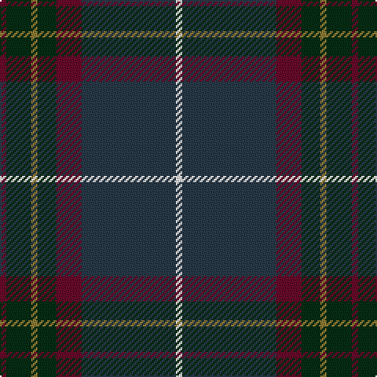

In pattern [BGGGBBW](/stripes/bgggbbw/).

This was sourced from register-of-tartans.  It is a [7 stripe tartan](/stripes/stripes7/).

Original link https://www.tartanregister.gov.uk/tartanDetails.aspx?ref=10260

## Register references

External register numbers recorded for this tartan.

- Scottish Register of Tartans: [10260](https://www.tartanregister.gov.uk/tartanDetails.aspx?ref=10260)

## Thread count
DR/4 DG16 LT4 DG12 DR16 DN60 W/4

## Palette
Each colour and the base-6 reference it is a variant of.

| Colour | Shade | Base |
|---|---|---|
| DG | <code style="background-color:#062E14;">#062E14</code> `oklch(26.6% 0.065 150.8)` <small>#062E14</small> | G <code style="background-color:#006100;">#006100</code> |
| DN | <code style="background-color:#283A48;">#283A48</code> `oklch(33.9% 0.034 242.4)` <small>#283A48</small> | B <code style="background-color:#2A418A;">#2A418A</code> |
| DR | <code style="background-color:#680B2A;">#680B2A</code> `oklch(33.9% 0.125 8.8)` <small>#680B2A</small> | B <code style="background-color:#2A418A;">#2A418A</code> |
| LT | <code style="background-color:#8E7C34;">#8E7C34</code> `oklch(58.8% 0.094 95.3)` <small>#8E7C34</small> | G <code style="background-color:#006100;">#006100</code> |
| W | <code style="background-color:#FFFFFF;">#FFFFFF</code> `oklch(100.0% 0.000 89.9)` <small>#FFFFFF</small> | W <code style="background-color:#F7F7F7;">#F7F7F7</code> |

# Sample pattern

## Nearest tartans

The nearest existing variants by ΔTartan distance.

1. [Scotch Mist](/setts/s8/n4o4n4k4n18k3do38w3~x2/) — ΔT 0.94
1. [Hardie (Name)](/setts/s6/m4dg9w2dg24dt37r3~x2/) — ΔT 1.07
1. [Kilkenny, County (District)](/setts/s7/dr4dg27o2db25lo5dg3o3~x2/) — ΔT 1.13
1. [Deeside, Royal](/setts/s6/lp4dy2dp4dy35n27r3~x2/) — ΔT 1.22
1. [New South Wales Waratah](/setts/s10/y12db2r2db2dt26dg2y3dg3y24r4~x2/) — ΔT 1.28
1. [Passion of Scotland (Fashion)](/setts/s7/dt6o4dt2db25k30g2k2~x2/) — ΔT 1.36
1. [Kinfauns Castle](/setts/s10/r4db10dg2db2dg24dp2dg2dp16dg2w1~x2/) — ΔT 1.38
1. [Java St Andrew Society hunting](/setts/s7/db50dg26k9dg4w2r2dg10~x2/) — ΔT 1.41
1. [Peter of Lee (Chief) (Personal)](/setts/s8/r4dg4k2dg29db21k3db3ly3~x2/) — ΔT 1.41
1. [Bouncing Blackie (Personal)](/setts/s7/dp5db8dt13g21db34dt55o3/) — ΔT 1.42

## Neighbour map

Every grey dot is one of 14299 variants placed by the first two principal components of the ΔTartan feature space (44% of its variance). Red is this tartan; blue dots are its nearest — click one to open its page.

<svg viewBox="0 0 640 380" role="img" style="max-width:100%;height:auto;border:1px solid #e0e0e0;border-radius:4px;display:block" xmlns="http://www.w3.org/2000/svg"><image href="/nn/cloud.v1.png" width="640" height="380"/><a href="/setts/s8/n4o4n4k4n18k3do38w3~x2/"><circle cx="329.9" cy="186.1" r="4" fill="#3465a4"><title>Scotch Mist</title></circle></a><a href="/setts/s6/m4dg9w2dg24dt37r3~x2/"><circle cx="333.9" cy="200.9" r="4" fill="#3465a4"><title>Hardie (Name)</title></circle></a><a href="/setts/s7/dr4dg27o2db25lo5dg3o3~x2/"><circle cx="282.8" cy="195.0" r="4" fill="#3465a4"><title>Kilkenny, County (District)</title></circle></a><a href="/setts/s6/lp4dy2dp4dy35n27r3~x2/"><circle cx="337.9" cy="188.3" r="4" fill="#3465a4"><title>Deeside, Royal</title></circle></a><a href="/setts/s10/y12db2r2db2dt26dg2y3dg3y24r4~x2/"><circle cx="323.7" cy="184.3" r="4" fill="#3465a4"><title>New South Wales Waratah</title></circle></a><a href="/setts/s7/dt6o4dt2db25k30g2k2~x2/"><circle cx="334.9" cy="210.7" r="4" fill="#3465a4"><title>Passion of Scotland (Fashion)</title></circle></a><a href="/setts/s10/r4db10dg2db2dg24dp2dg2dp16dg2w1~x2/"><circle cx="319.9" cy="153.7" r="4" fill="#3465a4"><title>Kinfauns Castle</title></circle></a><a href="/setts/s7/db50dg26k9dg4w2r2dg10~x2/"><circle cx="381.6" cy="196.2" r="4" fill="#3465a4"><title>Java St Andrew Society hunting</title></circle></a><a href="/setts/s8/r4dg4k2dg29db21k3db3ly3~x2/"><circle cx="297.6" cy="176.4" r="4" fill="#3465a4"><title>Peter of Lee (Chief) (Personal)</title></circle></a><a href="/setts/s7/dp5db8dt13g21db34dt55o3/"><circle cx="344.6" cy="218.4" r="4" fill="#3465a4"><title>Bouncing Blackie (Personal)</title></circle></a><circle cx="338.7" cy="193.8" r="5" fill="#c00000"/></svg>

ID: /setts/s7/dr1dg4y1dg3dr4dt15w1~x4/
