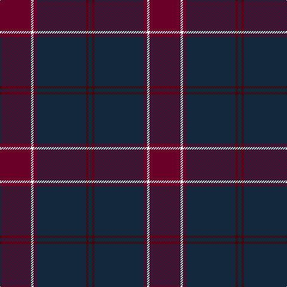

In pattern [BBBBBWB](/stripes/bbbbbwb/).

This was sourced from register-of-tartans.  It is a [7 stripe tartan](/stripes/stripes7/).

Original link https://www.tartanregister.gov.uk/tartanDetails.aspx?ref=1318

## Register references

External register numbers recorded for this tartan.

- Scottish Register of Tartans: [1318](https://www.tartanregister.gov.uk/tartanDetails.aspx?ref=1318)
- Scottish Tartans Authority (ITI): 4960

## Thread count
DRa/52 W4 DRa6 DN30 DN52 DR4 DN/6

## Palette
Each colour and its ΔE from the base-6 reference it is a variant of.

| Colour | Shade | Base | ΔE (OKLab) |
|---|---|---|---|
| DN | <code style="background-color:#14283C;">#14283C</code> `#14283C` | B <code style="background-color:#2A418A;">#2A418A</code> | 0.15 |
| DR | <code style="background-color:#4C0000;">#4C0000</code> `#4C0000` | B <code style="background-color:#2A418A;">#2A418A</code> | 0.25 |
| DRa | <code style="background-color:#680028;">#680028</code> `#680028` | B <code style="background-color:#2A418A;">#2A418A</code> | 0.21 |
| W | <code style="background-color:#FCFCFC;">#FCFCFC</code> `#FCFCFC` | W <code style="background-color:#F7F7F7;">#F7F7F7</code> | 0.01 |

# Sample pattern

## Nearest tartans

The nearest existing variants by ΔTartan distance.

1. [Dege of Saville Row](/setts/s6/dy11db1dy3db1db9r1~x4/) — ΔT 1.09
1. [Keeper of the Quaich Corporate Tartan Tartan Number: 1731. Earliest known date: 1988 Restricted. Sample in STS collection. See products available Copyright © Blair Urquhart, Comrie, 2015](/setts/s6/do3db3do3db27do40ly3/) — ΔT 1.18
1. [Patriot, The (Fashion)](/setts/s7/k10db4k34dt2k2dt30w3~x2/) — ΔT 1.39
1. [Sligo, County](/setts/s6/db50do4db12do23ly4do4~x2/) — ΔT 1.43
1. [Robert Gordon University](/setts/s6/k4r2k12db12k1lo2~x2/) — ΔT 1.44
1. [Griffiths Welsh Name Tartan Tartan Number: 5733. Earliest known date: 2002 The tartan for this Welsh surname and its variation, Griffith, is actually woven in Wales at the Cambrian Woollen Mill, weaving on the same site since 1830. This tartan differs from many traditional patterns in that the warp and weft differ, giving the finished worsted wool cloth more of a predominant stripe, vertically noticeable in the finished Kilt, or Cilt in Wales. Available from Wales Tartan Centres in Swansea See products available Copyright © Blair Urquhart, Comrie, 2015](/setts/s11/lo4do37db17do4db8do6r2do5db2do3lo4/) — ΔT 1.47
1. [Perthshire Tourist Board](/setts/s6/k26r6dg16k8dg3r2~x2/) — ΔT 1.50
1. [Cameron Hunting Brown Clan Tartan Tartan Number: 1745. Earliest known date: 1916 Nothing See products available Copyright © Blair Urquhart, Comrie, 2015](/setts/s6/dy15r5dy30db32dy4ly3~x2/) — ΔT 1.50
1. [Keeper of the Quaich](/setts/s6/dy3db3dy3db27dy40y3/) — ΔT 1.51
1. [Saorsa](/setts/s7/dp18dg24k3db6dp2db5dp18~x2/) — ΔT 1.52

## Neighbour map

Every grey dot is one of 14299 variants placed by the first two principal components of the ΔTartan feature space (44% of its variance). Red is this tartan; blue dots are its nearest — click one to open its page.

<svg viewBox="0 0 640 380" role="img" style="max-width:100%;height:auto;border:1px solid #e0e0e0;border-radius:4px;display:block" xmlns="http://www.w3.org/2000/svg"><image href="/nn/cloud.v1.png" width="640" height="380"/><a href="/setts/s6/dy11db1dy3db1db9r1~x4/"><circle cx="399.7" cy="245.0" r="4" fill="#3465a4"><title>Dege of Saville Row</title></circle></a><a href="/setts/s6/do3db3do3db27do40ly3/"><circle cx="457.7" cy="238.6" r="4" fill="#3465a4"><title>Keeper of the Quaich Corporate Tartan Tartan Number: 1731. Earliest known date: 1988 Restricted. Sample in STS collection. See products available Copyright © Blair Urquhart, Comrie, 2015</title></circle></a><a href="/setts/s7/k10db4k34dt2k2dt30w3~x2/"><circle cx="388.7" cy="210.9" r="4" fill="#3465a4"><title>Patriot, The (Fashion)</title></circle></a><a href="/setts/s6/db50do4db12do23ly4do4~x2/"><circle cx="472.3" cy="247.8" r="4" fill="#3465a4"><title>Sligo, County</title></circle></a><a href="/setts/s6/k4r2k12db12k1lo2~x2/"><circle cx="338.7" cy="237.6" r="4" fill="#3465a4"><title>Robert Gordon University</title></circle></a><a href="/setts/s11/lo4do37db17do4db8do6r2do5db2do3lo4/"><circle cx="429.5" cy="176.6" r="4" fill="#3465a4"><title>Griffiths Welsh Name Tartan Tartan Number: 5733. Earliest known date: 2002 The tartan for this Welsh surname and its variation, Griffith, is actually woven in Wales at the Cambrian Woollen Mill, weaving on the same site since 1830. This tartan differs from many traditional patterns in that the warp and weft differ, giving the finished worsted wool cloth more of a predominant stripe, vertically noticeable in the finished Kilt, or Cilt in Wales. Available from Wales Tartan Centres in Swansea See products available Copyright © Blair Urquhart, Comrie, 2015</title></circle></a><a href="/setts/s6/k26r6dg16k8dg3r2~x2/"><circle cx="405.2" cy="261.5" r="4" fill="#3465a4"><title>Perthshire Tourist Board</title></circle></a><a href="/setts/s6/dy15r5dy30db32dy4ly3~x2/"><circle cx="355.9" cy="235.1" r="4" fill="#3465a4"><title>Cameron Hunting Brown Clan Tartan Tartan Number: 1745. Earliest known date: 1916 Nothing See products available Copyright © Blair Urquhart, Comrie, 2015</title></circle></a><a href="/setts/s6/dy3db3dy3db27dy40y3/"><circle cx="472.2" cy="247.6" r="4" fill="#3465a4"><title>Keeper of the Quaich</title></circle></a><a href="/setts/s7/dp18dg24k3db6dp2db5dp18~x2/"><circle cx="335.2" cy="248.3" r="4" fill="#3465a4"><title>Saorsa</title></circle></a><circle cx="412.0" cy="228.9" r="5" fill="#c00000"/></svg>

ID: /setts/s7/dr26w2dr3dt15dt26dr2dt3~x2/
