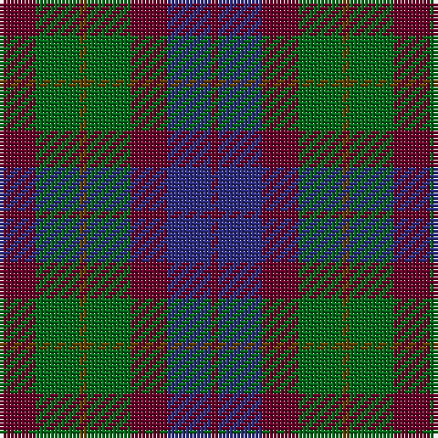

In pattern [BBBGGGB](/stripes/bbbgggb/).

This was sourced from house-of-tartan.  It is a [7 stripe tartan](/stripes/stripes7/).

Original link http://www.house-of-tartan.scotland.net/house/TartanViewjs.asp?colr=Def&tnam=2107

## Thread count
DR/10 G12 T2 G12 DR10 DB12 DR/2

## Palette
Each colour and its ΔE from the base-6 reference it is a variant of.

| Colour | Shade | Base | ΔE (OKLab) |
|---|---|---|---|
| DB | <code style="background-color:#2C2C80;">#2C2C80</code> `#2C2C80` | B <code style="background-color:#2A418A;">#2A418A</code> | 0.06 |
| DR | <code style="background-color:#680028;">#680028</code> `#680028` | B <code style="background-color:#2A418A;">#2A418A</code> | 0.21 |
| G | <code style="background-color:#006818;">#006818</code> `#006818` | G <code style="background-color:#006100;">#006100</code> | 0.02 |
| T | <code style="background-color:#604000;">#604000</code> `#604000` | G <code style="background-color:#006100;">#006100</code> | 0.14 |

# Sample pattern

## Nearest tartans

The nearest existing variants by ΔTartan distance.

1. [Dorward/Dogwood](/setts/s7/dy7r3dy9g15db19dy14r4~x2/) — ΔT 0.79
1. [Tennant (Yules)](/setts/s7/r1dy7g7db7g7db7r1~x8/) — ΔT 0.82
1. [Unidentified Pinafore](/setts/s7/dg24k4dg24k24t7r24t7~x2/) — ΔT 0.90
1. [MacCallum #2](/setts/s7/k6dg6r1dg6k6db6k1~x2/) — ΔT 1.06
1. [Dorward](/setts/s7/o7r3o9g15db19o14r4~x2/) — ΔT 1.21
1. [Abercrombie (Wilsons No 2/64)](/setts/s7/k6dg6ly1dg6k6dp6k1~x4/) — ΔT 1.23
1. [Scottish Airports (Corporate)](/setts/s6/dp4n18k17n3g18n4~x2/) — ΔT 1.24
1. [MacIntyre](/setts/s7/k12dg12k2dg12k12db12t3~x2/) — ΔT 1.24
1. [Tennant](/setts/s7/r1dr7g7db7g7db7r1~x4/) — ΔT 1.25
1. [Ferguson of Balquhidder #3](/setts/s6/k3dg12k12r2db12k3~x2/) — ΔT 1.25

## Neighbour map

Every grey dot is one of 14299 variants placed by the first two principal components of the ΔTartan feature space (44% of its variance). Red is this tartan; blue dots are its nearest — click one to open its page.

<svg viewBox="0 0 640 380" role="img" style="max-width:100%;height:auto;border:1px solid #e0e0e0;border-radius:4px;display:block" xmlns="http://www.w3.org/2000/svg"><image href="/nn/cloud.v1.png" width="640" height="380"/><a href="/setts/s7/dy7r3dy9g15db19dy14r4~x2/"><circle cx="229.6" cy="279.8" r="4" fill="#3465a4"><title>Dorward/Dogwood</title></circle></a><a href="/setts/s7/r1dy7g7db7g7db7r1~x8/"><circle cx="208.3" cy="280.5" r="4" fill="#3465a4"><title>Tennant (Yules)</title></circle></a><a href="/setts/s7/dg24k4dg24k24t7r24t7~x2/"><circle cx="192.5" cy="268.7" r="4" fill="#3465a4"><title>Unidentified Pinafore</title></circle></a><a href="/setts/s7/k6dg6r1dg6k6db6k1~x2/"><circle cx="220.8" cy="296.4" r="4" fill="#3465a4"><title>MacCallum #2</title></circle></a><a href="/setts/s7/o7r3o9g15db19o14r4~x2/"><circle cx="230.3" cy="278.2" r="4" fill="#3465a4"><title>Dorward</title></circle></a><a href="/setts/s7/k6dg6ly1dg6k6dp6k1~x4/"><circle cx="192.7" cy="278.7" r="4" fill="#3465a4"><title>Abercrombie (Wilsons No 2/64)</title></circle></a><a href="/setts/s6/dp4n18k17n3g18n4~x2/"><circle cx="222.8" cy="280.7" r="4" fill="#3465a4"><title>Scottish Airports (Corporate)</title></circle></a><a href="/setts/s7/k12dg12k2dg12k12db12t3~x2/"><circle cx="212.5" cy="302.5" r="4" fill="#3465a4"><title>MacIntyre</title></circle></a><a href="/setts/s7/r1dr7g7db7g7db7r1~x4/"><circle cx="180.1" cy="265.0" r="4" fill="#3465a4"><title>Tennant</title></circle></a><a href="/setts/s6/k3dg12k12r2db12k3~x2/"><circle cx="225.1" cy="280.0" r="4" fill="#3465a4"><title>Ferguson of Balquhidder #3</title></circle></a><circle cx="212.9" cy="283.4" r="5" fill="#c00000"/></svg>

ID: /setts/s7/dr5g6dy1g6dr5db6dr1~x2/
