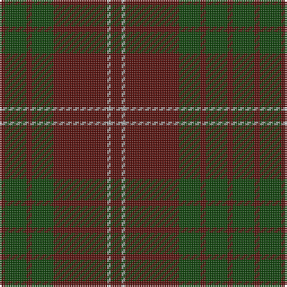

In pattern [BGBGBYB](/stripes/bgbgbyb/).

This was sourced from weddslist.  It is a [7 stripe tartan](/stripes/stripes7/).

Original link http://www.weddslist.com/cgi-bin/tartans/pg.pl?source=x

## Thread count
DR/6 N2 DR30 DG12 DR3 DG12 DR/3

## Palette
Each colour and the base-6 reference it is a variant of.

| Colour | Shade | Base |
|---|---|---|
| DG | <code style="background-color:#11450D;">#11450D</code> `oklch(34.4% 0.101 142.1)` <small>#11450D</small> | G <code style="background-color:#006100;">#006100</code> |
| DR | <code style="background-color:#59110D;">#59110D</code> `oklch(30.7% 0.105 28.2)` <small>#59110D</small> | B <code style="background-color:#2A418A;">#2A418A</code> |
| N | <code style="background-color:#AAAAAA;">#AAAAAA</code> `oklch(73.8% 0.000 89.9)` <small>#AAAAAA</small> | Y <code style="background-color:#F2BF00;">#F2BF00</code> |

# Sample pattern

## Nearest tartans

The nearest existing variants by ΔTartan distance.

1. [Crawford](/setts/s7/dr6lr2dr30dg12dr3dg12dr3~x2/) — ΔT 0.00
1. [Keeper of the Quaich](/setts/s6/dy3db3dy3db27dy40y3/) — ΔT 1.44
1. [Glen Trool District Tartan Tartan Number: 914. Earliest known date: pre 1945 Glen Trool is in the Galloway Uplands in the Southwest of Scotland. The tartan began life as a trade sett - a colourful fashion fabric - and was given a name merely to identify it. It proved very popular and is now recognised as a District Tartan. See products available Copyright © Blair Urquhart, Comrie, 2015](/setts/s5/dg37dy9dg3r9dy3~x2/) — ΔT 1.46
1. [Donachie of Brockloch](/setts/s10/o24dg2o2dg20o25dg2o2dg2o2dg20~x2/) — ΔT 1.50
1. [Glen Shee #1 (Fashion)](/setts/s5/r37do9r3g9do3~x2/) — ΔT 1.63
1. [Unidentified #44](/setts/s7/db13k3db20dy70db20dy30w3~x2/) — ΔT 1.69
1. [Wasko (Personal)](/setts/s7/r8lr2o30dg12o3dg12o3~x2/) — ΔT 1.73
1. [Donachie of Brockloch (Clan)](/setts/s10/r24dg2r2dg20r25dg2r2dg2r2dg20~x2/) — ΔT 1.81
1. [Dege of Saville Row](/setts/s6/dy11db1dy3db1db9r1~x4/) — ΔT 1.81
1. [MacIver of Strathendry Htg (Personal](/setts/s9/r3o28do5o5do33o5do5o28lo3~x2/) — ΔT 1.82

## Neighbour map

Every grey dot is one of 14299 variants placed by the first two principal components of the ΔTartan feature space (44% of its variance). Red is this tartan; blue dots are its nearest — click one to open its page.

<svg viewBox="0 0 640 380" role="img" style="max-width:100%;height:auto;border:1px solid #e0e0e0;border-radius:4px;display:block" xmlns="http://www.w3.org/2000/svg"><image href="/nn/cloud.v1.png" width="640" height="380"/><a href="/setts/s7/dr6lr2dr30dg12dr3dg12dr3~x2/"><circle cx="492.5" cy="253.1" r="4" fill="#3465a4"><title>Crawford</title></circle></a><a href="/setts/s6/dy3db3dy3db27dy40y3/"><circle cx="472.2" cy="247.6" r="4" fill="#3465a4"><title>Keeper of the Quaich</title></circle></a><a href="/setts/s5/dg37dy9dg3r9dy3~x2/"><circle cx="476.9" cy="258.4" r="4" fill="#3465a4"><title>Glen Trool District Tartan Tartan Number: 914. Earliest known date: pre 1945 Glen Trool is in the Galloway Uplands in the Southwest of Scotland. The tartan began life as a trade sett - a colourful fashion fabric - and was given a name merely to identify it. It proved very popular and is now recognised as a District Tartan. See products available Copyright © Blair Urquhart, Comrie, 2015</title></circle></a><a href="/setts/s10/o24dg2o2dg20o25dg2o2dg2o2dg20~x2/"><circle cx="497.5" cy="267.1" r="4" fill="#3465a4"><title>Donachie of Brockloch</title></circle></a><a href="/setts/s5/r37do9r3g9do3~x2/"><circle cx="514.9" cy="257.2" r="4" fill="#3465a4"><title>Glen Shee #1 (Fashion)</title></circle></a><a href="/setts/s7/db13k3db20dy70db20dy30w3~x2/"><circle cx="481.8" cy="221.0" r="4" fill="#3465a4"><title>Unidentified #44</title></circle></a><a href="/setts/s7/r8lr2o30dg12o3dg12o3~x2/"><circle cx="385.7" cy="226.2" r="4" fill="#3465a4"><title>Wasko (Personal)</title></circle></a><a href="/setts/s10/r24dg2r2dg20r25dg2r2dg2r2dg20~x2/"><circle cx="449.9" cy="234.9" r="4" fill="#3465a4"><title>Donachie of Brockloch (Clan)</title></circle></a><a href="/setts/s6/dy11db1dy3db1db9r1~x4/"><circle cx="399.7" cy="245.0" r="4" fill="#3465a4"><title>Dege of Saville Row</title></circle></a><a href="/setts/s9/r3o28do5o5do33o5do5o28lo3~x2/"><circle cx="420.6" cy="217.3" r="4" fill="#3465a4"><title>MacIver of Strathendry Htg (Personal</title></circle></a><circle cx="492.5" cy="253.1" r="5" fill="#c00000"/></svg>

ID: /setts/s7/dr6lr2dr30dg12dr3dg12dr3/
