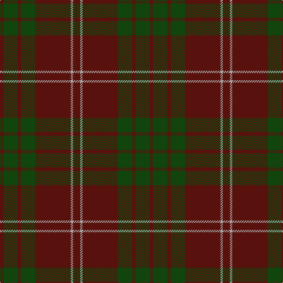

This page is one **sett** — a single exact thread-count. It belongs to the [tartan](/tartans/dr6lr2dr30dg12dr3dg12dr3/)
(the same proportion at any scale), whose colour order is pattern [BGBGBYB](/stripes/bgbgbyb/).

Sourced from weddslist.  It is a [7 stripe tartan](/stripes/stripes7/).

Original link http://www.weddslist.com/cgi-bin/tartans/pg.pl?source=tinsel

## Thread count
DR/12 N4 DR60 DG24 DR6 DG24 DR/6

## Palette

Palette: <strong>custom</strong>
<table><thead><tr><th>Colour</th><th>Threads</th><th>Shade</th><th>Base</th><th>OKLCh</th></tr></thead><tbody><tr><td>DR/</td><td style="text-align:right;font-variant-numeric:tabular-nums">12</td><td><code style="background-color:#59110D;">#59110D</code> <small style="color:#888">#59110D</small></td><td>B <code style="background-color:#2A418A;">#2A418A</code></td><td><small style="color:#888">oklch(30.7% 0.105 28.2)</small></td></tr><tr><td>N</td><td style="text-align:right;font-variant-numeric:tabular-nums">4</td><td><code style="background-color:#AAAAAA;">#AAAAAA</code> <small style="color:#888">#AAAAAA</small></td><td>Y <code style="background-color:#F2BF00;">#F2BF00</code></td><td><small style="color:#888">oklch(73.8% 0.000 89.9)</small></td></tr><tr><td>DR</td><td style="text-align:right;font-variant-numeric:tabular-nums">60</td><td><code style="background-color:#59110D;">#59110D</code> <small style="color:#888">#59110D</small></td><td>B <code style="background-color:#2A418A;">#2A418A</code></td><td><small style="color:#888">oklch(30.7% 0.105 28.2)</small></td></tr><tr><td>DG</td><td style="text-align:right;font-variant-numeric:tabular-nums">24</td><td><code style="background-color:#11450D;">#11450D</code> <small style="color:#888">#11450D</small></td><td>G <code style="background-color:#006100;">#006100</code></td><td><small style="color:#888">oklch(34.4% 0.101 142.1)</small></td></tr><tr><td>DR</td><td style="text-align:right;font-variant-numeric:tabular-nums">6</td><td><code style="background-color:#59110D;">#59110D</code> <small style="color:#888">#59110D</small></td><td>B <code style="background-color:#2A418A;">#2A418A</code></td><td><small style="color:#888">oklch(30.7% 0.105 28.2)</small></td></tr><tr><td>DG</td><td style="text-align:right;font-variant-numeric:tabular-nums">24</td><td><code style="background-color:#11450D;">#11450D</code> <small style="color:#888">#11450D</small></td><td>G <code style="background-color:#006100;">#006100</code></td><td><small style="color:#888">oklch(34.4% 0.101 142.1)</small></td></tr><tr><td>DR/</td><td style="text-align:right;font-variant-numeric:tabular-nums">6</td><td><code style="background-color:#59110D;">#59110D</code> <small style="color:#888">#59110D</small></td><td>B <code style="background-color:#2A418A;">#2A418A</code></td><td><small style="color:#888">oklch(30.7% 0.105 28.2)</small></td></tr></tbody></table>

# Sample pattern

## Nearest tartans

The nearest existing variants by ΔTartan distance, with this tartan at the top so the swatches line up against it.

ΔTartan

Tartan

Sett

—

<a href="/ttd/edit/#slug=dr6lr2dr30dg12dr3dg12dr3~x2">Crawford</a> <a class="nn-out" href="/setts/s7/dr6lr2dr30dg12dr3dg12dr3~x2/" title="open its dictionary page">↗</a>

0.00

<a href="/ttd/edit/#slug=dr6lr2dr30dg12dr3dg12dr3">Crawford</a> <a class="nn-out" href="/setts/s7/dr6lr2dr30dg12dr3dg12dr3/" title="open its dictionary page">↗</a>

1.44

<a href="/ttd/edit/#slug=dy3db3dy3db27dy40y3">Keeper of the Quaich</a> <a class="nn-out" href="/setts/s6/dy3db3dy3db27dy40y3/" title="open its dictionary page">↗</a>

1.46

<a href="/ttd/edit/#slug=dg37dy9dg3r9dy3~x2">Glen Trool District Tartan Tartan Number: 914. Earliest known date: pre 1945 Glen Trool is in the Galloway Uplands in the Southwest of Scotland. The tartan began life as a trade sett - a colourful fashion fabric - and was given a name merely to identify it. It proved very popular and is now recognised as a District Tartan. See products available Copyright © Blair Urquhart, Comrie, 2015</a> <a class="nn-out" href="/setts/s5/dg37dy9dg3r9dy3~x2/" title="open its dictionary page">↗</a>

1.50

<a href="/ttd/edit/#slug=o24dg2o2dg20o25dg2o2dg2o2dg20~x2">Donachie of Brockloch</a> <a class="nn-out" href="/setts/s10/o24dg2o2dg20o25dg2o2dg2o2dg20~x2/" title="open its dictionary page">↗</a>

1.62

<a href="/ttd/edit/#slug=r37do9r3g9do3~x2">Glen Shee #1 (Fashion)</a> <a class="nn-out" href="/setts/s5/r37do9r3g9do3~x2/" title="open its dictionary page">↗</a>

1.69

<a href="/ttd/edit/#slug=db13k3db20dy70db20dy30w3~x2">Unidentified #44</a> <a class="nn-out" href="/setts/s7/db13k3db20dy70db20dy30w3~x2/" title="open its dictionary page">↗</a>

1.73

<a href="/ttd/edit/#slug=r8lr2o30dg12o3dg12o3~x2">Wasko (Personal)</a> <a class="nn-out" href="/setts/s7/r8lr2o30dg12o3dg12o3~x2/" title="open its dictionary page">↗</a>

1.80

<a href="/ttd/edit/#slug=r24dg2r2dg20r25dg2r2dg2r2dg20~x2">Donachie of Brockloch (Clan)</a> <a class="nn-out" href="/setts/s10/r24dg2r2dg20r25dg2r2dg2r2dg20~x2/" title="open its dictionary page">↗</a>

1.81

<a href="/ttd/edit/#slug=dy11db1dy3dbi1db9r1~x4">Dege of Saville Row</a> <a class="nn-out" href="/setts/s6/dy11db1dy3dbi1db9r1~x4/" title="open its dictionary page">↗</a>

1.82

<a href="/ttd/edit/#slug=r3o28do5o5do33o5do5o28lo3~x2">MacIver of Strathendry Htg (Personal</a> <a class="nn-out" href="/setts/s9/r3o28do5o5do33o5do5o28lo3~x2/" title="open its dictionary page">↗</a>

## Neighbour map

Every grey dot is one of 14359 variants placed by the first two principal components of the ΔTartan feature space (44% of its variance). Red is this tartan; blue dots are its nearest — click one to open its page.

<svg viewBox="0 0 640 380" role="img" style="max-width:100%;height:auto;border:1px solid #e0e0e0;border-radius:4px;display:block" xmlns="http://www.w3.org/2000/svg"><image href="/nn/cloud.v1.png" width="640" height="380"/><a href="/setts/s7/dr6lr2dr30dg12dr3dg12dr3/"><circle cx="492.2" cy="253.5" r="4" fill="#3465a4"><title>Crawford</title></circle></a><a href="/setts/s6/dy3db3dy3db27dy40y3/"><circle cx="471.9" cy="248.1" r="4" fill="#3465a4"><title>Keeper of the Quaich</title></circle></a><a href="/setts/s5/dg37dy9dg3r9dy3~x2/"><circle cx="476.6" cy="258.9" r="4" fill="#3465a4"><title>Glen Trool District Tartan Tartan Number: 914. Earliest known date: pre 1945 Glen Trool is in the Galloway Uplands in the Southwest of Scotland. The tartan began life as a trade sett - a colourful fashion fabric - and was given a name merely to identify it. It proved very popular and is now recognised as a District Tartan. See products available Copyright © Blair Urquhart, Comrie, 2015</title></circle></a><a href="/setts/s10/o24dg2o2dg20o25dg2o2dg2o2dg20~x2/"><circle cx="497.3" cy="267.5" r="4" fill="#3465a4"><title>Donachie of Brockloch</title></circle></a><a href="/setts/s5/r37do9r3g9do3~x2/"><circle cx="514.3" cy="257.6" r="4" fill="#3465a4"><title>Glen Shee #1 (Fashion)</title></circle></a><a href="/setts/s7/db13k3db20dy70db20dy30w3~x2/"><circle cx="481.5" cy="221.3" r="4" fill="#3465a4"><title>Unidentified #44</title></circle></a><a href="/setts/s7/r8lr2o30dg12o3dg12o3~x2/"><circle cx="385.4" cy="226.7" r="4" fill="#3465a4"><title>Wasko (Personal)</title></circle></a><a href="/setts/s10/r24dg2r2dg20r25dg2r2dg2r2dg20~x2/"><circle cx="449.3" cy="235.4" r="4" fill="#3465a4"><title>Donachie of Brockloch (Clan)</title></circle></a><a href="/setts/s6/dy11db1dy3dbi1db9r1~x4/"><circle cx="399.4" cy="245.6" r="4" fill="#3465a4"><title>Dege of Saville Row</title></circle></a><a href="/setts/s9/r3o28do5o5do33o5do5o28lo3~x2/"><circle cx="419.9" cy="217.7" r="4" fill="#3465a4"><title>MacIver of Strathendry Htg (Personal</title></circle></a><circle cx="492.2" cy="253.5" r="5" fill="#c00000"/></svg>

ID: /setts/s7/dr6lr2dr30dg12dr3dg12dr3~x2/
