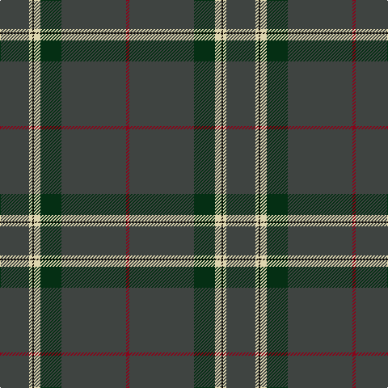

**Bands:** [RBGWKWB](/stripes/rbgwkwb/) · **Stripes:** [R DT DG W K W DT](/stripes/stripes7/) R DT DG W K W DT

This was sourced from register-of-tartans.  It is a [7 band tartan](/bands/bands7/).

Original link https://www.tartanregister.gov.uk/tartanDetails.aspx?ref=10533

## Register references

External register numbers recorded for this tartan.

- Scottish Register of Tartans: [10533](https://www.tartanregister.gov.uk/tartanDetails.aspx?ref=10533)

## Thread count
N/36 LR4 K2 LR8 DG26 N80 DR/4

## Palette
Each colour and its ΔE from the base-6 reference it is a variant of.

| Colour | Shade | Base | ΔE (OKLab) |
|---|---|---|---|
| DG | <code style="background-color:#052F14;">#052F14</code> `#052F14` | G <code style="background-color:#006100;">#006100</code> | 0.18 |
| DR | <code style="background-color:#89051B;">#89051B</code> `#89051B` | R <code style="background-color:#CC0000;">#CC0000</code> | 0.15 |
| K | <code style="background-color:#120A01;">#120A01</code> `#120A01` | K <code style="background-color:#000000;">#000000</code> | 0.15 |
| LR | <code style="background-color:#DDD5AF;">#DDD5AF</code> `#DDD5AF` | W <code style="background-color:#F7F7F7;">#F7F7F7</code> | 0.12 |
| N | <code style="background-color:#3F4441;">#3F4441</code> `#3F4441` | B <code style="background-color:#2A418A;">#2A418A</code> | 0.13 |

# Sample pattern

## Nearest tartans

The nearest existing variants by ΔTartan distance.

1. [Puxty-Dunne (Personal)](/setts/s7/n18w2k1w4g13n40r2~x2/) — ΔT 0.94
1. [Highland Autumn (Fashion)](/setts/s8/r2n2k2n28k8n9k1lo2~x2/) — ΔT 1.27
1. [Lochnagar Dark (Fashion)](/setts/s10/do6o1do40n1do12o12dp6o2r2o4~x2/) — ΔT 1.28
1. [MTV](/setts/s7/dr5k3dr9dg56t4dg2w3/) — ΔT 1.36
1. [London Scottish Rugby Club](/setts/s6/r5dt40w1dt13g8k4~x2/) — ΔT 1.39
1. [Dark Lochnagar](/setts/s10/do6o1do40n1do12o12n6o2r2o4~x2/) — ΔT 1.47
1. [Christie (London) Hunting](/setts/s6/dt60lr11o5n5k1o4~x2/) — ΔT 1.53
1. [Dunning Primary (School)](/setts/s5/n30do9w1r5ly1~x4/) — ΔT 1.56
1. [MTV](/setts/s7/r5k3r9dg56t4dg2w3/) — ΔT 1.59
1. [Center](/setts/s8/k50db2k13w1k13db5dg15r2~x2/) — ΔT 1.60

## Neighbour map

Every grey dot is one of 14299 variants placed by the first two principal components of the ΔTartan feature space (44% of its variance). Red is this tartan; blue dots are its nearest — click one to open its page.

<svg viewBox="0 0 640 380" role="img" style="max-width:100%;height:auto;border:1px solid #e0e0e0;border-radius:4px;display:block" xmlns="http://www.w3.org/2000/svg"><image href="/nn/cloud.v1.png" width="640" height="380"/><a href="/setts/s7/n18w2k1w4g13n40r2~x2/"><circle cx="508.2" cy="150.2" r="4" fill="#3465a4"><title>Puxty-Dunne (Personal)</title></circle></a><a href="/setts/s8/r2n2k2n28k8n9k1lo2~x2/"><circle cx="518.2" cy="164.7" r="4" fill="#3465a4"><title>Highland Autumn (Fashion)</title></circle></a><a href="/setts/s10/do6o1do40n1do12o12dp6o2r2o4~x2/"><circle cx="478.1" cy="125.3" r="4" fill="#3465a4"><title>Lochnagar Dark (Fashion)</title></circle></a><a href="/setts/s7/dr5k3dr9dg56t4dg2w3/"><circle cx="479.0" cy="138.5" r="4" fill="#3465a4"><title>MTV</title></circle></a><a href="/setts/s6/r5dt40w1dt13g8k4~x2/"><circle cx="524.8" cy="170.5" r="4" fill="#3465a4"><title>London Scottish Rugby Club</title></circle></a><a href="/setts/s10/do6o1do40n1do12o12n6o2r2o4~x2/"><circle cx="503.7" cy="146.8" r="4" fill="#3465a4"><title>Dark Lochnagar</title></circle></a><a href="/setts/s6/dt60lr11o5n5k1o4~x2/"><circle cx="470.9" cy="109.1" r="4" fill="#3465a4"><title>Christie (London) Hunting</title></circle></a><a href="/setts/s5/n30do9w1r5ly1~x4/"><circle cx="465.9" cy="176.2" r="4" fill="#3465a4"><title>Dunning Primary (School)</title></circle></a><a href="/setts/s7/r5k3r9dg56t4dg2w3/"><circle cx="470.9" cy="131.9" r="4" fill="#3465a4"><title>MTV</title></circle></a><a href="/setts/s8/k50db2k13w1k13db5dg15r2~x2/"><circle cx="549.3" cy="151.0" r="4" fill="#3465a4"><title>Center</title></circle></a><circle cx="504.1" cy="152.9" r="5" fill="#c00000"/></svg>

ID: /setts/s7/dt18w2k1w4dg13dt40r2~x2/
