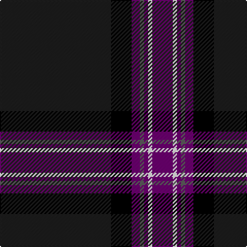

In pattern [BKBBBWB](/stripes/bkbbbwb/).

This was sourced from register-of-tartans.  It is a [7 stripe tartan](/stripes/stripes7/).

Original link https://www.tartanregister.gov.uk/tartanDetails.aspx?ref=11287

## Register references

External register numbers recorded for this tartan.

- Scottish Register of Tartans: [11287](https://www.tartanregister.gov.uk/tartanDetails.aspx?ref=11287)

## Thread count
Ka/108 K20 P8 N4 P4 W4 P/20

## Palette
Each colour and its ΔE from the base-6 reference it is a variant of.

| Colour | Shade | Base | ΔE (OKLab) |
|---|---|---|---|
| K | <code style="background-color:#000000;">#000000</code> `#000000` | K <code style="background-color:#000000;">#000000</code> | 0.00 |
| Ka | <code style="background-color:#1C1C1C;">#1C1C1C</code> `#1C1C1C` | B <code style="background-color:#2A418A;">#2A418A</code> | 0.21 |
| N | <code style="background-color:#5C5C5C;">#5C5C5C</code> `#5C5C5C` | B <code style="background-color:#2A418A;">#2A418A</code> | 0.15 |
| P | <code style="background-color:#6C0070;">#6C0070</code> `#6C0070` | B <code style="background-color:#2A418A;">#2A418A</code> | 0.16 |
| W | <code style="background-color:#FCFCFC;">#FCFCFC</code> `#FCFCFC` | W <code style="background-color:#F7F7F7;">#F7F7F7</code> | 0.01 |

# Sample pattern

## Nearest tartans

The nearest existing variants by ΔTartan distance.

1. [Highland Park](/setts/s9/lo2k3db6r4k48r4db6k3lb2~x2/) — ΔT 0.92
1. [Midnight Glen (Fashion)](/setts/s9/dp3k40lr3dp6k10dp10k3lr1o3~x2/) — ΔT 1.30
1. [MacNeill](/setts/s9/db5r3db21k5db5k40k2k2w1~x2/) — ΔT 1.31
1. [Genet, Edmond Charles 'Citizen' (Personal)](/setts/s7/r4k9dg9k40r2k2w2~x2/) — ΔT 1.36
1. [Cumnock (District)](/setts/s8/g3db16k3dp2k45r1k2lo3~x2/) — ΔT 1.37
1. [Nocken (Personal)](/setts/s9/lb3k6lb2k6db2k2db32k2n1~x2/) — ΔT 1.40
1. [City of Rome Pipe Band (Corporate)](/setts/s7/r12lo6k88db45k6db6ly6/) — ΔT 1.44
1. [State Seal of Massachusetts Fash)](/setts/s10/k62b4k7db29k3lo4k3lb4k11b16~x2/) — ΔT 1.47
1. [Nocken Blue Modern Tartan (Personal)](/setts/s9/lr3k6w2k6dt2k2dt32k2n1~x2/) — ΔT 1.48
1. [Pride of Scotland Contemporary](/setts/s11/k9n2o2n2k18n2k2lp1n19k33dp2~x2/) — ΔT 1.51

## Neighbour map

Every grey dot is one of 14299 variants placed by the first two principal components of the ΔTartan feature space (44% of its variance). Red is this tartan; blue dots are its nearest — click one to open its page.

<svg viewBox="0 0 640 380" role="img" style="max-width:100%;height:auto;border:1px solid #e0e0e0;border-radius:4px;display:block" xmlns="http://www.w3.org/2000/svg"><image href="/nn/cloud.v1.png" width="640" height="380"/><a href="/setts/s9/lo2k3db6r4k48r4db6k3lb2~x2/"><circle cx="468.4" cy="132.6" r="4" fill="#3465a4"><title>Highland Park</title></circle></a><a href="/setts/s9/dp3k40lr3dp6k10dp10k3lr1o3~x2/"><circle cx="476.7" cy="139.2" r="4" fill="#3465a4"><title>Midnight Glen (Fashion)</title></circle></a><a href="/setts/s9/db5r3db21k5db5k40k2k2w1~x2/"><circle cx="411.2" cy="130.8" r="4" fill="#3465a4"><title>MacNeill</title></circle></a><a href="/setts/s7/r4k9dg9k40r2k2w2~x2/"><circle cx="358.5" cy="146.8" r="4" fill="#3465a4"><title>Genet, Edmond Charles 'Citizen' (Personal)</title></circle></a><a href="/setts/s8/g3db16k3dp2k45r1k2lo3~x2/"><circle cx="439.0" cy="96.1" r="4" fill="#3465a4"><title>Cumnock (District)</title></circle></a><a href="/setts/s9/lb3k6lb2k6db2k2db32k2n1~x2/"><circle cx="407.1" cy="120.3" r="4" fill="#3465a4"><title>Nocken (Personal)</title></circle></a><a href="/setts/s7/r12lo6k88db45k6db6ly6/"><circle cx="336.7" cy="167.2" r="4" fill="#3465a4"><title>City of Rome Pipe Band (Corporate)</title></circle></a><a href="/setts/s10/k62b4k7db29k3lo4k3lb4k11b16~x2/"><circle cx="354.1" cy="138.3" r="4" fill="#3465a4"><title>State Seal of Massachusetts Fash)</title></circle></a><a href="/setts/s9/lr3k6w2k6dt2k2dt32k2n1~x2/"><circle cx="408.5" cy="125.3" r="4" fill="#3465a4"><title>Nocken Blue Modern Tartan (Personal)</title></circle></a><a href="/setts/s11/k9n2o2n2k18n2k2lp1n19k33dp2~x2/"><circle cx="455.7" cy="133.4" r="4" fill="#3465a4"><title>Pride of Scotland Contemporary</title></circle></a><circle cx="431.3" cy="139.8" r="5" fill="#c00000"/></svg>

ID: /setts/s7/dt27k5dp2n1dp1w1dp5~x4/
