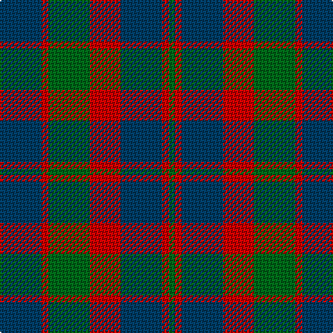

**Bands:** [GRBRGRB](/stripes/grbrgrb/) · **Stripes:** [G R DT R G R DT](/stripes/stripes7/) G R DT R G R DT

This was sourced from tartans-authority.  It is a [7 band tartan](/bands/bands7/).

Original link http://www.tartansauthority.com/tartan-ferret/display/8066/

## Thread count
DB/30 R5 G30 R22 DB30 R5 G/4

## Palette
Each colour and its ΔE from the base-6 reference it is a variant of.

| Colour | Shade | Base | ΔE (OKLab) |
|---|---|---|---|
| DB | <code style="background-color:#003C64;">#003C64</code> `#003C64` | B <code style="background-color:#2A418A;">#2A418A</code> | 0.08 |
| G | <code style="background-color:#006818;">#006818</code> `#006818` | G <code style="background-color:#006100;">#006100</code> | 0.02 |
| R | <code style="background-color:#C80000;">#C80000</code> `#C80000` | R <code style="background-color:#CC0000;">#CC0000</code> | 0.01 |

# Sample pattern

## Nearest tartans

The nearest existing variants by ΔTartan distance.

1. [Glasgow #2](/setts/s7/dg25r4db24r21dg25r3db4~x2/) — ΔT 0.41
1. [MacBean of Tomatin (Clan)](/setts/s7/db3r19db13r5g21r8db3~x2/) — ΔT 0.92
1. [Logan #5](/setts/s6/db9r3db1g9r3db1~x2/) — ΔT 0.95
1. [Skene D](/setts/s7/db9r6dg2r6dg18r6dg2~x2/) — ΔT 1.02
1. [Skene Clan Tartan Tartan Number: 516. Earliest known date: 1886 Smith No 53 has ROSE in place of RED. Grant's version is similar to the sample named Skene in the 1830 pattern book of Wilson's of Bannockburn. See products available Copyright © Blair Urquhart, Comrie, 2015](/setts/s7/db6r3g2r3g12r3g2~x2/) — ΔT 1.07
1. [Rob Roy (Film)](/setts/s6/t3dg1t10dg4r10t2~x4/) — ΔT 1.09
1. [Glasgow, Rock and Wheel](/setts/s7/g25m4db24m21g25m4db2~x2/) — ΔT 1.13
1. [Glasgow](/setts/s7/g25r4db24r21g25r3db4~x2/) — ΔT 1.14
1. [Logan, or Skene](/setts/s7/db9r3db1r3g9r3db1~x2/) — ΔT 1.17
1. [Robertson of Struan](/setts/s7/r6db2r2db21dg20r4dg4~x2/) — ΔT 1.23

## Neighbour map

Every grey dot is one of 14299 variants placed by the first two principal components of the ΔTartan feature space (44% of its variance). Red is this tartan; blue dots are its nearest — click one to open its page.

<svg viewBox="0 0 640 380" role="img" style="max-width:100%;height:auto;border:1px solid #e0e0e0;border-radius:4px;display:block" xmlns="http://www.w3.org/2000/svg"><image href="/nn/cloud.v1.png" width="640" height="380"/><a href="/setts/s7/dg25r4db24r21dg25r3db4~x2/"><circle cx="281.8" cy="261.5" r="4" fill="#3465a4"><title>Glasgow #2</title></circle></a><a href="/setts/s7/db3r19db13r5g21r8db3~x2/"><circle cx="256.4" cy="257.4" r="4" fill="#3465a4"><title>MacBean of Tomatin (Clan)</title></circle></a><a href="/setts/s6/db9r3db1g9r3db1~x2/"><circle cx="260.7" cy="242.6" r="4" fill="#3465a4"><title>Logan #5</title></circle></a><a href="/setts/s7/db9r6dg2r6dg18r6dg2~x2/"><circle cx="277.2" cy="246.1" r="4" fill="#3465a4"><title>Skene D</title></circle></a><a href="/setts/s7/db6r3g2r3g12r3g2~x2/"><circle cx="284.0" cy="253.3" r="4" fill="#3465a4"><title>Skene Clan Tartan Tartan Number: 516. Earliest known date: 1886 Smith No 53 has ROSE in place of RED. Grant's version is similar to the sample named Skene in the 1830 pattern book of Wilson's of Bannockburn. See products available Copyright © Blair Urquhart, Comrie, 2015</title></circle></a><a href="/setts/s6/t3dg1t10dg4r10t2~x4/"><circle cx="314.4" cy="246.9" r="4" fill="#3465a4"><title>Rob Roy (Film)</title></circle></a><a href="/setts/s7/g25m4db24m21g25m4db2~x2/"><circle cx="291.4" cy="245.1" r="4" fill="#3465a4"><title>Glasgow, Rock and Wheel</title></circle></a><a href="/setts/s7/g25r4db24r21g25r3db4~x2/"><circle cx="257.0" cy="247.8" r="4" fill="#3465a4"><title>Glasgow</title></circle></a><a href="/setts/s7/db9r3db1r3g9r3db1~x2/"><circle cx="235.8" cy="232.9" r="4" fill="#3465a4"><title>Logan, or Skene</title></circle></a><a href="/setts/s7/r6db2r2db21dg20r4dg4~x2/"><circle cx="284.7" cy="228.7" r="4" fill="#3465a4"><title>Robertson of Struan</title></circle></a><circle cx="270.3" cy="261.8" r="5" fill="#c00000"/></svg>

ID: /setts/s7/dt30r5g30r22dt30r5g4/
