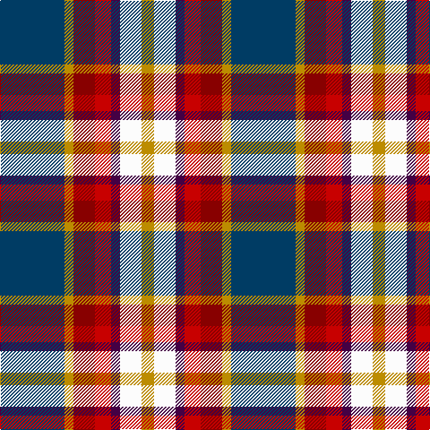

In pattern [BYRRBWY](/stripes/byrrbwy/).

This was sourced from tartans-authority.  It is a [7 stripe tartan](/stripes/stripes7/).

Original link http://www.tartansauthority.com/tartan-ferret/display/10693/

## Thread count
DB/72 DY10 DR24 R18 DP10 W24 DY/14

## Palette
Each colour and the base-6 reference it is a variant of.

| Colour | Shade | Base |
|---|---|---|
| DB | <code style="background-color:#003C64;">#003C64</code> `oklch(34.5% 0.089 246.0)` <small>#003C64</small> | B <code style="background-color:#2A418A;">#2A418A</code> |
| DP | <code style="background-color:#440044;">#440044</code> `oklch(27.1% 0.125 328.4)` <small>#440044</small> | B <code style="background-color:#2A418A;">#2A418A</code> |
| DR | <code style="background-color:#880000;">#880000</code> `oklch(39.4% 0.162 29.2)` <small>#880000</small> | R <code style="background-color:#CC0000;">#CC0000</code> |
| DY | <code style="background-color:#BC8C00;">#BC8C00</code> `oklch(66.8% 0.137 84.1)` <small>#BC8C00</small> | Y <code style="background-color:#F2BF00;">#F2BF00</code> |
| R | <code style="background-color:#C80000;">#C80000</code> `oklch(52.3% 0.215 29.2)` <small>#C80000</small> | R <code style="background-color:#CC0000;">#CC0000</code> |
| W | <code style="background-color:#FCFCFC;">#FCFCFC</code> `oklch(99.1% 0.000 89.9)` <small>#FCFCFC</small> | W <code style="background-color:#F7F7F7;">#F7F7F7</code> |

# Sample pattern

## Nearest tartans

The nearest existing variants by ΔTartan distance, with this tartan at the top so the swatches line up against it.

ΔTartan

Tartan

Sett

—

<a href="/ttd/edit/#slug=dt36lo5r12r9dp5w12lo7~x2">Galvez-Brown (Personal)</a> <a class="nn-out" href="/setts/s7/dt36lo5r12r9dp5w12lo7~x2/" title="open its dictionary page">↗</a>

0.78

<a href="/ttd/edit/#slug=w5k26ly4lb24dp8k3r4~x2">Pengelly, The Cornish</a> <a class="nn-out" href="/setts/s7/w5k26ly4lb24dp8k3r4~x2/" title="open its dictionary page">↗</a>

0.93

<a href="/ttd/edit/#slug=db36ly5r12r9dp5w12ly7~x2">Galvez-Brown</a> <a class="nn-out" href="/setts/s7/db36ly5r12r9dp5w12ly7~x2/" title="open its dictionary page">↗</a>

1.02

<a href="/ttd/edit/#slug=k8r12w8dg15n30ly5~x2">Reekie (Edmonton)</a> <a class="nn-out" href="/setts/s6/k8r12w8dg15n30ly5~x2/" title="open its dictionary page">↗</a>

1.02

<a href="/ttd/edit/#slug=lg2r20g2dt15k2lg19lb2~x2">Wallace Memorial Centenary</a> <a class="nn-out" href="/setts/s7/lg2r20g2dt15k2lg19lb2~x2/" title="open its dictionary page">↗</a>

1.06

<a href="/ttd/edit/#slug=r17k5w4k6ly5db31k5g6w3~x2">Dean/Dundas (Personal)</a> <a class="nn-out" href="/setts/s9/r17k5w4k6ly5db31k5g6w3~x2/" title="open its dictionary page">↗</a>

1.07

<a href="/ttd/edit/#slug=k8r12w8g15db30ly5~x2">Reekie (Name)</a> <a class="nn-out" href="/setts/s6/k8r12w8g15db30ly5~x2/" title="open its dictionary page">↗</a>

1.12

<a href="/ttd/edit/#slug=w5o20k8r5dp36lo5~x2">Lord's Own Highlanders (Corporate)</a> <a class="nn-out" href="/setts/s6/w5o20k8r5dp36lo5~x2/" title="open its dictionary page">↗</a>

1.14

<a href="/ttd/edit/#slug=w6g10r22db16g2k4k5~x2">Nicolson of Taransay (Personal)</a> <a class="nn-out" href="/setts/s7/w6g10r22db16g2k4k5~x2/" title="open its dictionary page">↗</a>

1.14

<a href="/ttd/edit/#slug=k2db15w5db15r15w2k2g4ly3g4k2~x2">Pride, George (Personal)</a> <a class="nn-out" href="/setts/s11/k2db15w5db15r15w2k2g4ly3g4k2~x2/" title="open its dictionary page">↗</a>

1.15

<a href="/ttd/edit/#slug=k20r6ly3db24g3r8w4~x2">Eichelberger (Perrsonal)</a> <a class="nn-out" href="/setts/s7/k20r6ly3db24g3r8w4~x2/" title="open its dictionary page">↗</a>

## Neighbour map

Every grey dot is one of 14299 variants placed by the first two principal components of the ΔTartan feature space (44% of its variance). Red is this tartan; blue dots are its nearest — click one to open its page.

<svg viewBox="0 0 640 380" role="img" style="max-width:100%;height:auto;border:1px solid #e0e0e0;border-radius:4px;display:block" xmlns="http://www.w3.org/2000/svg"><image href="/nn/cloud.v1.png" width="640" height="380"/><a href="/setts/s7/w5k26ly4lb24dp8k3r4~x2/"><circle cx="118.6" cy="146.7" r="4" fill="#3465a4"><title>Pengelly, The Cornish</title></circle></a><a href="/setts/s7/db36ly5r12r9dp5w12ly7~x2/"><circle cx="111.3" cy="150.6" r="4" fill="#3465a4"><title>Galvez-Brown</title></circle></a><a href="/setts/s6/k8r12w8dg15n30ly5~x2/"><circle cx="87.0" cy="197.2" r="4" fill="#3465a4"><title>Reekie (Edmonton)</title></circle></a><a href="/setts/s7/lg2r20g2dt15k2lg19lb2~x2/"><circle cx="139.1" cy="152.7" r="4" fill="#3465a4"><title>Wallace Memorial Centenary</title></circle></a><a href="/setts/s9/r17k5w4k6ly5db31k5g6w3~x2/"><circle cx="122.5" cy="132.0" r="4" fill="#3465a4"><title>Dean/Dundas (Personal)</title></circle></a><a href="/setts/s6/k8r12w8g15db30ly5~x2/"><circle cx="84.4" cy="199.6" r="4" fill="#3465a4"><title>Reekie (Name)</title></circle></a><a href="/setts/s6/w5o20k8r5dp36lo5~x2/"><circle cx="179.0" cy="176.2" r="4" fill="#3465a4"><title>Lord's Own Highlanders (Corporate)</title></circle></a><a href="/setts/s7/w6g10r22db16g2k4k5~x2/"><circle cx="104.8" cy="160.2" r="4" fill="#3465a4"><title>Nicolson of Taransay (Personal)</title></circle></a><a href="/setts/s11/k2db15w5db15r15w2k2g4ly3g4k2~x2/"><circle cx="135.0" cy="145.2" r="4" fill="#3465a4"><title>Pride, George (Personal)</title></circle></a><a href="/setts/s7/k20r6ly3db24g3r8w4~x2/"><circle cx="117.8" cy="168.6" r="4" fill="#3465a4"><title>Eichelberger (Perrsonal)</title></circle></a><circle cx="120.3" cy="163.5" r="5" fill="#c00000"/></svg>

ID: /setts/s7/dt36lo5r12r9dp5w12lo7~x2/
