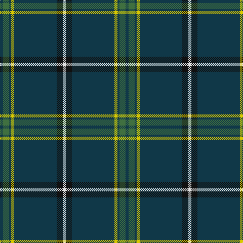

In pattern [BGBYBKW](/stripes/bgbybkw/).

This was sourced from register-of-tartans.  It is a [7 stripe tartan](/stripes/stripes7/).

Original link https://www.tartanregister.gov.uk/tartanDetails.aspx?ref=386

## Attestations

This cloth appears in 2 source records; the oldest owns this page.

- 01/05/2005 — Bro-sant-Brieg (register-of-tartans, [record](https://www.tartanregister.gov.uk/tartanDetails.aspx?ref=386))
- 2005 May — Bro-sant-Brieg (Corporate) (tartans-authority, [record](http://www.tartansauthority.com/tartan-ferret/display/6654/))

## Register references

External register numbers recorded for this tartan.

- Scottish Register of Tartans: [386](https://www.tartanregister.gov.uk/tartanDetails.aspx?ref=386)
- Scottish Tartans Authority (ITI): 6654

## Thread count
DN/6 G12 DN4 Y6 DN84 K12 LN/6

## Palette
Each colour and its ΔE from the base-6 reference it is a variant of.

| Colour | Shade | Base | ΔE (OKLab) |
|---|---|---|---|
| DN | <code style="background-color:#103848;">#103848</code> `#103848` | B <code style="background-color:#2A418A;">#2A418A</code> | 0.12 |
| G | <code style="background-color:#407040;">#407040</code> `#407040` | G <code style="background-color:#006100;">#006100</code> | 0.09 |
| K | <code style="background-color:#101010;">#101010</code> `#101010` | K <code style="background-color:#000000;">#000000</code> | 0.17 |
| LN | <code style="background-color:#E0E0E0;">#E0E0E0</code> `#E0E0E0` | W <code style="background-color:#F7F7F7;">#F7F7F7</code> | 0.07 |
| Y | <code style="background-color:#D8C800;">#D8C800</code> `#D8C800` | Y <code style="background-color:#F2BF00;">#F2BF00</code> | 0.04 |

# Sample pattern

## Nearest tartans

The nearest existing variants by ΔTartan distance.

1. [MTV](/setts/s7/dr5k3dr9dg56t4dg2w3/) — ΔT 1.04
1. [Bundanoon](/setts/s9/db17r3dg55db3dg4db3dg4ly3w5~x2/) — ΔT 1.06
1. [MTV](/setts/s7/r5k3r9dg56t4dg2w3/) — ΔT 1.25
1. [Sarros, Terrence (USA) (Personal)](/setts/s8/k2w2dt8k4dg33r2dg16w2~x2/) — ΔT 1.29
1. [Indiana #2](/setts/s8/db50ly4db3ly4db8k2db12w5~x2/) — ΔT 1.47
1. [Special Air Service](/setts/s5/db26t6dg1o1w2~x2/) — ΔT 1.48
1. [Cleland](/setts/s5/k2db36g12w3r2~x2/) — ΔT 1.50
1. [Scotts Valley](/setts/s9/dg20r1ly1r1lb1dg1r1lb1db5~x4/) — ΔT 1.51
1. [Salvation Army, Hunting](/setts/s7/db40g8k1ly2k1g8db5~x4/) — ΔT 1.54
1. [Fife Flyers](/setts/s8/dt2w2dt43b5db4k8db2w2~x2/) — ΔT 1.59

## Neighbour map

Every grey dot is one of 14299 variants placed by the first two principal components of the ΔTartan feature space (44% of its variance). Red is this tartan; blue dots are its nearest — click one to open its page.

<svg viewBox="0 0 640 380" role="img" style="max-width:100%;height:auto;border:1px solid #e0e0e0;border-radius:4px;display:block" xmlns="http://www.w3.org/2000/svg"><image href="/nn/cloud.v1.png" width="640" height="380"/><a href="/setts/s7/dr5k3dr9dg56t4dg2w3/"><circle cx="479.0" cy="138.5" r="4" fill="#3465a4"><title>MTV</title></circle></a><a href="/setts/s9/db17r3dg55db3dg4db3dg4ly3w5~x2/"><circle cx="392.2" cy="131.4" r="4" fill="#3465a4"><title>Bundanoon</title></circle></a><a href="/setts/s7/r5k3r9dg56t4dg2w3/"><circle cx="470.9" cy="131.9" r="4" fill="#3465a4"><title>MTV</title></circle></a><a href="/setts/s8/k2w2dt8k4dg33r2dg16w2~x2/"><circle cx="431.0" cy="170.7" r="4" fill="#3465a4"><title>Sarros, Terrence (USA) (Personal)</title></circle></a><a href="/setts/s8/db50ly4db3ly4db8k2db12w5~x2/"><circle cx="412.6" cy="123.7" r="4" fill="#3465a4"><title>Indiana #2</title></circle></a><a href="/setts/s5/db26t6dg1o1w2~x2/"><circle cx="453.6" cy="149.0" r="4" fill="#3465a4"><title>Special Air Service</title></circle></a><a href="/setts/s5/k2db36g12w3r2~x2/"><circle cx="388.0" cy="168.6" r="4" fill="#3465a4"><title>Cleland</title></circle></a><a href="/setts/s9/dg20r1ly1r1lb1dg1r1lb1db5~x4/"><circle cx="403.1" cy="122.9" r="4" fill="#3465a4"><title>Scotts Valley</title></circle></a><a href="/setts/s7/db40g8k1ly2k1g8db5~x4/"><circle cx="487.3" cy="143.1" r="4" fill="#3465a4"><title>Salvation Army, Hunting</title></circle></a><a href="/setts/s8/dt2w2dt43b5db4k8db2w2~x2/"><circle cx="396.0" cy="128.6" r="4" fill="#3465a4"><title>Fife Flyers</title></circle></a><circle cx="455.8" cy="146.7" r="5" fill="#c00000"/></svg>

ID: /setts/s7/dt3g6dt2ly3dt42k6w3~x2/
