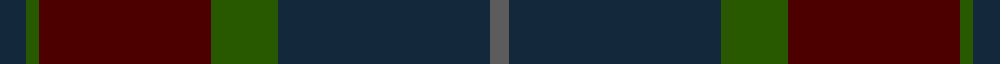

In pattern [BBGBBGB](/stripes/bbgbbgb/).

This was sourced from house-of-tartan.  It is a [7 stripe tartan](/stripes/stripes7/).

Original link http://www.house-of-tartan.scotland.net/house/TartanViewjs.asp?colr=Def&tnam=2219

## Thread count
DN/8 Ga4 DR32 DR20 Ga20 DN64 N/6

## Palette
Each colour and the base-6 reference it is a variant of.

| Colour | Shade | Base |
|---|---|---|
| DN | <code style="background-color:#14283C;">#14283C</code> `oklch(27.1% 0.046 249.9)` <small>#14283C</small> | B <code style="background-color:#2A418A;">#2A418A</code> |
| DR | <code style="background-color:#4C0000;">#4C0000</code> `oklch(26.2% 0.107 29.2)` <small>#4C0000</small> | B <code style="background-color:#2A418A;">#2A418A</code> |
| G | <code style="background-color:#006818;">#006818</code> `oklch(45.0% 0.142 145.0)` <small>#006818</small> | G <code style="background-color:#006100;">#006100</code> |
| Ga | <code style="background-color:#285800;">#285800</code> `oklch(41.0% 0.122 135.8)` <small>#285800</small> | G <code style="background-color:#006100;">#006100</code> |
| N | <code style="background-color:#5C5C5C;">#5C5C5C</code> `oklch(47.5% 0.000 89.9)` <small>#5C5C5C</small> | B <code style="background-color:#2A418A;">#2A418A</code> |
| R | <code style="background-color:#CC4438;">#CC4438</code> `oklch(57.7% 0.174 28.7)` <small>#CC4438</small> | R <code style="background-color:#CC0000;">#CC0000</code> |

# Sample pattern

## Nearest tartans

The nearest existing variants by ΔTartan distance, with this tartan at the top so the swatches line up against it.

ΔTartan

Tartan

Sett

—

<a href="/ttd/edit/#slug=dt4dg2dr16dr10dg10dt32n3~x2">Dempster Family Tartan Tartan Number: 2219. Earliest known date: 2001 Designed by Claire Donaldson of the House of Edgar. See products available Copyright © Blair Urquhart, Comrie, 2015</a> <a class="nn-out" href="/setts/s7/dt4dg2dr16dr10dg10dt32n3~x2/" title="open its dictionary page">↗</a>

1.05

<a href="/ttd/edit/#slug=do8y2do27k10n4k2n3k2n16do2~x2">Highland Granite</a> <a class="nn-out" href="/setts/s10/do8y2do27k10n4k2n3k2n16do2~x2/" title="open its dictionary page">↗</a>

1.28

<a href="/ttd/edit/#slug=dp32dg16o14k4o6dp7k2~x2">Aisteach</a> <a class="nn-out" href="/setts/s7/dp32dg16o14k4o6dp7k2~x2/" title="open its dictionary page">↗</a>

1.33

<a href="/ttd/edit/#slug=k5dy5k5dy34n33k6n5o2">Brave for Men (Fashion)</a> <a class="nn-out" href="/setts/s8/k5dy5k5dy34n33k6n5o2/" title="open its dictionary page">↗</a>

1.52

<a href="/ttd/edit/#slug=r1dy2dt12dy8db16lo1~x2">Bobby Jones (Personal)</a> <a class="nn-out" href="/setts/s6/r1dy2dt12dy8db16lo1~x2/" title="open its dictionary page">↗</a>

1.56

<a href="/ttd/edit/#slug=dt43dg8dt8dt21dg10w2~x2">Longmuir (2014)</a> <a class="nn-out" href="/setts/s6/dt43dg8dt8dt21dg10w2~x2/" title="open its dictionary page">↗</a>

1.58

<a href="/ttd/edit/#slug=dg28r4dp27r27dg28r5dp2~x2">Madder</a> <a class="nn-out" href="/setts/s7/dg28r4dp27r27dg28r5dp2~x2/" title="open its dictionary page">↗</a>

1.62

<a href="/ttd/edit/#slug=db3r1db14dg14r1dg1r1dg1r2~x4">Breckon Hunting (Name)</a> <a class="nn-out" href="/setts/s9/db3r1db14dg14r1dg1r1dg1r2~x4/" title="open its dictionary page">↗</a>

1.63

<a href="/ttd/edit/#slug=dg5k2dg28k10dy26db4dg4~x2">John Telfar Dunbar Hunting</a> <a class="nn-out" href="/setts/s7/dg5k2dg28k10dy26db4dg4~x2/" title="open its dictionary page">↗</a>

1.67

<a href="/ttd/edit/#slug=n8o3n34k34dp3~x2">Passion of Scotland, Pewter (Fashion</a> <a class="nn-out" href="/setts/s5/n8o3n34k34dp3~x2/" title="open its dictionary page">↗</a>

1.69

<a href="/ttd/edit/#slug=dp5db8dt13g21db34dt55o3">Bouncing Blackie (Personal)</a> <a class="nn-out" href="/setts/s7/dp5db8dt13g21db34dt55o3/" title="open its dictionary page">↗</a>

## Neighbour map

Every grey dot is one of 14299 variants placed by the first two principal components of the ΔTartan feature space (44% of its variance). Red is this tartan; blue dots are its nearest — click one to open its page.

<svg viewBox="0 0 640 380" role="img" style="max-width:100%;height:auto;border:1px solid #e0e0e0;border-radius:4px;display:block" xmlns="http://www.w3.org/2000/svg"><image href="/nn/cloud.v1.png" width="640" height="380"/><a href="/setts/s10/do8y2do27k10n4k2n3k2n16do2~x2/"><circle cx="386.0" cy="231.4" r="4" fill="#3465a4"><title>Highland Granite</title></circle></a><a href="/setts/s7/dp32dg16o14k4o6dp7k2~x2/"><circle cx="351.8" cy="235.5" r="4" fill="#3465a4"><title>Aisteach</title></circle></a><a href="/setts/s8/k5dy5k5dy34n33k6n5o2/"><circle cx="356.4" cy="215.8" r="4" fill="#3465a4"><title>Brave for Men (Fashion)</title></circle></a><a href="/setts/s6/r1dy2dt12dy8db16lo1~x2/"><circle cx="306.0" cy="229.1" r="4" fill="#3465a4"><title>Bobby Jones (Personal)</title></circle></a><a href="/setts/s6/dt43dg8dt8dt21dg10w2~x2/"><circle cx="426.2" cy="252.4" r="4" fill="#3465a4"><title>Longmuir (2014)</title></circle></a><a href="/setts/s7/dg28r4dp27r27dg28r5dp2~x2/"><circle cx="353.4" cy="270.9" r="4" fill="#3465a4"><title>Madder</title></circle></a><a href="/setts/s9/db3r1db14dg14r1dg1r1dg1r2~x4/"><circle cx="419.7" cy="240.6" r="4" fill="#3465a4"><title>Breckon Hunting (Name)</title></circle></a><a href="/setts/s7/dg5k2dg28k10dy26db4dg4~x2/"><circle cx="392.1" cy="269.1" r="4" fill="#3465a4"><title>John Telfar Dunbar Hunting</title></circle></a><a href="/setts/s5/n8o3n34k34dp3~x2/"><circle cx="314.0" cy="246.4" r="4" fill="#3465a4"><title>Passion of Scotland, Pewter (Fashion</title></circle></a><a href="/setts/s7/dp5db8dt13g21db34dt55o3/"><circle cx="344.6" cy="218.4" r="4" fill="#3465a4"><title>Bouncing Blackie (Personal)</title></circle></a><circle cx="383.9" cy="251.1" r="5" fill="#c00000"/></svg>

ID: /setts/s7/dt4dg2dr16dr10dg10dt32n3~x2/
