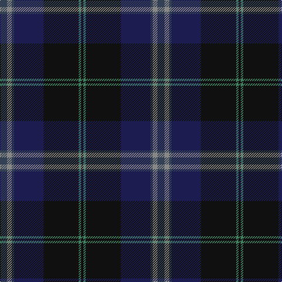

In pattern [BRBBKGK](/stripes/brbbkgk/).

This was sourced from tartans-authority.  It is a [7 stripe tartan](/stripes/stripes7/).

Original link http://www.tartansauthority.com/tartan-ferret/display/7729/

## Attestations

This cloth appears in 2 source records; the oldest owns this page.

- December 2007 — Passion of Scotland (Fashion) (tartans-authority, [record](http://www.tartansauthority.com/tartan-ferret/display/7729/))
- undated — Passion of Scotland (register-of-tartans, [record](https://www.tartanregister.gov.uk/tartanDetails.aspx?ref=5713))

## Register references

External register numbers recorded for this tartan.

- Scottish Register of Tartans: [5713](https://www.tartanregister.gov.uk/tartanDetails.aspx?ref=5713)
- Scottish Tartans Authority (ITI): 7729

## Thread count
N/12 Na8 N4 DB50 K60 G4 K/4

## Palette
Each colour and its ΔE from the base-6 reference it is a variant of.

| Colour | Shade | Base | ΔE (OKLab) |
|---|---|---|---|
| DB | <code style="background-color:#1C1C50;">#1C1C50</code> `#1C1C50` | B <code style="background-color:#2A418A;">#2A418A</code> | 0.14 |
| G | <code style="background-color:#408060;">#408060</code> `#408060` | G <code style="background-color:#006100;">#006100</code> | 0.14 |
| K | <code style="background-color:#101010;">#101010</code> `#101010` | K <code style="background-color:#000000;">#000000</code> | 0.17 |
| N | <code style="background-color:#344054;">#344054</code> `#344054` | B <code style="background-color:#2A418A;">#2A418A</code> | 0.09 |
| Na | <code style="background-color:#888888;">#888888</code> `#888888` | R <code style="background-color:#CC0000;">#CC0000</code> | 0.24 |

# Sample pattern

## Nearest tartans

The nearest existing variants by ΔTartan distance.

1. [Bouncing Blackie (Personal)](/setts/s7/dp5db8dt13g21db34dt55o3/) — ΔT 0.93
1. [Bobby Jones (Personal)](/setts/s6/r1dy2dt12dy8db16lo1~x2/) — ΔT 1.11
1. [Monarchs Corporate Sport Tartan Tartan Number: 2222. Earliest known date: 2002 Designed by Enid Brown of Lyle & Scott Ltd for Gleneagles Golf Developments. To be used for golf clothing and accessories. The Monarch's Course, created in the early 1990's by Jack Nicklaus, was renamed The PGA Centenary Course in February 2001 to celebrate the centenary year of The Professional Golfer's Association and is the selected venue for the 2014 Ryder Cup. See products available Copyright © Blair Urquhart, Comrie, 2015](/setts/s6/db19k4dr1k4dg9k1~x4/) — ΔT 1.17
1. [Bobby Jones (Personal)](/setts/s6/r1dy2k12dy8db16lo1~x2/) — ΔT 1.18
1. [Java St Andrew Society hunting](/setts/s7/db50dg26k9dg4w2r2dg10~x2/) — ΔT 1.20
1. [Kingsbarns Golf Links](/setts/s10/k8r3dt4g4dt48k48g4k4lo3dt8/) — ΔT 1.26
1. [Bressuire](/setts/s7/dr1dg4y1dg3dr4dt15w1~x4/) — ΔT 1.36
1. [Dallard (Personal)](/setts/s5/k37dg37n8k3dp5~x2/) — ΔT 1.37
1. [Pitceathly Chamberlain Tartan Tartan Number: 10190. Earliest known date: 2010 Designed for the 80th birthday of Sophia Joan Chamberlain nee Pitceathly for her own use and that of her immediate family. See products available Copyright © Blair Urquhart, Comrie, 2015](/setts/s10/db2k3dg5k7db20k2db5k2dg20lb1~x2/) — ΔT 1.37
1. [Stansbury](/setts/s8/dg28r3k28db8t1dg8r2k3~x2/) — ΔT 1.39

## Neighbour map

Every grey dot is one of 14299 variants placed by the first two principal components of the ΔTartan feature space (44% of its variance). Red is this tartan; blue dots are its nearest — click one to open its page.

<svg viewBox="0 0 640 380" role="img" style="max-width:100%;height:auto;border:1px solid #e0e0e0;border-radius:4px;display:block" xmlns="http://www.w3.org/2000/svg"><image href="/nn/cloud.v1.png" width="640" height="380"/><a href="/setts/s7/dp5db8dt13g21db34dt55o3/"><circle cx="344.6" cy="218.4" r="4" fill="#3465a4"><title>Bouncing Blackie (Personal)</title></circle></a><a href="/setts/s6/r1dy2dt12dy8db16lo1~x2/"><circle cx="306.0" cy="229.1" r="4" fill="#3465a4"><title>Bobby Jones (Personal)</title></circle></a><a href="/setts/s6/db19k4dr1k4dg9k1~x4/"><circle cx="351.1" cy="211.8" r="4" fill="#3465a4"><title>Monarchs Corporate Sport Tartan Tartan Number: 2222. Earliest known date: 2002 Designed by Enid Brown of Lyle &amp; Scott Ltd for Gleneagles Golf Developments. To be used for golf clothing and accessories. The Monarch's Course, created in the early 1990's by Jack Nicklaus, was renamed The PGA Centenary Course in February 2001 to celebrate the centenary year of The Professional Golfer's Association and is the selected venue for the 2014 Ryder Cup. See products available Copyright © Blair Urquhart, Comrie, 2015</title></circle></a><a href="/setts/s6/r1dy2k12dy8db16lo1~x2/"><circle cx="286.1" cy="218.1" r="4" fill="#3465a4"><title>Bobby Jones (Personal)</title></circle></a><a href="/setts/s7/db50dg26k9dg4w2r2dg10~x2/"><circle cx="381.6" cy="196.2" r="4" fill="#3465a4"><title>Java St Andrew Society hunting</title></circle></a><a href="/setts/s10/k8r3dt4g4dt48k48g4k4lo3dt8/"><circle cx="362.4" cy="184.7" r="4" fill="#3465a4"><title>Kingsbarns Golf Links</title></circle></a><a href="/setts/s7/dr1dg4y1dg3dr4dt15w1~x4/"><circle cx="338.7" cy="193.8" r="4" fill="#3465a4"><title>Bressuire</title></circle></a><a href="/setts/s5/k37dg37n8k3dp5~x2/"><circle cx="296.1" cy="245.6" r="4" fill="#3465a4"><title>Dallard (Personal)</title></circle></a><a href="/setts/s10/db2k3dg5k7db20k2db5k2dg20lb1~x2/"><circle cx="330.9" cy="205.3" r="4" fill="#3465a4"><title>Pitceathly Chamberlain Tartan Tartan Number: 10190. Earliest known date: 2010 Designed for the 80th birthday of Sophia Joan Chamberlain nee Pitceathly for her own use and that of her immediate family. See products available Copyright © Blair Urquhart, Comrie, 2015</title></circle></a><a href="/setts/s8/dg28r3k28db8t1dg8r2k3~x2/"><circle cx="349.2" cy="184.1" r="4" fill="#3465a4"><title>Stansbury</title></circle></a><circle cx="334.9" cy="210.7" r="5" fill="#c00000"/></svg>

ID: /setts/s7/dt6o4dt2db25k30g2k2~x2/
